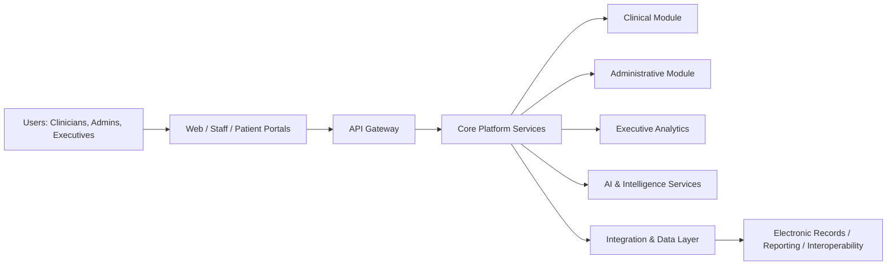

# Hospital Operating System (HOS)

A Modular, Enterprise-Grade Digital Operating System for Hospitals

[](https://github.com)
[](https://github.com)
[](JDMS/docs/)
[](https://github.com)

## 1. Project Overview

The Hospital Operating System (HOS) is a reusable, enterprise-grade digital platform for managing hospitals across clinical, administrative, operational, academic, and executive functions. It is designed as a long-term foundation for scalable health information systems rather than a one-off application.

The first implementation of HOS is the JUTH Digital Management System (JDMS) for Jos University Teaching Hospital (JUTH), Nigeria. In this context, HOS is the platform and JDMS is the first deployment and domain-specific realization of that platform.

This repository provides the architectural foundation, documentation, implementation conventions, and initial project structure for building HOS as a sustainable, modular, and extensible ecosystem.

## 2. Vision

To create a resilient, interoperable, and future-ready hospital operating platform that supports high-quality care delivery, operational excellence, data-driven decision-making, and long-term digital transformation across hospitals and healthcare networks.

## 3. Mission

To deliver a modular, secure, and adaptable enterprise software platform that enables hospitals to streamline workflows, improve patient outcomes, strengthen governance, and support innovation through modern software engineering and AI-enabled services.

## 4. Project Philosophy

HOS is built on the following principles:

- Modular architecture for independent evolution of capabilities
- Reusability across hospitals, regions, and deployment models
- Security, privacy, and auditability by design
- Interoperability with existing hospital systems and third-party services
- Data-driven operations and measurable institutional outcomes
- Open, maintainable engineering practices for long-term sustainability
- Clear separation of platform services from implementation-specific workflows

## 5. Platform Architecture Overview

HOS is structured as a platform composed of reusable services, shared domain models, standardized interfaces, and configurable application layers. The design is intended to support both local deployments and large-scale multi-hospital or statewide implementations.



The platform is intended to be implemented through a layered architecture that separates:

- User interfaces and channels
- Business services and workflows
- Shared domain logic and data models
- Integration, analytics, and AI services
- Infrastructure and deployment automation

## 6. HOS vs JDMS

| Concept | Definition |
|---|---|
| HOS | The reusable enterprise platform and long-term product architecture for hospital management systems |
| JDMS | The first implementation of HOS for Jos University Teaching Hospital, Nigeria |

This repository is the foundation for HOS. JDMS is the initial deployment and a reference implementation that will help validate the platform model before broader expansion.

## 7. Planned Modules

### Clinical
- Patient registration and demographics
- Outpatient and inpatient workflows
- Diagnostics, pharmacy, laboratory, and radiology support
- Care pathways and clinical documentation

### Administrative
- Human resources and staff management
- Finance and billing
- Procurement and inventory
- Records management and workflow administration

### Executive
- Dashboards and performance monitoring
- Operational analytics and reporting
- Governance and decision support
- Strategic planning and KPI tracking

### Academic & Research
- Training and academic operations
- Research data management
- Teaching hospital workflows
- Institutional reporting and collaboration

### AI
- Clinical decision support
- Predictive analytics
- Intelligent workflow assistance
- Natural language and document intelligence

## 8. Technology Stack

The project is intended to support a modern, scalable, and interoperable technology stack. The initial implementation direction includes:

- Frontend: web and portal applications with a component-driven UI framework
- Backend: modular services with API-driven architecture
- Data layer: relational database management, schema versioning, and migration tooling
- Integration: APIs, event-based communication, and interoperability support
- Infrastructure: containerization, orchestration, monitoring, and deployment automation
- Quality: automated testing, linting, documentation, and CI/CD practices

The stack is expected to evolve over time as the platform matures and new deployment requirements emerge.

## 9. Repository Structure

The repository is organized to support long-term architecture, implementation, and documentation work:

```text
JDMS/
  apps/                 # End-user applications and portals
  assets/               # Shared assets, logos, UI resources, legacy assets
  database/             # Schemas, migrations, backups, seeds
  docker/               # Containerization assets
  docs/                 # Project documentation and architecture records
  infrastructure/       # Deployment, monitoring, Kubernetes, Terraform, and infrastructure assets
  packages/             # Shared libraries, configuration, utilities, and types
  scripts/              # Automation and operational scripts
  services/             # Domain-driven backend services
  tests/                # Unit, integration, and end-to-end tests
  tools/                # Internal tools and engineering utilities
```

## 10. Documentation Structure

Project documentation is intentionally organized to support enterprise-level lifecycle management and cross-functional collaboration. Key documentation areas include:

- Project management and planning materials
- System context and vision documents
- Requirements and specifications
- Architecture and design records
- Database and API references
- Security and deployment guidance
- Testing and operations documentation

The documentation set is expected to be used as the authoritative reference for architecture, implementation, and governance decisions.

## 11. Development Workflow

The recommended development workflow is:

1. Review requirements and related documentation
2. Create or update architecture and design notes where applicable
3. Implement changes in a feature-oriented branch
4. Add or update tests for affected behavior
5. Validate the change through relevant checks and reviews
6. Merge through the established branch strategy after review

The repository is intended to support disciplined, documentation-first engineering practices.

## 12. Coding Standards

Contributions should follow a consistent and professional standard:

- Write clear, maintainable, and well-documented code
- Favor modular design and separation of concerns
- Use consistent naming, formatting, and structure
- Apply security and privacy safeguards in all relevant layers
- Ensure test coverage for business-critical workflows
- Keep changes traceable through meaningful commit history and documentation

Where applicable, platform components should be designed for reuse rather than for isolated implementation.

## 13. Branching Strategy

A simple, scalable branch model is recommended:

- main: stable production-ready baseline
- develop: integration branch for ongoing work
- feature/*: new features or major enhancements
- fix/*: bug fixes and corrections
- release/*: stabilization for planned releases
- hotfix/*: urgent production corrections

Protected branches and review-based merges are expected for production-quality changes.

## 14. Current Project Status

The project is currently in its foundational and architectural phase. Work has begun on establishing:

- the overall platform vision and scope
- the modular system structure
- repository organization and documentation framework
- domain-driven planning for initial hospital workflows

The project is positioned for long-term growth and enterprise-grade delivery.

## 15. Development Roadmap

### Phase 1: Foundation
- Establish repository structure and documentation standards
- Define core architecture and shared services
- Create initial domain models and workflow boundaries

### Phase 2: Core Hospital Operations
- Implement foundational administrative and clinical capabilities
- Build shared data models and service integrations
- Introduce reporting and operational visibility

### Phase 3: Intelligence and Scale
- Extend into executive analytics, AI services, and decision support
- Strengthen interoperability and integration capabilities
- Prepare for multi-site and statewide deployment models

## 16. Future Expansion

HOS is intended to evolve beyond a single hospital implementation. Future expansion may include:

- deployment to additional hospitals and health networks
- statewide health systems and regional platforms
- interoperability with national health infrastructure
- expanded AI-assisted clinical and operational capabilities
- multi-tenant and configurable enterprise deployment models

The architecture is being designed with this expansion path in mind.

## 17. Contributing

Contributions are welcome from developers, architects, domain experts, and institutional partners who want to help build a durable and impactful healthcare platform.

Contributors are encouraged to:

- review the relevant documentation before making changes
- follow established coding and review practices
- keep proposals aligned with the long-term platform vision
- document significant decisions and architectural changes

Please open an issue or discussion for proposed changes, architectural concerns, or implementation ideas.

## 18. License

A formal open-source licensing model will be finalized as the project governance and contribution framework mature. Until then, repository use and contribution should be managed in accordance with the applicable institutional and project policies.

## 19. Contact / Maintainers

Maintainer information will be published as the project governance structure is finalized.

For institutional or strategic collaboration inquiries, please contact the project leadership through the repository or the associated organization channel.

## 20. Closing Statement

This repository is the foundation of a long-term, enterprise-grade Hospital Operating System intended to scale from JUTH to multiple hospitals and statewide deployments. It is designed not only for immediate implementation, but for durable evolution as a reusable digital platform for modern healthcare delivery.
