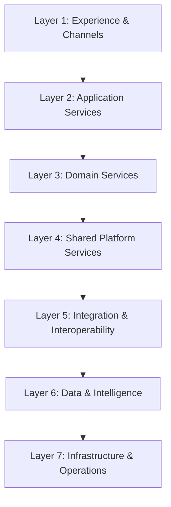
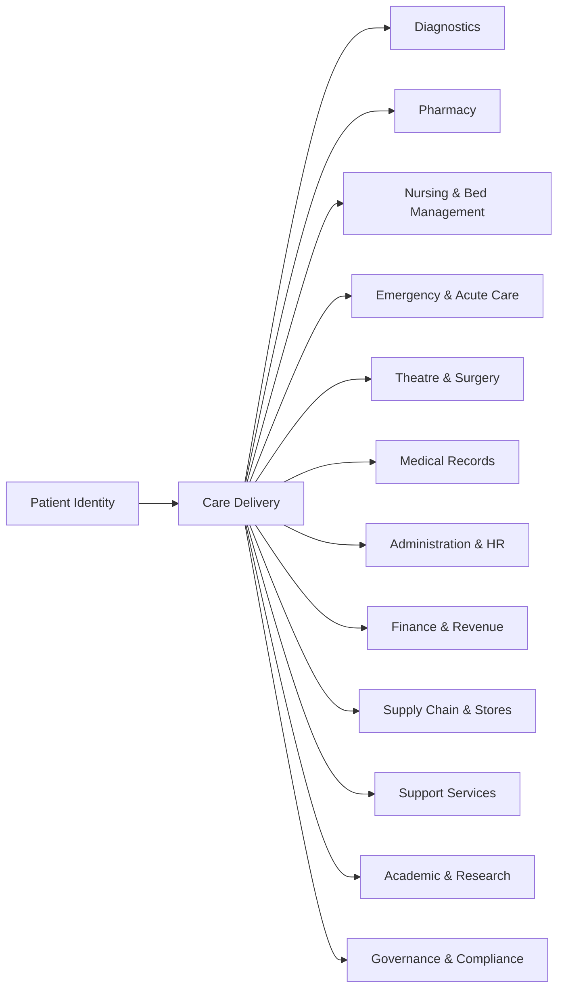
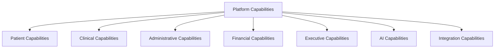
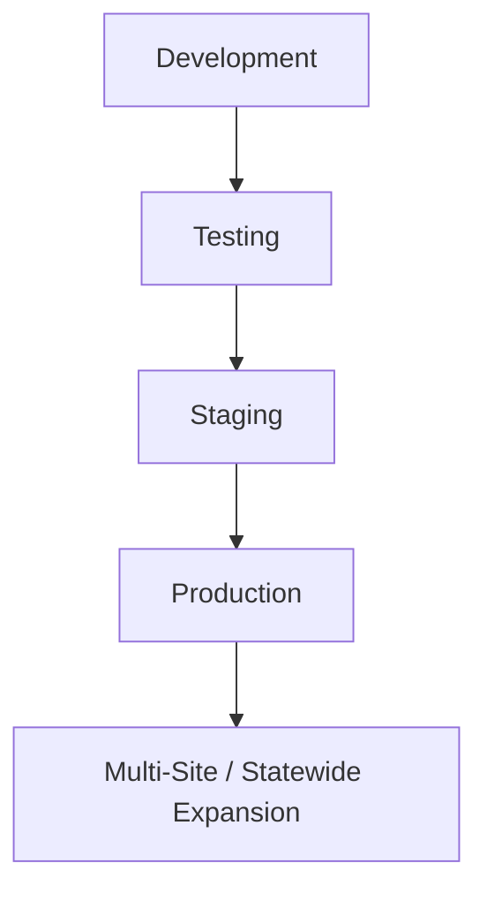

# HOS Blueprint

## Purpose

This document is the master blueprint of the Hospital Operating System (HOS). It provides the executive and technical overview of the platform, its architectural intent, its domain structure, its operating model, and its long-term evolution strategy.

This blueprint is the single entry point for understanding the HOS ecosystem. It connects strategy, architecture, capabilities, domains, engineering practices, and deployment direction into one authoritative reference.

## Status

- Status: Draft
- Version: 0.1.0
- Owner: Chief Enterprise Architect
- Audience: Executives, architects, engineers, product leaders, clinical stakeholders, and delivery teams

## Related Project Documents

- [Project Charter](../README.md)
- [Documentation Index](DOCUMENT_INDEX.md)
- [Hospital Business Architecture](04_Architecture/HOSPITAL_BUSINESS_ARCHITECTURE.md)
- [Domain-Driven Architecture](04_Architecture/DOMAIN_DRIVEN_ARCHITECTURE.md)
- [System Architecture](04_Architecture/SYSTEM_ARCHITECTURE.md)
- [Capability Model](29_Capability_Model/README.md)
- [HOS Engineering Handbook](25_Project_Operations/HOS_ENGINEERING_HANDBOOK.md)
- [Project Roadmap](00_Project_Management/ROADMAP.md)
- [ADR-001](16_Decision_Records/ADR-001.md)

---

## 1. Vision

HOS will become a reusable, enterprise-grade digital operating platform for hospitals and healthcare networks. It will support safe patient care, efficient hospital operations, academic and research excellence, intelligent decision-making, and scalable expansion across institutions and regions.

## 2. Mission

HOS exists to provide a modular, secure, interoperable, and future-ready technology foundation that enables hospitals to deliver high-quality care, improve operational performance, strengthen governance, and accelerate digital transformation.

## 3. Platform Philosophy

HOS is designed as a platform, not merely as a software product. Its philosophy is grounded in:

- modularity over monolithic rigidity
- reuse over duplication
- clinical safety over speed alone
- interoperability over isolated systems
- governance over informal delivery
- intelligent evolution over reactive replacement

---

## 4. Architectural Principles

The platform is guided by the following architectural principles:

- Build around hospital business domains rather than technical silos.
- Separate concerns across presentation, application, domain, integration, and infrastructure layers.
- Preserve security, privacy, auditability, and traceability as fundamental design requirements.
- Design for reuse, configuration, and future multi-site deployment.
- Use explicit contracts for domain interaction and interoperability.
- Keep core domain logic independent from infrastructure and external systems.
- Treat documentation, standards, and governance as part of the architecture.

---

## 5. Seven-Layer Architecture

HOS is architected as a seven-layer platform to separate concerns and support long-term growth.



### Layer Definitions

1. Experience & Channels
   - Web portals, staff applications, patient apps, mobile experiences, and external user channels.
2. Application Services
   - workflow orchestration, domain-specific use cases, user journeys, and application modules.
3. Domain Services
   - healthcare business capabilities such as patient management, diagnostics, pharmacy, finance, and operations.
4. Shared Platform Services
   - identity, configuration, workflow, notification, audit, analytics, and security services.
5. Integration & Interoperability
   - APIs, messaging, event buses, connectors, and external system adapters.
6. Data & Intelligence
   - data storage, data products, reporting, AI services, and analytics.
7. Infrastructure & Operations
   - hosting, containers, observability, deployment pipelines, backup, and resilience.

---

## 6. Domain Model Overview

The hospital enterprise is modeled around core clinical, operational, academic, administrative, financial, governance, and support domains.



These domains are implemented through bounded contexts and explicit contracts, ensuring business alignment and long-term maintainability.

---

## 7. Capability Model Overview

HOS organizes business capabilities into platform, patient, clinical, administrative, financial, executive, AI, and integration groups.



### Capability Themes

- Platform: identity, configuration, audit, security, observability
- Patient: registration, patient journey, records
- Clinical: care workflows, diagnostics, specialty services
- Administrative: HR, operations, service coordination
- Financial: billing, claims, procurement, inventory
- Executive: dashboards, performance, governance
- AI: clinical decision support, forecasting, analytics
- Integration: interoperability, partner APIs, event exchange

---

## 8. Business Architecture Overview

HOS supports the full enterprise hospital model, including:

- governance and executive oversight
- clinical service delivery
- diagnostic and pharmacy services
- financial and reimbursement operations
- academic and research functions
- infrastructure, support, and facilities management

The business architecture ensures that every software module is grounded in a real hospital capability, process, or operating need.

---

## 9. Technology Stack

The platform is intended to be implemented using a modern, scalable, and interoperable stack.

### Recommended Direction

- Frontend: component-driven web and portal interfaces
- Backend: modular services with API-first design
- Data Layer: relational databases, schema versioning, and migration tooling
- Integration: REST APIs, event-driven messaging, connectors, and transformation services
- Intelligence: analytics engines, reporting services, and AI-enabled capabilities
- Operations: containerization, orchestration, observability, CI/CD, and infrastructure automation

---

## 10. Repository Structure

The repository is organized to support architecture, implementation, governance, and delivery work.

```text
docs/
  00_HOS_BLUEPRINT.md
  00_Project_Management/
  04_Architecture/
  16_Decision_Records/
  25_Project_Operations/
  29_Capability_Model/
JDMS/
  apps/
  assets/
  database/
  docker/
  docs/
  infrastructure/
  packages/
  services/
  tests/
```

This structure supports the separation of platform architecture, implementation modules, deployment assets, and operational documentation.

---

## 11. AI Engineering Strategy

AI is treated as a strategic capability of HOS, not as an isolated feature.

### Strategic Objectives

- improve clinical decision support and quality of care
- automate repetitive workflows and document processing
- accelerate reporting and operational insight
- support predictive planning and intelligent assistance
- preserve safety, explainability, and governance in AI usage

### AI Engineering Principles

- AI must be human-reviewed and governed.
- Clinical AI must be validated and evidence-based.
- AI outputs must remain traceable and auditable.
- AI use must follow platform security, privacy, and compliance requirements.

---

## 12. Security Philosophy

Security is foundational to HOS. The platform must protect patient data, institutional assets, operational systems, and clinical workflows.

### Core Security Positions

- identity and access are controlled and least-privilege based
- sensitive data is protected in transit and at rest
- auditability is mandatory for important actions
- security controls are embedded into architecture, not added at the end
- external integration points are governed by strict validation and monitoring

---

## 13. Deployment Philosophy

HOS is designed for phased deployment across environments and institutions.

### Deployment Model



### Deployment Principles

- use controlled promotion across environments
- support repeatable deployment automation
- maintain rollback readiness for critical services
- enable environment-specific configuration without code divergence
- support future multi-site and regional rollout models

---

## 14. Statewide Evolution Strategy

HOS is designed to evolve from a single-hospital implementation into a broader healthcare platform.

### Evolution Stages

1. foundational platform and core hospital modules
2. specialty and departmental expansion
3. enterprise analytics and AI
4. multi-hospital deployment and shared services
5. regional or statewide interoperability and governance

This strategy ensures that the platform remains reusable, governable, and adaptable as it scales.

---

## 15. Implementation Roadmap

The implementation roadmap is anchored in three major goals:

1. Establish the platform foundation
2. Deliver core clinical and administrative capabilities
3. Expand into analytics, AI, integration, and multi-site deployment

### Phased Direction

- Phase 1: architecture, governance, shared services, and documentation maturity
- Phase 2: patient and clinical workflows, diagnostics, records, and administration
- Phase 3: finance, procurement, executive reporting, and AI capabilities
- Phase 4: interoperability, multi-site expansion, and statewide evolution

---

## 16. Future Expansion

HOS is expected to grow into a comprehensive digital health platform that supports:

- additional hospitals and health networks
- specialized clinical modules and regional services
- national interoperability and data exchange
- intelligent workflow automation and decision support
- configurable deployment models for diverse institutions

---

## 17. References to Major Documentation

The following documents provide the detailed basis for the blueprint:

- [Project Charter](../README.md)
- [Documentation Index](DOCUMENT_INDEX.md)
- [Project Roadmap](00_Project_Management/ROADMAP.md)
- [Hospital Business Architecture](04_Architecture/HOSPITAL_BUSINESS_ARCHITECTURE.md)
- [Domain-Driven Architecture](04_Architecture/DOMAIN_DRIVEN_ARCHITECTURE.md)
- [System Architecture](04_Architecture/SYSTEM_ARCHITECTURE.md)
- [Capability Model](29_Capability_Model/README.md)
- [HOS Engineering Handbook](25_Project_Operations/HOS_ENGINEERING_HANDBOOK.md)
- [ADR-001](16_Decision_Records/ADR-001.md)

---

## Summary

The HOS Blueprint provides the integrated architectural and strategic foundation for the entire platform. It aligns business architecture, domain architecture, capability design, engineering governance, and deployment strategy into a single coherent vision for building a hospital operating system that can evolve over time.

## Revision History

| Version | Date | Summary |
| --- | --- | --- |
| 0.1.0 | 2026-07-07 | Initial publication of the HOS master blueprint |
