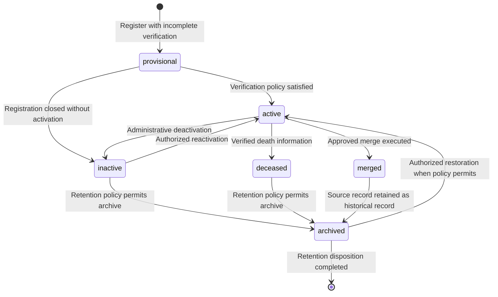
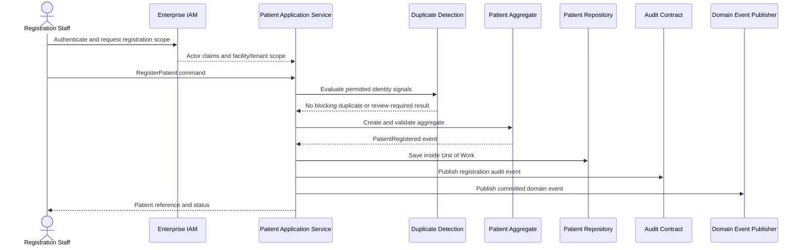
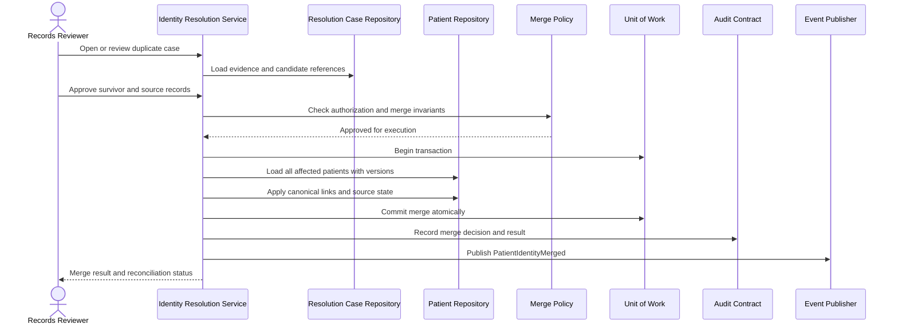
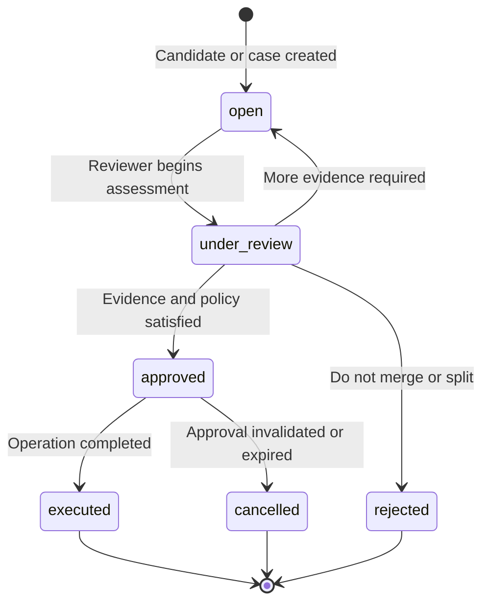
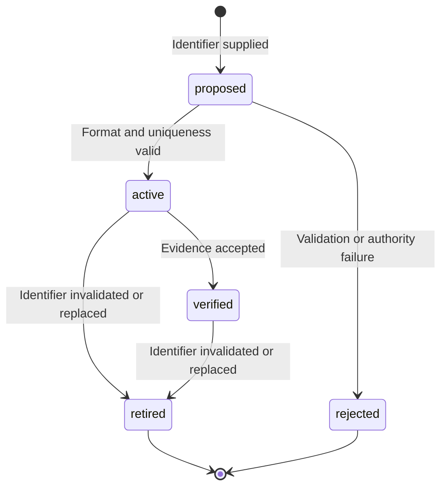
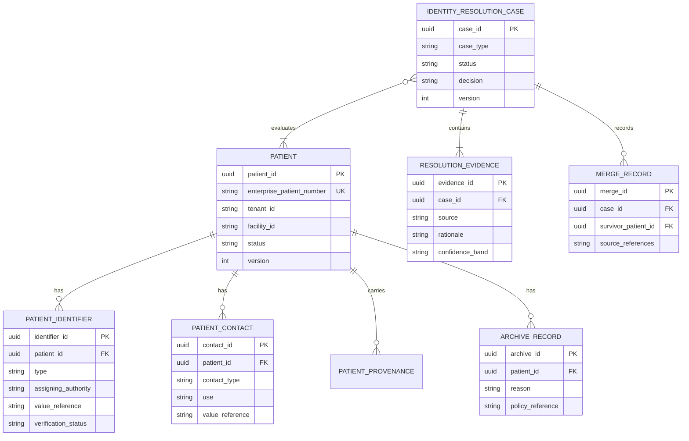

# JUTH Enterprise Hospital Operating System (JUTH HOS)

# Patient Domain Blueprint

## Document Control

- **Domain:** Patient Administration and Master Patient Index
- **Bounded Context:** Patient
- **Owner:** Chief Software Architect and designated Patient Domain Owner
- **Status:** Draft for architecture, security, and clinical review
- **Version:** 1.0.0
- **Target Sprint:** Sprint 007A
- **Reviewers:** Clinical reviewer, Health Information Management, Security Architecture, Data Protection, Operations, QA, and DevOps
- **Related ADRs:** [ADR-005: Clean Architecture](../01_Architecture/ADR/ADR-005.md), [ADR-006: Domain-Driven Design](../01_Architecture/ADR/ADR-006.md), [ADR-007: Modular Monolith Strategy](../01_Architecture/ADR/ADR-007.md), [ADR-008: Event-Driven Integration](../01_Architecture/ADR/ADR-008.md), [ADR-009: Healthcare Standards](../01_Architecture/ADR/ADR-009.md)
- **Related Constitution Volumes:** [Volume 01: Enterprise Platform Architecture](../00_Project_Management/JUTH_ENTERPRISE_ARCHITECTURE_AND_DEVELOPMENT_CONSTITUTION/Volume-01-Enterprise-Platform-Architecture.md), [Volume 04: Clinical Domain Architecture](../00_Project_Management/JUTH_ENTERPRISE_ARCHITECTURE_AND_DEVELOPMENT_CONSTITUTION/Volume-04-Clinical-Domain-Architecture.md), [Volume 05: Enterprise Patient Workspace](../00_Project_Management/JUTH_ENTERPRISE_ARCHITECTURE_AND_DEVELOPMENT_CONSTITUTION/Volume-05-Enterprise-Patient-Workspace.md), [Volume 06: Security and IAM](../00_Project_Management/JUTH_ENTERPRISE_ARCHITECTURE_AND_DEVELOPMENT_CONSTITUTION/Volume-06-Security-IAM.md), [Volume 07: Integration Standards](../00_Project_Management/JUTH_ENTERPRISE_ARCHITECTURE_AND_DEVELOPMENT_CONSTITUTION/Volume-07-Integration-Standards.md), [Volume 08: Development Standards](../00_Project_Management/JUTH_ENTERPRISE_ARCHITECTURE_AND_DEVELOPMENT_CONSTITUTION/Volume-08-Development-Standards.md)
- **Related Operational References:** [Hospital Business Architecture](../04_Architecture/HOSPITAL_BUSINESS_ARCHITECTURE.md), [Domain-Driven Architecture](../04_Architecture/DOMAIN_DRIVEN_ARCHITECTURE.md), [Capability Model](../29_Capability_Model/README.md), [Legacy System Notes](../13_Legacy_System/README.md)
- **Blueprint Framework:** [Domain Blueprint README](README.md) and [Domain Blueprint Template](Template.md)

## 1. Vision

The Patient bounded context provides one trusted, longitudinal, and auditable identity for each person receiving or supporting care through JUTH HOS.

It enables authorized staff and connected systems to identify a patient safely, maintain accurate administrative demographics, preserve identity history, and carry the same patient context into encounters and other bounded contexts.

The context is an identity and patient-administration capability. It is not the clinical record itself and does not own clinical observations, diagnoses, medications, orders, results, or encounters.

The enterprise EMR shall digitally replicate and improve upon the lifecycle of the traditional JUTH paper patient folder. The folder is the conceptual source of truth for the logical order, continuity, and legal meaning of patient care documentation. Digital ownership is distributed across bounded contexts, but every folder interaction must have an equivalent digital representation, a patient reference, a lifecycle, provenance, and an audit trail.

The platform must remain viable for an operational lifespan of at least 20 to 30 years. It must support new departments, hospitals, states, countries, regulatory requirements, specialties, AI capabilities, independently deployed modules, plugin expansion, and future microservice extraction without requiring existing bounded contexts to be redesigned.

## 1A. JUTH Institutional Operational Knowledge Baseline

This section preserves the accumulated JUTH-specific operational knowledge that must guide implementation. It is part of the blueprint's domain context, not an optional implementation note.

### SmartClinic and Legacy Workflow Findings

The accumulated SmartClinic and legacy workflow analysis identifies the following constraints to preserve and improve:

- Clinic-centric workflows do not by themselves provide a complete enterprise patient journey.
- Patient identity and search must work across departments rather than requiring staff to know which clinic created a record.
- Repeated registration and inconsistent identifiers create duplicate patient records and fragmented histories.
- Legacy search limitations make exact-name, spelling-variant, incomplete-demographic, and department-specific searches unreliable when used alone.
- Manual folder handling and weak movement visibility can make a record unavailable to the next department even when the patient is physically present.
- A departmental record view can hide prior encounters, investigations, referrals, medication history, and follow-up obligations from another service.
- A clinical note, investigation result, prescription, or referral must not become an isolated departmental artifact.
- Auditability must cover who created, viewed, changed, routed, filed, released, or corrected a record.

The Patient context therefore owns enterprise identity and patient lookup contracts, while Medical Records and clinical contexts own their respective content. No new module may repeat the legacy pattern of creating a separate patient identity store.

### Current Registration and Medical Records Practice

The blueprint preserves the operational role of registration and Medical Records as the controlled entry point for patient identity and the legal record lifecycle:

1. Registration captures identity and demographic information, checks for an existing patient using available identifiers and search criteria, and assigns or retrieves the patient's Medical Record Number (MRN) or hospital number.
2. Where identity is incomplete or verification is pending, the record is explicitly provisional rather than silently treated as a fully verified identity.
3. Medical Records maintains the patient index, supports chart assembly and retrieval, tracks record availability, protects confidentiality, and governs retention and archival activity.
4. Clinical departments add documentation to the patient's longitudinal record rather than creating an independent departmental chart.
5. Records that are requested, released, transferred, returned, archived, or corrected require traceable status and responsible actor information.

The digital platform must improve speed and searchability without removing these controls or treating registration as a one-time screen instead of an identity lifecycle.

### Physical Patient Folder Lifecycle

The paper folder remains the conceptual model for clinical continuity:

1. A folder is created or retrieved under the patient's MRN and identity.
2. Demographics, registration documents, encounter documents, and supporting evidence are filed against that identity.
3. The folder moves with the patient's care pathway or is formally requested by the next department.
4. Investigations, reports, prescriptions, procedures, referrals, follow-up instructions, correspondence, consent forms, and scanned documents are added to the longitudinal record.
5. Medical Records tracks the folder's location, availability, completeness, release, return, and archive state.
6. Historical contents remain discoverable and legally attributable even after the active episode has ended.

The digital equivalent is a longitudinal patient record index with versioned documents, encounter references, movement or location status, document lifecycle, access history, and a canonical Patient reference. The Patient context does not absorb clinical documents into the Patient aggregate; it provides the identity and linkage on which the Medical Records and clinical contexts depend.

### Nigerian Tertiary Hospital Operating Reality

The first deployment must support the operating reality of a Nigerian tertiary teaching hospital:

- Registration, Medical Records, clinical departments, diagnostics, pharmacy, accounts, and referrals may operate as distinct service points with different queues and responsibilities.
- Patients may move between General Outpatient, specialty clinics, Eye Clinic, emergency, wards, theatre, laboratory, radiology, pharmacy, accounts, and Medical Records during one continuous care journey.
- A patient may return after a long interval, present through a different department, or arrive with an existing paper folder and an identifier known locally but not globally.
- Network, device, staffing, and external-system availability may vary by location and shift; downtime and reconciliation must be designed explicitly.
- The digital system must support both facility-level operational identity and enterprise-level identity without forcing each facility to discard existing accountable practices.
- Teaching, referral, and multidisciplinary care require history to be visible across authorized departments while confidentiality remains scoped.

These are operational constraints for JUTH HOS and must not be replaced by a generic single-clinic registration assumption.

### Eye Clinic Workflow Knowledge

The Eye Clinic is a specialty workflow and an important validation path for the enterprise patient model. The Patient context must support, without owning the specialty details:

- Clinic registration and patient identity confirmation.
- Ophthalmic consultation and examination documentation.
- Diagnostic requests, imaging, reports, and result review.
- Treatment, procedure, and surgery coordination references.
- Referrals to and from Eye Clinic.
- Follow-up scheduling, follow-up status, and continuity across visits.
- Interaction with Nursing, Pharmacy, Radiology, Laboratory, Accounts, Medical Records, and ICT.

The Eye Clinic must extend the shared patient workspace and use the enterprise Patient reference. It must not create a clinic-specific patient identity, MRN, search index, or isolated history.

### Cross-Context Clinical Lifecycle Invariant

The following paper-folder artifacts must have digital counterparts. The owning context may differ, but each counterpart must link to Patient and preserve lifecycle, provenance, history, and audit evidence.

| Traditional folder artifact       | Digital counterpart                         | Likely owning context           | Patient context obligation                                     |
| --------------------------------- | ------------------------------------------- | ------------------------------- | -------------------------------------------------------------- |
| Registration and demographics     | Patient identity and demographic profile    | Patient                         | Own canonical identity and MRN linkage.                        |
| Encounter history                 | Encounter and episode references            | Encounter / Care Delivery       | Provide stable Patient reference and historical resolution.    |
| Clinical notes                    | Versioned clinical documents                | Clinical Care / Medical Records | Provide identity, context, provenance, and access linkage.     |
| Nursing notes                     | Versioned nursing documentation             | Nursing Operations              | Preserve patient and encounter references.                     |
| Vital signs                       | Observations with timestamps and author     | Clinical Care / Nursing         | Provide patient identity and longitudinal retrieval linkage.   |
| Laboratory requests               | Diagnostic orders                           | Laboratory / Diagnostics        | Provide patient reference and order context.                   |
| Laboratory results                | Verified diagnostic results                 | Laboratory / Diagnostics        | Preserve result linkage and historical patient resolution.     |
| Radiology requests                | Imaging orders and studies                  | Radiology / Diagnostics         | Preserve patient identity mapping to imaging systems.          |
| Radiology reports                 | Versioned diagnostic reports                | Radiology / Medical Records     | Preserve author, report status, and patient linkage.           |
| Procedures and theatre records    | Procedure and operation records             | Theatre / Clinical Care         | Link to patient, encounter, consent, and historical record.    |
| Medication orders                 | Prescriptions and medication orders         | Pharmacy / Clinical Care        | Provide identity reference without owning medication rules.    |
| Drug administration records       | Administration events                       | Nursing / Pharmacy              | Preserve patient, medication, author, time, and audit linkage. |
| Prescriptions                     | Prescribed and dispensed medication records | Clinical Care / Pharmacy        | Maintain patient reference and history continuity.             |
| Referrals                         | Referral requests, responses, and status    | Referral / Care Coordination    | Carry patient reference across departments and facilities.     |
| Discharge summaries               | Finalized discharge documentation           | Care Delivery / Medical Records | Preserve patient and encounter history linkage.                |
| Follow-up appointments            | Follow-up plan and appointment reference    | Scheduling / Care Delivery      | Preserve continuity after the current visit.                   |
| Clinical correspondence           | Signed correspondence and routing status    | Medical Records / Clinical Care | Preserve patient identity and document provenance.             |
| Attachments and scanned documents | Versioned document or attachment metadata   | Medical Records                 | Preserve source, classification, checksum, and access history. |
| Consent forms                     | Versioned consent evidence                  | Consent / Medical Records       | Link consent evidence without owning consent policy.           |
| Billing references                | Patient-linked financial references         | Revenue Cycle                   | Preserve only reference linkage, not financial ownership.      |
| Audit history                     | Immutable audit events and access history   | Enterprise Audit                | Publish patient identity and operation context.                |

## 1B. JUTH Philosophy and Institutional Purpose

The JUTH Enterprise Hospital Operating System is not merely an electronic medical record, a clinic-management application, a billing application, or a collection of departmental screens. It is the digital evolution of the hospital's traditional patient folder and the institutional memory of Jos University Teaching Hospital.

The traditional folder expresses an important institutional truth: a patient is not a series of disconnected transactions. Registration, consultation, investigation, treatment, referral, admission, discharge, and return visits are chapters in one continuing story. The Patient bounded context provides the identity and continuity foundation for that story while allowing each clinical and administrative bounded context to own its specialized facts.

The software shall adapt to clinicians, records officers, nurses, pharmacists, laboratory personnel, radiology personnel, accounts staff, and other hospital workers. Clinicians and operational staff must not be forced to change safe, necessary work merely because a software boundary is convenient to implement. When workflow must change, the change must be justified by clinical safety, measurable operational improvement, or an approved governance decision. Every architectural decision shall be evaluated by how it improves healthcare delivery, reduces avoidable work, preserves evidence, and supports responsible care.

Technology exists to support clinical care, not to obstruct it. The Patient context therefore treats fast and reliable identity resolution, safe patient selection, continuity across service points, and complete traceability as clinical capabilities rather than administrative conveniences.

The Patient blueprint is the single architectural source of truth for patient identity and continuity decisions. It preserves the institutional knowledge gathered from JUTH registration, Medical Records, Eye Clinic, SmartClinic analysis, physical-folder practice, and Nigerian tertiary hospital operations. Future implementation teams must explain any deviation from this blueprint through the approved architecture governance process.

## 1C. The Digital Patient Folder

The digital patient folder is the central organizing principle for the Patient context and for every bounded context that records a patient interaction. Each patient has one lifelong digital folder identity within the applicable enterprise and facility governance model. The folder may contain records owned by different bounded contexts, but those records remain connected by a canonical Patient reference, the relevant encounter or service context, provenance, lifecycle state, and audit history.

The digital folder is not a single unbounded aggregate and it is not permission for every module to write to Patient data. It is a continuity model. Patient owns identity, identifiers, administrative demographics, identity resolution, and the contracts that allow other contexts to contribute or retrieve their own chapters. Medical Records and the relevant clinical or operational bounded context own the content, custody, filing, signing, retention, and legal status of their artifacts.

The folder shall express the following continuity:

- Registration creates or resolves the patient's canonical identity and links the MRN or hospital number used by JUTH operational practice.
- Demographics remain part of the identity record with provenance, correction history, and appropriate verification state.
- Every encounter becomes another chapter linked to the same patient, even when the encounter occurs in a new department, facility, or specialty.
- Every investigation request and verified result is filed against the patient and the relevant encounter or service context.
- Every prescription, medication order, and drug administration record remains connected to the same longitudinal identity while medication rules remain owned by clinical and pharmacy contexts.
- Every admission, transfer, operation, procedure, discharge, referral, and follow-up action extends the same historical timeline.
- Clinical notes, nursing notes, vital signs, correspondence, attachments, scanned documents, consent evidence, and billing references have explicit digital counterparts and accountable owners.
- Corrections create traceable versions; they do not erase the historical evidence that was previously part of the record.
- Merges, splits, identifier retirement, archival, and restoration preserve the ability of an authorized reviewer to understand what happened and why.

The digital folder must remain readable decades later. This requires stable non-semantic identifiers, explicit document and event versions, source and authority metadata, migration-safe contracts, human-readable operational references such as MRN, and a clear distinction between current state and historical evidence. A future implementation must not depend on a temporary screen layout, a department-specific database key, or an undocumented local convention to reconstruct the patient's story.

The folder principle also governs downtime and transition. When approved paper procedures are used because the system or a dependency is unavailable, the resulting registration, order, result, prescription, administration, referral, consent, or clinical note must have a controlled reconciliation path. A temporary paper record must never become an invisible parallel patient identity or an untraceable branch of the legal medical record.

## 1D. Lifelong Clinical Timeline

The patient timeline is chronological, longitudinal, and cross-departmental. It is a continuity view assembled from authoritative records owned by their respective bounded contexts. It must not flatten clinical meaning into an undifferentiated activity feed, but it must allow an authorized user to understand the sequence and relationship of care over time.

The timeline shall be capable of presenting, with appropriate clinical and privacy controls:

- Registration and identity verification history.
- Consultations in general outpatient and specialist clinics.
- Admissions, ward stays, transfers, and discharge events.
- Emergency visits and urgent care episodes.
- Eye Clinic consultations, examinations, imaging, procedures, operations, and follow-up.
- Dental, physiotherapy, and other specialty encounters.
- Laboratory requests, specimen or order status, verified results, corrections, and filing history.
- Radiology requests, imaging studies, reports, amendments, and links to the relevant diagnostic system.
- Procedures, theatre records, operative documentation, and consent references.
- Diagnoses, active problems, allergies, alerts, and other clinical facts owned by clinical contexts.
- Medication orders, prescriptions, dispensing references, and drug administration records.
- Referrals, referral responses, transfers of responsibility, and follow-up plans.
- Discharge summaries, clinical correspondence, and documented mortality or death-related records where authorized.
- Attachments, scanned documents, consent forms, and Medical Records filing or release events.
- Patient-linked billing and revenue references without moving financial ownership into Patient.
- Audit history showing access, creation, correction, routing, release, merge, split, archival, and other governed actions.

No item should disappear from the clinical story merely because it was created by another department or legacy workflow. A timeline projection may be progressively loaded and purpose-filtered, but it must preserve the relationships needed to navigate from the patient to the originating encounter, document, order, result, prescription, referral, or administrative event. Historical encounters remain available according to authorization and retention policy even after the patient's current department or active status changes.

## 1E. Lessons Learned from SmartClinic and Legacy Operations

The following findings are institutional lessons, not generic product preferences. They describe failure modes observed or identified in the SmartClinic and related hospital workflows. They are architectural anti-patterns for JUTH HOS and shall not be reproduced in the Patient context or in dependent bounded contexts.

### Responsiveness and Throughput Failures

- Slow login delays the beginning of care and encourages shared credentials, workarounds, or paper-first operation.
- Slow page loading interrupts busy clinic flow and increases queues.
- Slow patient search makes staff repeat registration or create a new record when the existing patient cannot be found quickly.
- Poor responsiveness makes routine workflows impractical at high-volume service points.
- Performance degradation over time indicates that indexes, projections, data retention, query paths, and operational capacity must be designed deliberately from the start.
- Low-latency identity reads, search, save operations, and authentication are clinical workflow requirements, not optional refinements.

The Patient architecture shall use bounded queries, indexed identity paths, purpose-specific projections, progressive loading, measured performance budgets, observability, and background processing for work that does not need to block the user. A workflow may not claim to be complete merely because it eventually finishes; its response behavior must be appropriate for real JUTH clinic conditions.

### Identity, Search, and History Failures

- Duplicate patient records fragment clinical history and create patient-safety risk.
- Weak search capabilities and exact-name dependence prevent staff from locating existing records.
- Department-local search or hidden historical records gives the false impression that a patient has no prior care.
- Hidden historical records prevent clinicians from seeing relevant investigations, medication history, referrals, and earlier decisions.
- Fragmented identity data makes the MRN or hospital number unreliable as a continuity reference.

The Patient context therefore treats the Master Patient Index, MRN management, explainable duplicate detection, canonical resolution, historical identifier retention, and cross-department search as foundational capabilities. A failed search must not silently become a new registration. A suspected duplicate must not silently become a merge. A record must not be hidden merely because it originated in another department, a prior facility, an earlier implementation, or a long-closed encounter.

### Workflow and Module Separation Failures

- Fragmented workflows force staff to repeat the same identity, encounter, or administrative information.
- Disconnected modules prevent a clinical or operational event from continuing naturally into the next responsible department.
- Multiple clicks for routine tasks increase cognitive load and reduce throughput.
- Manual workarounds signal that the system does not reflect real hospital responsibilities or handoffs.
- Difficulty extending the system causes departments to create local workarounds instead of participating in the enterprise platform.
- Poor interoperability isolates JUTH from future facilities, partner systems, national standards, and enterprise services.

The modular monolith shall provide explicit contracts and shared patient context without creating a single god module. New departments extend approved interfaces and publish their own records and events. Existing identity and continuity contracts must not be rewritten whenever a new specialty, service point, or enterprise system is introduced.

### Payment and Service-Continuity Failures

- Payment synchronization failures create conflicting financial status across modules.
- Consultation blocked after payment couples clinical care to an unreliable local payment view.
- Module-specific payment tracking makes it difficult to know which status is authoritative.

JUTH HOS shall use one enterprise billing ledger and published payment events. Patient and clinical modules may consume an authorized financial status or reference, but they must not maintain competing payment truth. Payment-dependent workflows shall define explicit availability, authorization, and reconciliation behavior so that a temporary finance or integration failure does not create contradictory records or unsafe clinical obstruction.

### Paper and Documentation Failures

- Pharmacy paper prescriptions break the connection between prescribing, dispensing, medication history, and future administration support.
- Laboratory paper requests and radiology paper requests separate orders from their results and make filing dependent on manual movement.
- Hybrid paper workflows make it difficult to know whether the electronic or physical record is complete.
- Poor audit trails make it difficult to determine who created, viewed, changed, routed, filed, released, or corrected a record.

The digital folder principle replaces these gaps with linked, versioned, auditable artifacts. Where paper remains necessary for approved downtime or legal reasons, the paper artifact is governed as part of the same record lifecycle and reconciled into the digital folder. It is not an alternative source of truth that can remain permanently disconnected.

### Usability, Scalability, and Sustainability Failures

- Poor usability pushes experienced staff toward local memory and informal processes.
- Poor scalability makes the system less useful as patient volume, departments, data history, or facilities grow.
- Weak interoperability prevents safe exchange with FHIR, HL7, DICOM, finance, diagnostics, pharmacy, and future enterprise systems.
- Manual workarounds hide defects and make audit, training, support, and improvement more difficult.

The Patient context shall favor clear workflows, minimal navigation, fast retrieval, stable contracts, measurable operations, explainable decisions, and maintainable ownership. These are institutional controls for a hospital expected to preserve knowledge and serve patients for decades.

## 1F. Enterprise Engineering Principles for Patient Continuity

Every future Patient implementation and every dependent bounded context shall be evaluated against these principles:

1. **Performance first:** Identity resolution, patient loading, search, and save operations must be designed with measurable latency budgets before implementation.
2. **Clinical safety:** A wrong patient, hidden history, unfiled result, or ambiguous medication record is a safety defect, not merely a usability defect.
3. **Accuracy:** Identity, MRN linkage, provenance, timestamps, authorship, and version history must be preserved without silent normalization or loss.
4. **Scalability:** The design must support large patient volumes, long histories, new departments, new facilities, and future national or international deployment.
5. **Reliability:** The system must behave predictably during dependency failure, partial outage, retry, timeout, and recovery.
6. **Auditability:** Material actions and access must be traceable with actor, purpose, time, source, correlation, scope, and prior state where applicable.
7. **Maintainability:** Ownership, boundaries, contracts, and failure behavior must be understandable to future JUTH teams.
8. **Extensibility:** New modules must integrate through published contracts without changing existing domain ownership or rewriting existing modules.
9. **Security by design:** Least privilege, minimum disclosure, tenant and facility scope, encryption, and fail-closed authorization are part of the domain boundary.
10. **Offline resilience:** Approved downtime operation must preserve safe temporary identity and document reconciliation without creating invisible parallel histories.
11. **Future-proof architecture:** Stable identifiers, additive schema and contract evolution, anti-corruption layers, and replaceable infrastructure must protect the 20- to 30-year lifespan.
12. **Low latency:** Authentication, patient search, patient loading, and routine saves must be fast enough for busy hospital service points.
13. **Minimal clicks:** Common actions must not require unnecessary navigation, repeated data entry, or avoidable confirmation steps.
14. **Minimal navigation:** The active patient context and relevant historical timeline must remain available as staff move through the workflow.
15. **High availability:** Critical identity and continuity capabilities require monitored availability, safe degradation, recovery procedures, and tested backups.
16. **Fast search:** Search must prefer exact identifiers while supporting safe, explainable combinations for real-world name and demographic variation.
17. **Fast patient loading:** Patient context must load progressively and remain useful while deeper history or external records are retrieved.
18. **Efficient database access:** Repository and query designs must use appropriate indexes, projections, pagination, caching, and bounded reads.
19. **Background processing:** Non-blocking work such as projections, reconciliation, notifications, data-quality analysis, and document processing should not delay safe frontline actions.
20. **Asynchronous event handling:** Events must preserve ordering, idempotency, version, correlation, and retry behavior without making every consumer a synchronous dependency.
21. **Caching with source authority:** Caches may accelerate reads, but source version, invalidation, expiry, and stale-data behavior must be explicit.
22. **Monitoring and observability:** Performance, errors, search quality, duplicate cases, reconciliation, dependency health, and audit delivery must be measurable.

These principles do not authorize technical shortcuts that weaken domain ownership. Speed must not be achieved by bypassing audit, security, transaction integrity, or clinical review.

## 1G. Paper-Free Hospital Direction

The long-term operational objective is a paper-free clinical environment in which authorized staff can complete and retrieve the patient's record digitally throughout the care journey. The target includes:

- Registration and identity verification.
- Consultation and clinical documentation.
- Laboratory requests, specimen workflow, results, and result filing.
- Radiology requests, imaging references, reports, and amendments.
- Pharmacy orders, electronic prescriptions, dispensing, and medication history.
- Medication administration recording.
- Procedures, theatre records, and operative documentation.
- Referrals, responses, transfers of responsibility, and follow-up plans.
- Discharge documentation and summaries.
- Consents where legally and operationally permitted.
- Attachments, scanned source documents, correspondence, and Medical Records filing.
- Audit, release, correction, retention, and legal medical record controls.

Paper should exist only for an approved downtime procedure, a legal or regulatory requirement, or a controlled transition approved by Medical Records and governance authorities. Paper used under those conditions must have a known owner, patient and MRN linkage, custody or location, reconciliation deadline, completeness check, and audit evidence. The absence of a paper-free implementation at an early stage does not remove the architectural requirement to preserve a path toward this objective.

## 1H. Electronic Prescribing and Medication Continuity

JUTH HOS shall progress toward completely electronic prescribing. Handwritten prescriptions and permanently hybrid prescribing workflows are not the target operating model because they disconnect the prescriber, pharmacy, medication history, administration record, and audit trail.

The intended continuity is:

1. An authorized prescriber creates an electronic medication order or prescription in the appropriate clinical context.
2. The order is linked to the Patient reference, encounter, prescriber, time, status, and relevant clinical context.
3. Pharmacy receives the approved prescription through a published contract or event and can distinguish new, amended, cancelled, dispensed, and rejected states.
4. Medication history reflects the governed order and dispensing lifecycle without copying it into competing module-specific truth.
5. Nursing or another authorized administering service records drug administration as a separate, time-specific event with author, dose, route, status, and reason where applicable.
6. Corrections, cancellations, substitutions, and exceptions remain auditable and do not erase the original prescribing evidence.

This architecture is intentionally ready for clinical decision support, drug interaction checking, allergy awareness, barcode verification, and future medication administration support. Those capabilities belong to appropriate clinical, pharmacy, nursing, and AI extension boundaries. They must consume explicit contracts and must not be embedded as hidden rules in the Patient aggregate.

## 1I. Enterprise Billing Philosophy

Billing is an enterprise capability and must have one source of financial truth: one enterprise billing ledger governed by the Revenue Cycle or Finance bounded context. Patient, encounters, clinics, laboratory, radiology, pharmacy, theatre, admissions, and other modules may create billable references or consume an authorized financial status, but no module may maintain its own competing payment status as a substitute for the enterprise ledger.

The centralized model requires:

- A single authoritative ledger for charges, invoices, payments, adjustments, reversals, refunds, and financial status.
- Real-time or explicitly statused payment visibility through a versioned contract.
- Payment events propagated to authorized enterprise consumers.
- Idempotent handling of payment events and retries.
- Reconciliation for delayed, duplicate, reversed, or unavailable payment responses.
- Separation between clinical authorization and financial visibility so that a local synchronization failure is not misrepresented as a completed or failed payment.
- Audit evidence for payment creation, confirmation, adjustment, reversal, and access.
- Patient-linked billing references without financial data ownership in Patient.

This model directly addresses SmartClinic payment synchronization failures. Consultation must not be blocked because one module holds stale or contradictory payment information. A payment-dependent workflow may apply approved business policy, but it must query or receive the enterprise financial state, show uncertainty when the finance boundary is unavailable, and reconcile through a governed process. The Patient context stores identity linkage only; it does not calculate charges, receive payment, or decide revenue policy.

## 1J. Expandability and Enterprise Integration

The Patient boundary must remain stable as JUTH HOS expands. Future capabilities may include Human Resources, Payroll, Finance, Procurement, Inventory, Biomedical Engineering, Fleet, Hostel, Research, Teaching, Artificial Intelligence, statewide health services, national interoperability, public health, analytics, and decision support. The introduction of any one of these capabilities must not require rewriting Patient identity, invalidating historical references, or changing the ownership of existing clinical records.

Every new module shall integrate through one or more of:

- Versioned APIs.
- Domain events for changes within a bounded context.
- Integration events for cross-context and external communication.
- A governed message bus or equivalent delivery infrastructure when approved.
- Published contracts with explicit schemas, versions, ownership, classification, and deprecation policy.
- Anti-corruption layers for external or legacy models.

Direct database access across bounded-context boundaries is prohibited. A module may not read another module's tables, reuse another module's persistence entity as its own domain model, or update another module's data to avoid defining a contract. Contract evolution must be additive and backward-compatible for the supported lifecycle. Breaking changes require migration, consumer coordination, review, and an approved ADR where architecture is affected.

The Patient context shall be ready for independent module deployment and future microservice extraction, while the initial platform remains a modular monolith. This means that boundaries are expressed in interfaces, commands, queries, events, authorization scope, and ownership before physical deployment is separated.

## 1K. AI Readiness and Controlled Extension Points

JUTH HOS shall be ready to support future AI capabilities without making AI a hidden dependency of patient identity or clinical truth. Potential extension points include:

- Clinical summaries and administrative summaries.
- Clinical decision support.
- Duplicate detection and identity-resolution assistance.
- Clinical coding assistance.
- Document extraction and classification.
- Voice documentation assistance.
- Research and cohort analysis.
- Operational and clinical analytics.
- Predictive healthcare and population health.
- Risk prediction and prioritization.

AI logic must not be embedded into the core Patient aggregate, identity invariants, MRN assignment, merge execution, or legal medical record controls. AI may propose, rank, summarize, extract, or signal through a governed extension contract. An authorized human or approved deterministic workflow remains accountable for decisions that change identity, clinical records, access, billing, or patient care.

AI extensions must provide:

- Clear input and output contracts with versioning.
- Provenance and model or rule version.
- Confidence or uncertainty where meaningful.
- Human review and override where risk requires it.
- Audit of generated suggestions, accepted actions, rejected actions, and responsible actor.
- Protection against patient-data leakage and unnecessary disclosure.
- Safe behavior when the model, external service, or supporting data is unavailable.
- Monitoring for drift, bias, false matches, unsafe recommendations, and degraded performance.

The Patient context may publish well-defined identity, demographic, duplicate-candidate, and document-reference signals to an approved AI boundary. It must never silently convert a prediction into canonical patient truth.

## 1L. JUTH Clinical User Experience Principles

The Patient experience must reflect real hospital workflow and the working conditions of JUTH's busy service points. Every screen and workflow that consumes Patient capabilities should:

- Open quickly and show useful patient context immediately.
- Require minimal clicks for registration, search, selection, confirmation, and routine saves.
- Minimize navigation while preserving access to the lifelong timeline.
- Use language and sequence familiar to registration, Medical Records, clinical, nursing, pharmacy, laboratory, radiology, accounts, and referral staff.
- Make the current patient, MRN or hospital number, encounter, department, location, and relevant alerts unambiguous.
- Warn clearly about possible duplicates, stale data, identity uncertainty, and restricted access.
- Load progressively so a busy clinic can begin safe work without waiting for unrelated history.
- Preserve context when staff move between specialties or service points.
- Support keyboard navigation where appropriate for high-volume workflows.
- Provide a path for future accessibility improvements across shared components.
- Support large patient volumes, long histories, and intermittent dependency performance.
- Avoid hiding important history behind department-specific screens or excessive navigation.
- Distinguish current clinical facts from historical documents, audit evidence, and unresolved review items.

Clinical UX does not permit a frontend to implement business rules that belong in the domain or application layers. The workspace presents authorized projections, guides safe workflow, and records user intent through contracts. It must not compensate for missing backend ownership with local patient records, local payment status, or ungoverned module-specific history.

## 1M. Long-Term Vision

The Patient context is an early foundation of the official Enterprise Hospital Operating System for JUTH. The long-term vision is an in-house maintained, extensible enterprise platform capable of serving the hospital for decades while preserving the institutional memory represented by its patient records.

JUTH HOS is intended to become:

- The official Enterprise Hospital Operating System for Jos University Teaching Hospital.
- An extensible platform shared by clinical, administrative, operational, research, and teaching capabilities.
- An in-house maintained system whose architecture and knowledge remain understandable to successive JUTH engineering and clinical teams.
- A platform capable of preserving patient continuity and operational evidence for at least 20 to 30 years.
- A foundation for additional hospitals, facilities, states, national interoperability, and future statewide deployment.
- A benchmark for safe, maintainable, interoperable healthcare technology in Nigeria.

This vision requires patience with governance and discipline in implementation. The Patient domain must not be optimized for one screen, one department, one vendor integration, or one release at the expense of the hospital's future record. Every release must preserve the ability to understand what happened to a patient, what care was provided, what evidence was created, who acted, and how the record evolved.

## 2. Scope

### In Scope

- Patient registration and maintenance of the enterprise patient record.
- Master Patient Index (MPI) capabilities within the JUTH HOS tenant and facility model.
- Enterprise and facility patient identifiers.
- Demographic, contact, communication, and administrative identity data.
- Patient search and retrieval for authorized workflows.
- Medical Record Number (MRN) and hospital-number management with enterprise identity linkage.
- Patient-folder index linkage, record availability, and authorized department movement references.
- Duplicate detection, identity resolution, merge, and split governance.
- Patient lifecycle state, archival state, and restoration controls.
- Provenance, history, audit events, and traceability of identity changes.
- Interoperability mappings for patient identity and demographic data.
- Patient context references consumed by other bounded contexts.

### Out of Scope

- Encounters, visits, appointments, admissions, transfers, and discharges.
- Clinical notes, diagnoses, allergies, vitals, problems, orders, results, and medications.
- Laboratory, radiology, pharmacy, theatre, nursing, emergency, or specialty workflows.
- Billing accounts, insurance adjudication, NHIA claims, payments, and revenue cycle.
- Staff identity, authentication, authorization implementation, and session management.
- Consent policy implementation, although consent-related access requirements are integration dependencies.
- Clinical terminology ownership and clinical decision support.
- Patient portal workflows and direct patient self-service authentication.
- Reporting warehouse implementation and analytics pipelines.
- Physical database schema, Prisma models, migrations, controllers, DTOs, and runtime endpoints in this blueprint sprint.

## 3. Responsibilities

The Patient context owns the identity and administrative record of a patient. It is responsible for maintaining the patient aggregate, enforcing identity integrity, publishing patient identity events, and providing contracts for authorized consumers.

The context delegates authentication and authorization decisions to the enterprise IAM platform, audit persistence to the audit platform, facility and tenant reference data to the relevant platform context, and clinical or financial behavior to downstream bounded contexts.

Downstream contexts may reference a patient through a stable patient identifier and a versioned patient summary contract. They must not reach into Patient persistence or copy the Patient aggregate as their own source of truth.

The paper-folder principle is enforced through explicit cross-context linkage rather than by placing all clinical content inside Patient. Every clinical, administrative, diagnostic, medication, referral, consent, billing-reference, attachment, or scanned-document artifact that would historically be filed in the physical folder must carry an auditable Patient reference and a governed lifecycle. Patient owns identity and linkage; Medical Records and the relevant clinical or operational context own the artifact and its content.

## 4. Ubiquitous Language

| Term                        | Meaning                                                                                                                                    | Notes                                                                                                                 |
| --------------------------- | ------------------------------------------------------------------------------------------------------------------------------------------ | --------------------------------------------------------------------------------------------------------------------- |
| Patient                     | A person who has been registered or provisionally identified in JUTH HOS.                                                                  | The Patient aggregate root.                                                                                           |
| Enterprise Patient Number   | A human-readable enterprise identifier assigned by JUTH HOS.                                                                               | It is not the technical primary key.                                                                                  |
| Patient Identifier          | A typed identifier associated with a patient, such as an enterprise, facility, or external identifier.                                     | Each identifier has provenance and lifecycle.                                                                         |
| Medical Record Number (MRN) | The operational hospital record number used to retrieve and preserve a patient's longitudinal record.                                      | It is distinct from the technical patient ID and is never silently reassigned.                                        |
| Patient Folder Index        | The governed index linking a Patient reference to the physical or digital record location, documents, encounters, and availability state.  | Medical Records owns record custody and document lifecycle; Patient owns identity linkage.                            |
| Department Movement         | An authorized movement, handoff, referral, or location change through which a patient continues care across departments or service points. | The Patient reference persists; Encounter and Care Delivery own movement events.                                      |
| Legal Medical Record        | The governed set of authoritative clinical and administrative evidence retained for care, operational, and medico-legal purposes.          | Record designation, retention, correction, and release policy are controlled by Medical Records and the organization. |
| Master Patient Index        | The authoritative identity index used to resolve a person across facilities and systems.                                                   | It is implemented through the Patient context contracts.                                                              |
| Provisional Patient         | A patient record created with limited verified information pending identity verification.                                                  | Provisional status does not remove audit requirements.                                                                |
| Verified Patient            | A patient record whose identity has met the approved verification policy.                                                                  | Verification policy is configurable and reviewable.                                                                   |
| Duplicate Candidate         | A possible duplicate relationship identified by matching rules or a user.                                                                  | It is not proof of duplication.                                                                                       |
| Identity Resolution Case    | A governed case used to review duplicate, merge, or split decisions.                                                                       | It has its own lifecycle and audit trail.                                                                             |
| Survivor                    | The patient record retained after an approved merge.                                                                                       | The survivor remains the canonical patient reference.                                                                 |
| Source Record               | A patient record absorbed by an approved merge.                                                                                            | It remains traceable and is not physically deleted.                                                                   |
| Merge                       | A governed operation that consolidates duplicate patient records into one survivor.                                                        | It requires explicit authorization and audit evidence.                                                                |
| Split                       | A governed operation that separates incorrectly combined identity information or reverses an erroneous merge.                              | It must preserve provenance.                                                                                          |
| Patient Context             | The stable patient identity and selected administrative summary carried across workflows.                                                  | Encounter and clinical data are owned elsewhere.                                                                      |
| Facility                    | A hospital site or operational location participating in the enterprise deployment.                                                        | Facility reference data is external to this context.                                                                  |
| Tenant                      | The organizational boundary within which data and policy are scoped.                                                                       | Tenant isolation is mandatory.                                                                                        |
| Provenance                  | Evidence describing who, when, where, and from which source a patient fact originated.                                                     | Required for identity changes and interoperability.                                                                   |
| Administrative Demographics | Identity and registration attributes such as name, birth date, sex recorded for administration, address, and contact points.               | Clinical interpretations are out of scope.                                                                            |
| Active Identifier           | An identifier currently valid for lookup and reference.                                                                                    | Retired identifiers remain historical evidence.                                                                       |
| Archive                     | A controlled lifecycle state in which a record is retained but excluded from normal active workflows.                                      | Archiving is not deletion.                                                                                            |
| Record Link                 | A controlled relationship between records used for identity resolution or interoperability.                                                | Links must be auditable and versioned.                                                                                |

## 5. Bounded Context

### Context Boundary

The Patient context owns the patient identity aggregate, administrative demographics, patient identifiers, patient lifecycle, identity resolution cases, and the contracts required to reference these concepts.

The context does not own care delivery facts. An Encounter context owns encounter identity and lifecycle; clinical contexts own clinical facts; Billing owns financial responsibility; IAM owns users and authorization; Audit owns immutable audit persistence.

### Upstream Dependencies

- Enterprise IAM for authenticated actor identity, roles, permissions, facility scope, tenant scope, and session context.
- Facility and organizational reference data for facility, department, and tenant references.
- Configuration and terminology services for approved code sets and configurable validation policy.
- Enterprise clock and identifier abstractions from the shared domain kernel.

### Downstream Dependencies

- Encounter and appointment contexts consume stable patient references.
- Clinical, diagnostic, pharmacy, billing, reporting, and interoperability contexts consume approved patient identity contracts.
- Enterprise Patient Workspace consumes patient banner and patient context projections.

### Shared Kernel Dependencies

The context uses the shared DDD kernel for entities, aggregate roots, value objects, domain events, repository contracts, specifications, results, clocks, identifiers, and guard utilities. It must not introduce a second implementation of these platform concepts.

### Anti-Corruption Layer Requirements

External identifiers, HL7 messages, FHIR resources, DICOM patient fields, and facility-specific registration payloads must be translated through integration adapters. External schemas, codes, and transport details must not become Patient domain types without an explicit mapping decision.

### Data and Behavior Ownership

Patient is the source of truth for identity and administrative patient data. Consumers may cache projections for performance, but cached values must include source version and timestamp and must not be used to overwrite Patient data without a governed command.

## 6. Stakeholders

- Patients and authorized representatives.
- Registration and admission staff.
- Health Information Management and medical records staff.
- Clinicians and clinical support staff who identify patients during care.
- Hospital administration and facility operations.
- Privacy, security, and compliance officers.
- Billing, insurance, and NHIA integration teams as downstream consumers.
- Laboratory, radiology, pharmacy, theatre, nursing, and other future domain teams.
- Interoperability and data exchange teams.
- Support, operations, quality assurance, and audit teams.

## 7. Business Objectives

- Reduce duplicate patient records and unsafe patient selection.
- Provide a reliable enterprise identity across JUTH facilities.
- Improve registration accuracy and staff workflow continuity.
- Preserve complete identity history and medico-legal traceability.
- Enable downstream clinical and administrative contexts to use one stable patient reference.
- Support standards-based interoperability without leaking external schemas into the domain.
- Provide controlled identity correction, merge, split, archive, and restoration processes.
- Improve patient matching quality while protecting confidentiality and minimizing unnecessary data exposure.

## 8. Actors

| Actor                          | Responsibilities                                                                 | Typical Access                                                                 |
| ------------------------------ | -------------------------------------------------------------------------------- | ------------------------------------------------------------------------------ |
| Registration Officer           | Searches, registers, verifies, and updates patient identity data.                | Create, read, and update within assigned facility scope.                       |
| Health Records Officer         | Reviews identity quality, duplicate candidates, merges, splits, and corrections. | Elevated identity-resolution permissions.                                      |
| Clinician                      | Selects and views patient identity context during authorized care.               | Read and search within care and facility scope.                                |
| Clinical Support User          | Uses patient identity for laboratory, radiology, pharmacy, or other workflows.   | Read and search according to role and scope.                                   |
| Patient or Representative      | Supplies or confirms demographic information through an approved channel.        | Limited self-service capability, if separately approved.                       |
| System Administrator           | Manages configuration and operational access.                                    | No implicit patient-data access; access remains permission-scoped and audited. |
| Integration Client             | Exchanges patient identity data through approved contracts.                      | Service-account permissions and facility or tenant scope.                      |
| Privacy or Compliance Reviewer | Reviews access, correction, export, retention, and audit evidence.               | Read-only governance access.                                                   |
| Audit Reviewer                 | Investigates identity changes and access history.                                | Read-only audit access.                                                        |

## 9. Functional Requirements

| ID         | Requirement                                                                                                                                                                                                                                                           |
| ---------- | --------------------------------------------------------------------------------------------------------------------------------------------------------------------------------------------------------------------------------------------------------------------- |
| PAT-FR-001 | The context shall create a patient record with required administrative identity data and provenance.                                                                                                                                                                  |
| PAT-FR-002 | The context shall assign a stable technical patient identifier and an enterprise patient number according to approved identifier policy.                                                                                                                              |
| PAT-FR-003 | The context shall support provisional and verified patient lifecycle states.                                                                                                                                                                                          |
| PAT-FR-004 | The context shall maintain typed patient identifiers with source, validity, verification, and retirement state.                                                                                                                                                       |
| PAT-FR-005 | The context shall maintain names, birth information, administrative sex, address, contact points, communication preference, and representative information where permitted.                                                                                           |
| PAT-FR-006 | The context shall support authorized patient search by enterprise identifier, facility identifier, external identifier, name, birth date, phone, and approved combinations.                                                                                           |
| PAT-FR-007 | The context shall return only data permitted by the caller's role, facility, tenant, and purpose scope.                                                                                                                                                               |
| PAT-FR-008 | The context shall detect and record possible duplicates without automatically merging records.                                                                                                                                                                        |
| PAT-FR-009 | The context shall support a governed identity resolution case lifecycle.                                                                                                                                                                                              |
| PAT-FR-010 | The context shall support authorized merge decisions that preserve source history and redirect references to the survivor.                                                                                                                                            |
| PAT-FR-011 | The context shall support authorized split decisions that preserve provenance and do not erase historical evidence.                                                                                                                                                   |
| PAT-FR-012 | The context shall support patient correction, archival, and restoration according to policy.                                                                                                                                                                          |
| PAT-FR-013 | The context shall publish versioned domain and integration events for material identity changes.                                                                                                                                                                      |
| PAT-FR-014 | The context shall expose conceptual contracts for downstream patient context consumption without exposing persistence entities.                                                                                                                                       |
| PAT-FR-015 | The context shall record audit evidence for patient creation, view, search, change, export, resolution, merge, split, archive, restore, and denied access.                                                                                                            |
| PAT-FR-016 | The context shall support idempotent command handling for retried registration and integration requests.                                                                                                                                                              |
| PAT-FR-017 | The context shall keep the technical patient ID, enterprise patient number, MRN or hospital number, facility identifier, and external identifiers distinct while preserving their governed relationships.                                                             |
| PAT-FR-018 | The context shall provide a versioned patient-folder index linkage contract so authorized consumers can locate the patient's longitudinal record and its availability state without accessing another context's persistence.                                          |
| PAT-FR-019 | The context shall provide stable patient references for movement across departments, service points, facilities, and locations without creating a new identity for each workflow.                                                                                     |
| PAT-FR-020 | The context shall preserve historical patient and encounter references after a return visit, department change, identifier retirement, merge, split, or archival transition.                                                                                          |
| PAT-FR-021 | The context shall evolve identity contracts additively and backward-compatibly so new departments, hospitals, states, countries, regulatory requirements, specialties, AI modules, or independently deployed modules do not require redesign of the Patient boundary. |

## 10. Non-functional Requirements

- Patient data shall be protected by least privilege, facility scope, tenant scope, and fail-closed authorization.
- Identity changes shall be traceable to actor, time, source, request, correlation, facility, tenant, and prior version.
- Domain logic shall remain framework-independent and follow Clean Architecture dependency direction.
- Persistence shall be replaceable through repository contracts and Unit of Work boundaries.
- Commands that modify identity shall be transactionally consistent and optimistic-lock protected.
- Search results shall minimize sensitive data and support purpose-appropriate projections.
- The context shall support multi-facility deployment without using facility-specific code paths for core identity rules.
- Integration contracts shall be versioned and backward-compatible where practical.
- The implementation shall be testable with unit, integration, contract, end-to-end, security, accessibility, and clinical safety evidence appropriate to risk.
- The context shall degrade safely when downstream systems are unavailable; it shall not silently create conflicting identity records.
- Operational logs shall contain correlation identifiers and shall not expose unnecessary patient data.
- The architecture shall support an operational lifespan of at least 20–30 years through non-semantic identifiers, versioned contracts, replaceable adapters, and additive evolution.
- Future enterprise systems, including Human Resources, Payroll, Procurement, Inventory, Asset Management, Finance, Revenue Management, and Executive Reporting, shall integrate through published APIs and events rather than direct database coupling.
- Published APIs and events shall be versioned and remain backward-compatible for the supported deprecation period.

## 11. Domain Model

The Patient context is modeled around identity integrity rather than clinical care. The principal aggregate is Patient. Identity resolution is modeled as a separate governed aggregate because duplicate review, merge, and split decisions have their own lifecycle, evidence, authorization, and consistency boundary.

The model follows the shared domain kernel and uses:

- Entities for concepts with identity and lifecycle.
- Value objects for immutable, validated concepts such as names, identifiers, dates, and contact points.
- Aggregates for transaction and invariant boundaries.
- Domain services for rules that do not naturally belong to one entity.
- Domain events for material state changes.
- Application services for use-case orchestration and authorization coordination.
- Repository interfaces for persistence abstraction.

## 12. Aggregates

| Aggregate                | Root Entity            | Consistency Boundary                                                                                                        | Notes                                                        |
| ------------------------ | ---------------------- | --------------------------------------------------------------------------------------------------------------------------- | ------------------------------------------------------------ |
| Patient                  | Patient                | Patient identity, administrative demographics, identifiers, contacts, lifecycle state, version, and provenance.             | The root controls all changes to its identity-owned members. |
| Identity Resolution Case | IdentityResolutionCase | Duplicate candidate evidence, review status, proposed action, decision, reviewer evidence, and affected patient references. | Merge and split decisions are not implicit Patient updates.  |

## 13. Root Aggregate

### Patient

Patient is the aggregate root for a single person record. It owns the patient technical identifier, enterprise patient number, lifecycle state, demographic profile, identifiers, contact points, provenance, audit-relevant version, and domain event collection.

Patient commands must enter through the aggregate or an application service that invokes aggregate behavior. Controllers, persistence adapters, and UI components must not mutate patient state directly.

### IdentityResolutionCase

IdentityResolutionCase is the aggregate root for a duplicate, merge, or split review. It records the candidate records, evidence, proposed action, reviewer decisions, policy checks, and outcome. It references Patient identifiers and never embeds a second copy of the Patient aggregate.

## 14. Entities

| Entity                 | Identity                                                | Lifecycle                                                  | Notes                                                                 |
| ---------------------- | ------------------------------------------------------- | ---------------------------------------------------------- | --------------------------------------------------------------------- |
| Patient                | `PatientId`                                             | Provisional, active, inactive, deceased, merged, archived. | Aggregate root and source of truth for patient identity.              |
| PatientIdentifier      | Identifier record identity plus typed identifier value. | Proposed, active, verified, retired, rejected.             | Retired identifiers remain historical evidence and are not reused.    |
| PatientContact         | Contact record identity.                                | Active, preferred, retired.                                | Contact details are administrative and privacy-sensitive.             |
| IdentityResolutionCase | `IdentityResolutionCaseId`                              | Open, under review, resolved, rejected, cancelled.         | Aggregate root for duplicate, merge, and split governance.            |
| ResolutionEvidence     | Evidence record identity within a resolution case.      | Recorded, superseded, withdrawn.                           | Evidence must preserve source, reviewer, timestamp, and rationale.    |
| MergeRecord            | Merge operation identity.                               | Proposed, approved, executed, reversed.                    | Records survivor, source records, decision, and resulting references. |
| ArchiveRecord          | Archive operation identity.                             | Requested, approved, executed, restored.                   | Records policy basis, actor, timestamp, and restoration history.      |

## 15. Value Objects

| Value Object            | Fields                                                                          | Validation Rules                                                                                                 | Notes                                                            |
| ----------------------- | ------------------------------------------------------------------------------- | ---------------------------------------------------------------------------------------------------------------- | ---------------------------------------------------------------- |
| PatientId               | UUID value.                                                                     | Non-empty, canonical UUID format.                                                                                | Technical identifier; never derived from sensitive demographics. |
| EnterprisePatientNumber | Formatted enterprise number.                                                    | Generated by approved policy, unique, immutable after assignment.                                                | Human-readable reference.                                        |
| PatientName             | Family name, given names, optional other names, prefix, suffix, use.            | Normalized for comparison while preserving entered display form; required components follow registration policy. | Must preserve source and correction history.                     |
| BirthInformation        | Birth date, precision, and verification state.                                  | Future dates rejected; unknown or partial dates handled explicitly.                                              | Do not infer an exact date from an approximate value.            |
| AdministrativeSex       | Approved administrative code and display value.                                 | Must use configured terminology and support unknown or not recorded where policy permits.                        | This is not a clinical gender model.                             |
| Address                 | Lines, locality, region, country, postal code, use.                             | Country and use validated; normalization must preserve original value.                                           | Multiple uses may be represented.                                |
| ContactPoint            | Type, value, use, rank, verification state.                                     | Type-specific normalization and validation; sensitive values protected in logs.                                  | Supports phone, email, and approved channels.                    |
| PatientIdentifierValue  | Type, value, assigning authority, facility, validity, verification.             | Type-specific normalization, authority required, uniqueness policy enforced.                                     | External identifiers never become technical primary keys.        |
| FacilityReference       | Facility identifier and display name.                                           | Must reference an active approved facility.                                                                      | The Facility context owns facility lifecycle.                    |
| TenantReference         | Tenant identifier.                                                              | Must reference an authorized tenant.                                                                             | Used for isolation and policy evaluation.                        |
| CommunicationPreference | Preferred language, contact method, and notification restrictions.              | Uses approved configured codes and privacy rules.                                                                | Does not implement notification delivery.                        |
| Provenance              | Source, actor, timestamp, facility, tenant, request ID, correlation ID, reason. | Required for material changes and imports.                                                                       | Supports audit and reconciliation.                               |
| PatientReference        | Patient ID, enterprise number, source version.                                  | Non-empty stable reference and known version.                                                                    | Used by downstream contracts.                                    |

## 16. Enumerations

- `PatientStatus`: `provisional`, `active`, `inactive`, `deceased`, `merged`, `archived`.
- `VerificationStatus`: `unverified`, `provisional`, `verified`, `rejected`, `retired`.
- `PatientIdentifierType`: `enterprise`, `facility`, `national`, `passport`, `insurance`, `external`, `temporary`.
- `ContactPointType`: `phone`, `email`, `other`.
- `ContactPointUse`: `home`, `work`, `mobile`, `emergency`, `other`.
- `AddressUse`: `home`, `work`, `temporary`, `billing`, `other`.
- `IdentityResolutionCaseType`: `duplicate_review`, `merge`, `split`, `correction_review`.
- `IdentityResolutionCaseStatus`: `open`, `under_review`, `approved`, `rejected`, `executed`, `cancelled`.
- `MergeDecision`: `merge`, `do_not_merge`, `defer`, `needs_more_evidence`.
- `ArchiveReason`: `retention_policy`, `duplicate_resolution`, `administrative_closure`, `other_approved_reason`.

Codes and display labels shall be maintained through approved configuration or terminology mechanisms rather than hard-coded in presentation components.

## 17. Domain Services

| Service                           | Responsibility                                                                                                                                 |
| --------------------------------- | ---------------------------------------------------------------------------------------------------------------------------------------------- |
| DuplicateDetectionService         | Compares a candidate patient against permitted identity attributes and produces explainable duplicate candidates with confidence and evidence. |
| IdentityResolutionService         | Applies policy to a resolution case and determines whether evidence is sufficient for the proposed action.                                     |
| PatientMergeService               | Coordinates aggregate-level merge rules, survivor selection, identifier preservation, and merge invariants.                                    |
| PatientSplitService               | Coordinates safe separation of incorrectly combined records while preserving provenance and historical links.                                  |
| PatientIdentifierService          | Validates identifier authority, normalization, uniqueness, verification, and retirement rules.                                                 |
| PatientLifecycleService           | Applies allowed lifecycle transitions and ensures required reasons, permissions, and audit events.                                             |
| PatientSearchSpecificationService | Builds persistence-independent specifications from an authorized search intent.                                                                |

Domain services must not depend on NestJS, Prisma, HTTP, UI state, or external transport libraries.

## 18. Repository Interfaces

The following are conceptual contracts only. Implementations must use the shared repository and Unit of Work abstractions.

| Repository                       | Aggregate                          | Required Methods                                                                                              | Transaction Rules                                                           |
| -------------------------------- | ---------------------------------- | ------------------------------------------------------------------------------------------------------------- | --------------------------------------------------------------------------- |
| PatientRepository                | Patient                            | `findById`, `findByEnterpriseNumber`, `findByIdentifier`, `search`, `save`, `existsByIdentifier`, `paginate`. | Patient mutation occurs inside a Unit of Work and optimistic version check. |
| IdentityResolutionCaseRepository | IdentityResolutionCase             | `findById`, `findOpenCasesForPatient`, `search`, `save`, `paginate`.                                          | Case decision and status transition are atomic.                             |
| PatientReferenceRepository       | Patient references and merge links | `resolveCanonicalPatient`, `findMergeHistory`, `saveLink`.                                                    | Canonical resolution must be consistent with the latest committed merge.    |
| PatientAuditQueryRepository      | Audit projection or contract       | `findPatientHistory`, `findAccessHistory`, `findResolutionHistory`.                                           | Read-only and governed by audit access policy.                              |

Repository contracts return domain objects or dedicated read models, never Prisma entities or HTTP DTOs.

## 19. Policies

| Policy                     | Rule                                                                                           | Inputs                                                         | Outcome                                                    |
| -------------------------- | ---------------------------------------------------------------------------------------------- | -------------------------------------------------------------- | ---------------------------------------------------------- |
| PatientAccessPolicy        | Patient data is visible only when the actor has explicit permission and scope.                 | Actor claims, purpose, patient, facility, tenant, session.     | Allow a minimum data projection or deny.                   |
| PatientRegistrationPolicy  | A new record must pass required field, identifier, provenance, and duplicate checks.           | Registration command and candidate matches.                    | Create provisional or verified patient, or require review. |
| IdentifierUniquenessPolicy | An active identifier may not be assigned to two canonical patients within its authority scope. | Identifier type, value, authority, facility, tenant.           | Accept, reject, or route to resolution.                    |
| DuplicateResolutionPolicy  | A duplicate candidate cannot be auto-merged solely on a similarity score.                      | Evidence, confidence, actor, patient states.                   | Require review, reject, or authorize governed merge.       |
| MergeAuthorizationPolicy   | Merge and split require a dedicated permission and appropriate scope.                          | Actor claims, case, affected facilities, policy configuration. | Permit, deny, or require elevated review.                  |
| PatientCorrectionPolicy    | Corrections preserve prior values, reason, provenance, and version history.                    | Change command, current version, reason, actor.                | Commit a new version or reject.                            |
| ArchivePolicy              | Archive is controlled retention state, not deletion.                                           | Patient state, reason, retention policy, dependencies.         | Archive, defer, or reject.                                 |
| ExportPolicy               | Patient exports are purpose-limited, minimized, logged, and scope-checked.                     | Actor, purpose, fields, destination, scope.                    | Permit a projection or deny.                               |

## 20. Business Rules

- A Patient must have a stable technical identifier that is never reused.
- An enterprise patient number must be unique and immutable after assignment.
- A patient record must carry tenant and facility provenance.
- An active identifier must be unique within its assigning-authority scope.
- Identifier normalization must be deterministic, while the original entered value remains available where required for evidence.
- A patient cannot transition to `active` unless the minimum registration and verification policy is satisfied.
- A provisional patient may be created only with an explicit provisional reason and source.
- A merged source record cannot be treated as an independent active patient.
- A merge must select exactly one survivor and record every source record, affected identifier, decision, actor, reason, and timestamp.
- A merge must preserve source history and must not physically delete the source record.
- A split must create an explicit provenance trail and must not silently rewrite historical clinical or financial references.
- A retired identifier must never be reassigned to a different patient.
- Patient updates require the expected aggregate version and must fail on stale state.
- Sensitive searches and exports must be audited even when no record is returned.
- A denied access decision must not reveal whether a restricted patient exists.
- No domain rule may be bypassed by direct repository writes, integration imports, or UI behavior.

## 21. Validation Rules

### Registration Validation

- Required identity fields are determined by the approved registration policy and must be explicit in the implementation contract.
- Names are trimmed, normalized for matching, and stored with a display-preserving representation.
- Birth information cannot contain a future date and must preserve precision when only a year or approximate date is known.
- Administrative sex uses configured terminology and supports an allowed unknown or not-recorded state.
- Contact points are normalized by type and must not be stored in plaintext logs.
- Facility and tenant references must be valid and within the actor's scope.
- At least one permitted patient identifier must exist before the record can become active.

### Search Validation

- Search requests must include a minimum safe criterion or an approved combination of weaker criteria.
- Broad searches must be permissioned, rate-limited, paginated, and audited.
- Search results must use a minimum disclosure projection and must not return unrestricted demographic detail by default.
- Identifier searches must normalize input according to identifier type and authority.

### Change Validation

- Updates must include an expected version or an equivalent concurrency token.
- Material corrections require a reason and provenance.
- Merge and split commands require a resolution case and explicit authorization.
- Archive and restore commands require a policy-valid reason and audit event.

## 22. State Model

The Patient lifecycle is administrative and identity-focused.

Invalid transitions must fail closed and must produce a domain error with no partial state change.

## 23. Domain Events

| Event                        | Trigger                                                                                                         | Aggregate                   | Payload                                                                                         | Consumers                                                               |
| ---------------------------- | --------------------------------------------------------------------------------------------------------------- | --------------------------- | ----------------------------------------------------------------------------------------------- | ----------------------------------------------------------------------- |
| `PatientRegistered`          | Patient record created.                                                                                         | Patient                     | Patient reference, status, facility, tenant, provenance, version.                               | Encounter, workspace, reporting, audit, integration adapters.           |
| `PatientVerified`            | Verification policy satisfied.                                                                                  | Patient                     | Patient reference, verification result, actor, version.                                         | Downstream contexts and audit.                                          |
| `PatientUpdated`             | Material administrative identity change committed.                                                              | Patient                     | Changed field categories, patient reference, version, provenance.                               | Patient projections, workspace, audit, integration.                     |
| `PatientIdentifierAdded`     | Identifier added and accepted.                                                                                  | Patient                     | Identifier type, authority, scoped reference, version.                                          | MPI projections, integration, audit.                                    |
| `PatientIdentifierRetired`   | Identifier invalidated or replaced.                                                                             | Patient                     | Identifier reference, reason, actor, version.                                                   | MPI projections and audit.                                              |
| `PatientAccessed`            | Governed patient read or search access recorded.                                                                | Patient or access contract  | Patient reference where disclosure permits, purpose, actor, correlation.                        | Audit and security monitoring.                                          |
| `DuplicateCandidateDetected` | Matching rule identifies possible duplicate.                                                                    | IdentityResolutionCase      | Case ID, patient references, evidence summary, confidence band.                                 | Health records, audit, work queues.                                     |
| `PatientMergeApproved`       | Authorized review approves merge.                                                                               | IdentityResolutionCase      | Case ID, survivor, sources, decision, reviewer evidence.                                        | Patient application service and audit.                                  |
| `PatientMerged`              | Merge transaction completed.                                                                                    | Patient and resolution case | Survivor, source records, redirects, versions, provenance.                                      | Encounter, billing, clinical references, workspace, integration.        |
| `PatientSplitApproved`       | Authorized review approves split.                                                                               | IdentityResolutionCase      | Case ID, source, resulting records, reason, reviewer evidence.                                  | Patient application service and audit.                                  |
| `PatientSplit`               | Split transaction completed.                                                                                    | Patient and resolution case | Resulting references, provenance, affected links, versions.                                     | Downstream reconciliation and audit.                                    |
| `PatientArchived`            | Archive transaction completed.                                                                                  | Patient                     | Patient reference, reason, policy, actor, version.                                              | Search projections, reporting, audit.                                   |
| `PatientRestored`            | Authorized restoration completed.                                                                               | Patient                     | Patient reference, reason, actor, version.                                                      | Search projections and audit.                                           |
| `PatientRecordContextLinked` | Patient identity is linked to a governed folder index, document, encounter, or other authorized record context. | Patient or linkage contract | Patient reference, MRN or hospital number, source context, facility, location, linkage version. | Medical Records, workspace, audit, and authorized downstream consumers. |

Event payloads must be data-minimized, versioned, correlation-aware, and free of unnecessary clinical detail.

## 24. Commands

| Command                     | Intent                                              | Actor                                                  | Authorization                                        | Validation                                                           |
| --------------------------- | --------------------------------------------------- | ------------------------------------------------------ | ---------------------------------------------------- | -------------------------------------------------------------------- |
| `RegisterPatient`           | Create a provisional or active patient record.      | Registration officer or approved integration client.   | Patient create permission and facility/tenant scope. | Required fields, identifier policy, provenance, duplicate detection. |
| `VerifyPatient`             | Confirm identity against approved evidence.         | Registration or Health Information Management officer. | Patient verify permission.                           | Evidence, current state, version, and policy.                        |
| `UpdatePatientDemographics` | Correct or update administrative data.              | Registration officer or authorized records officer.    | Patient update permission.                           | Field validation, reason, version, provenance.                       |
| `AddPatientIdentifier`      | Add a typed identifier.                             | Registration or integration actor.                     | Identifier manage permission.                        | Authority, normalization, uniqueness, verification.                  |
| `RetirePatientIdentifier`   | Retire an identifier without deleting history.      | Records officer.                                       | Identifier manage permission.                        | Reason, current state, version, downstream impact.                   |
| `OpenDuplicateCase`         | Create an identity resolution case.                 | Registration or records officer.                       | Duplicate review permission.                         | Candidate references, evidence, scope.                               |
| `ApprovePatientMerge`       | Approve a proposed merge.                           | Authorized records reviewer.                           | Merge permission and policy scope.                   | Case status, survivor, evidence, conflict checks.                    |
| `ExecutePatientMerge`       | Apply an approved merge transaction.                | Patient application service under authorized command.  | Merge execute permission and valid approval.         | Idempotency, locks, versions, references, audit.                     |
| `ApprovePatientSplit`       | Approve a proposed split.                           | Authorized records reviewer.                           | Split permission and policy scope.                   | Case status, provenance plan, downstream impact.                     |
| `ExecutePatientSplit`       | Apply an approved split transaction.                | Patient application service under authorized command.  | Split execute permission and valid approval.         | Idempotency, locks, versions, references, audit.                     |
| `ArchivePatient`            | Move a record to controlled archive state.          | Records officer.                                       | Archive permission.                                  | Retention policy, current state, dependencies, reason.               |
| `RestorePatient`            | Restore an archived record where policy permits.    | Records officer.                                       | Restore permission.                                  | Policy, reason, version, audit.                                      |
| `ExportPatientIdentity`     | Produce a minimized authorized identity projection. | Approved staff or integration client.                  | Export permission and purpose scope.                 | Field minimization, destination, audit, rate limit.                  |

## 25. Queries

| Query                          | Intent                                           | Actor                                               | Filters                                          | Output                                             |
| ------------------------------ | ------------------------------------------------ | --------------------------------------------------- | ------------------------------------------------ | -------------------------------------------------- |
| `GetPatientById`               | Retrieve a patient summary by stable identifier. | Authorized staff or service.                        | Patient ID, scope, projection.                   | Authorized patient summary and version.            |
| `GetPatientByEnterpriseNumber` | Retrieve a patient by enterprise number.         | Authorized staff or service.                        | Enterprise number, scope.                        | Authorized patient summary and version.            |
| `FindPatientByIdentifier`      | Resolve an active or historical identifier.      | Authorized staff or service.                        | Type, value, assigning authority, scope.         | Canonical patient reference and identifier status. |
| `SearchPatients`               | Find possible patients for safe selection.       | Authorized staff or service.                        | Structured criteria, pagination, sorting, scope. | Minimum disclosure result page and match metadata. |
| `GetDuplicateCandidates`       | Review duplicate candidates.                     | Health Information Management or approved reviewer. | Case status, facility, confidence, date.         | Candidate cases and evidence summary.              |
| `GetPatientHistory`            | Review identity changes and provenance.          | Records, privacy, or audit reviewer.                | Patient ID, date range, event type.              | Authorized history projection.                     |
| `GetMergeHistory`              | Review merge and split relationships.            | Records, privacy, or audit reviewer.                | Patient ID, case ID, date range.                 | Resolution history and canonical links.            |

## 26. Application Services

| Application Service                   | Responsibilities                                                                                                                       |
| ------------------------------------- | -------------------------------------------------------------------------------------------------------------------------------------- |
| PatientRegistrationApplicationService | Authorizes and orchestrates registration, duplicate detection, aggregate creation, persistence, audit, and event publication.          |
| PatientMaintenanceApplicationService  | Coordinates demographic and identifier changes with version checks and audit requirements.                                             |
| PatientSearchApplicationService       | Validates search intent, applies access scope, builds specifications, executes the query, and returns a minimum disclosure projection. |
| IdentityResolutionApplicationService  | Opens and manages resolution cases, collects decisions, and coordinates merge or split approval.                                       |
| PatientMergeApplicationService        | Verifies approval, locks affected aggregates, executes the merge transaction, publishes events, and records audit evidence.            |
| PatientSplitApplicationService        | Verifies approval, applies the split plan, preserves provenance, reconciles references, and records audit evidence.                    |
| PatientLifecycleApplicationService    | Coordinates verify, archive, restore, and state transition commands.                                                                   |
| PatientExportApplicationService       | Applies purpose limitation and field minimization before producing an approved identity export.                                        |

Application services may depend on domain contracts, IAM contracts, audit contracts, and repository interfaces. Domain services must not depend on application services.

## 27. Integration Events

| Event                      | Trigger                                 | External Consumers                                                        | Version | Notes                                              |
| -------------------------- | --------------------------------------- | ------------------------------------------------------------------------- | ------- | -------------------------------------------------- |
| `PatientIdentityCreated`   | Patient registration commits.           | Interoperability adapters, downstream module contracts.                   | `1.x`   | Data-minimized patient identity projection.        |
| `PatientIdentityChanged`   | Material identity change commits.       | Workspace, encounter, billing, clinical, reporting, integration adapters. | `1.x`   | Includes changed categories and source version.    |
| `PatientIdentifierChanged` | Identifier added, verified, or retired. | MPI projections and external identity adapters.                           | `1.x`   | Authority and scope are explicit.                  |
| `PatientIdentityMerged`    | Approved merge commits.                 | Encounter, clinical, billing, reporting, interoperability.                | `1.x`   | Consumers reconcile source references to survivor. |
| `PatientIdentitySplit`     | Approved split commits.                 | Downstream reconciliation services.                                       | `1.x`   | Requires careful consumer-specific reconciliation. |
| `PatientIdentityArchived`  | Archive commits.                        | Search, reporting, interoperability, audit.                               | `1.x`   | Archive is not deletion.                           |

Integration events require event name, version, source, timestamp, correlation ID, aggregate reference, schema version, and data classification. A message broker is not required by this blueprint and is governed separately.

## 28. Workflows

### Registration Workflow

1. Actor authenticates through enterprise IAM.
2. Application service validates actor, facility, tenant, and purpose scope.
3. Registration data is normalized into domain value objects.
4. Duplicate detection evaluates permitted identity attributes.
5. If no blocking conflict exists, Patient is created as provisional or active according to policy.
6. The aggregate is persisted inside a Unit of Work with an audit record.
7. Domain and integration events are published after successful commit.
8. Downstream projections consume the event idempotently.

Failure paths include validation rejection, insufficient scope, identifier conflict, duplicate review required, stale command, infrastructure failure, and event publication failure. No failure may leave an untraceable patient record.

### Duplicate Review and Merge Workflow

1. A duplicate candidate is generated by matching rules or an authorized user.
2. An Identity Resolution Case records evidence and candidate references.
3. An authorized reviewer compares records using minimum necessary data.
4. The reviewer chooses merge, do not merge, defer, or request more evidence.
5. Merge approval records the survivor, source records, rationale, and reviewer evidence.
6. The merge application service rechecks authorization, versions, conflicts, and idempotency.
7. A transaction updates canonical links and patient lifecycle state.
8. Audit and integration events notify downstream contexts to reconcile references.

### Correction Workflow

1. An authorized actor requests a correction with a reason.
2. The current patient version is loaded.
3. Validation and policy checks run against the proposed values.
4. The aggregate applies the change and records provenance.
5. A new version, audit event, and identity-change event are committed.

### Archive and Restore Workflow

Archive and restore are policy-controlled lifecycle transitions. They must evaluate outstanding dependencies, preserve historical visibility for authorized audit, and never remove the only evidence of identity history.

### Multi-department Patient Movement and Folder Continuity

1. Registration or Medical Records resolves the patient using the enterprise patient identity and MRN or hospital number.
2. The receiving service creates or references the appropriate encounter or work item without creating a second patient identity.
3. The patient context remains available as the patient moves between registration, GOPD, specialty clinics, Eye Clinic, emergency, wards, theatre, laboratory, radiology, pharmacy, accounts, referrals, and Medical Records.
4. Orders, results, notes, procedures, prescriptions, drug administration records, referrals, follow-up actions, correspondence, consents, attachments, and scanned documents retain the Patient reference and the relevant encounter or service reference.
5. Medical Records maintains the digital folder index, record availability, completeness, custody or location state, release history, and archive state through its own bounded contracts.
6. The system preserves the same longitudinal identity when a patient returns after a long interval, attends another department or facility, or presents with a local identifier; unresolved identity uncertainty remains explicit and reviewable.

### Clinical Documentation and Filing Workflow

Every paper-folder interaction has a digital counterpart with an accountable owner and lifecycle. An authorized author creates a versioned clinical or administrative artifact, associates it with the Patient reference and applicable encounter or service, and submits it through the approved signing or verification flow. The folder index records the artifact's location, status, provenance, and availability. Investigation requests are linked to their resulting reports; prescriptions and drug administration records remain distinguishable; referrals and follow-up actions retain their originating context. Corrections append a new version and preserve the prior evidence. Medical Records completeness, filing, release, retention, and legal-record controls remain auditable and are not replaced by an identity update.

## 29. API Boundaries

This section is conceptual and does not authorize endpoint implementation in this sprint.

The future REST boundary should expose versioned resources under an enterprise API version, with DTOs separated from domain and persistence models. The conceptual resource groups are:

- Patient identity resource and minimum disclosure summary.
- Patient search resource with structured criteria, pagination, sorting, and filtering.
- Patient identifier resource.
- Identity resolution case resource.
- Merge and split command resources.
- Patient history and audit query resources.
- Patient-folder index and record-context linkage resources for authorized availability and continuity views.

Expected API behavior:

- Standard success and error envelopes defined by the platform.
- Validation at the request boundary and domain boundary.
- HTTP status mapping without exposing internal exception or persistence details.
- Authentication and authorization through enterprise IAM.
- Correlation and request identifiers on every response.
- OpenAPI documentation for all public contracts.
- No direct exposure of database entities.
- No unrestricted patient search or bulk export.
- MRN, hospital-number, and patient-folder references are exposed only through purpose-appropriate, scope-filtered projections.

## 30. UI Responsibilities

The Staff Portal extension for Patient should provide:

- Safe patient search and selection.
- Registration and demographic maintenance forms.
- Clear provisional, verified, merged, inactive, and archived status indicators.
- Duplicate warnings and a governed resolution work queue for authorized records staff.
- Patient banner and patient context integration through the Enterprise Patient Workspace.
- Explicit loading, validation, error, empty, and permission-denied states.
- Accessibility, keyboard navigation, and responsive behavior consistent with the shared design system.
- Minimal disclosure in lists and search results.

The UI must not implement duplicate matching, merge rules, authorization decisions, audit persistence, or business invariants. It must call application/API contracts and render their results.

## 31. Security Requirements

### Roles and Permissions

The implementation must use centrally registered permissions and role claims. Suggested permission keys are:

- `PATIENT_READ`
- `PATIENT_SEARCH`
- `PATIENT_CREATE`
- `PATIENT_UPDATE`
- `PATIENT_IDENTIFIER_MANAGE`
- `PATIENT_DUPLICATE_REVIEW`
- `PATIENT_MERGE_APPROVE`
- `PATIENT_MERGE_EXECUTE`
- `PATIENT_SPLIT_APPROVE`
- `PATIENT_SPLIT_EXECUTE`
- `PATIENT_ARCHIVE`
- `PATIENT_RESTORE`
- `PATIENT_EXPORT`
- `PATIENT_AUDIT_READ`

These permissions are blueprint-level requirements and must be registered through the enterprise IAM process before implementation.

### Authorization Rules

- Default decision is deny.
- Permissions must be combined with tenant, facility, department, session, and purpose scope where applicable.
- Service accounts must use explicit integration permissions and may not inherit human privileges.
- Merge, split, archive, restore, and export require elevated permissions and enhanced audit.
- A restricted search must not disclose patient existence through timing, error wording, or partial results.
- Break-glass behavior, if approved by IAM governance, must be explicit, time-bound, reason-based, and auditable.

### Data Protection

- Encrypt patient data in transit and at rest according to platform security policy.
- Do not place patient names, identifiers, phone numbers, or addresses in ordinary logs.
- Apply field minimization to search, workspace, integration, and export projections.
- Protect backups and audit records using the enterprise data protection policy.
- Do not send patient data to AI tools or external services without an approved security and clinical governance decision.

## 32. Audit Requirements

Every patient-data read, search, create, update, export, identifier change, duplicate review, merge, split, archive, restore, and denied access decision must be auditable according to organizational policy.

Audit records must include, where available:

- Event type and outcome.
- Actor identity, role, department, facility, tenant, and session.
- Patient reference or a privacy-preserving reference when disclosure is restricted.
- Source system and integration client.
- Timestamp from the enterprise clock.
- Request ID, correlation ID, and operation ID.
- Previous and resulting version for changes.
- Reason, purpose, and approval evidence for sensitive actions.
- Error or denial code for failed operations.

Audit persistence is owned by the enterprise audit platform. Patient owns the audit event contract and must publish events without coupling to an audit storage implementation.

## 33. Performance Requirements

Initial engineering targets for representative JUTH workloads are:

- Patient identity read p95 of 500 ms or less, excluding network transit.
- Structured patient search p95 of 2 seconds or less for a normal page size.
- Registration command p95 of 1 second or less when no external verification is required.
- Duplicate candidate evaluation must have a defined timeout and must fail safe to a review-required outcome.
- Search results must be paginated and bounded; unbounded patient result sets are prohibited.
- Merge and split operations may prioritize correctness and auditability over low latency and must expose operation status.
- Projections and caches must carry source version and invalidation behavior.
- Exact MRN or hospital-number lookup should meet the identity-read target for normal operational use; folder-index availability must be retrievable without an unbounded clinical-history query.

Targets must be validated through performance testing and may be refined through an approved operational decision.

## 34. Concurrency Considerations

- Patient and Identity Resolution Case aggregates use optimistic concurrency with a version value.
- Conflicting updates must return a standard concurrency error and must not overwrite newer data.
- Merge and split operations must acquire a consistent lock or equivalent serialization boundary for all affected patient records.
- A patient cannot be merged twice concurrently.
- Retried commands require idempotency keys or equivalent command identity.
- Integration event consumers must be idempotent and must process event versions in a controlled manner.
- Canonical patient resolution must not observe a partially committed merge.
- Long-running resolution reviews must revalidate all patient versions at execution time.

## 35. Error Scenarios

| Scenario                                      | Expected Behavior                                                                                                  |
| --------------------------------------------- | ------------------------------------------------------------------------------------------------------------------ |
| Invalid required data                         | Return validation error; persist nothing.                                                                          |
| Invalid identifier format                     | Reject with typed validation detail; do not normalize silently into a different identifier.                        |
| Identifier already belongs to another patient | Stop registration or route to identity resolution; never overwrite.                                                |
| Possible duplicate found                      | Return a review-required outcome or warning according to policy; never auto-merge without explicit approval.       |
| Patient not found                             | Return a safe not-found result without exposing restricted existence.                                              |
| Access denied                                 | Return standardized authorization error and write an audit event.                                                  |
| Stale aggregate version                       | Return concurrency conflict; require fresh read and explicit retry.                                                |
| Merge case not approved                       | Reject execution and preserve case state.                                                                          |
| Merge conflict discovered at execution        | Roll back transaction, record failure, and require renewed review.                                                 |
| Split cannot preserve provenance              | Reject split; no partial records or history changes.                                                               |
| Archive blocked by policy                     | Reject or defer with reason; preserve active state.                                                                |
| External identifier authority unavailable     | Do not invent verification; retain provisional state or queue controlled reconciliation.                           |
| Event publication failure                     | Preserve committed domain state, record operational failure, and support reliable retry without duplicate effects. |
| Database or infrastructure failure            | Return infrastructure error, log correlation data without patient detail, and leave transaction atomic.            |

## 36. Reporting Requirements

The Patient context should provide governed read models for:

- Registration volumes and status by facility and period.
- Provisional-to-verified conversion.
- Duplicate candidate volumes, aging, and resolution outcomes.
- Merge and split activity with authorized audit access.
- Identifier verification and retirement trends.
- Demographic completeness and data-quality exceptions.
- Archived and restored record counts.
- Search and registration operational performance.

Reports must use privacy-minimized projections, role-based access, and explicit data ownership. Clinical outcome reporting belongs to other contexts.

## 37. Search Requirements

Search must prioritize patient safety and minimum disclosure.

Supported search categories may include:

- Exact enterprise patient number.
- Exact MRN or hospital number, with assigning facility or authority where required.
- Exact facility or external identifier with assigning authority.
- Name and birth information combination.
- Name and contact-point combination.
- Approved phonetic or normalized name matching.
- Patient status, facility, and date filters for authorized operational queues.

Search design rules:

- Exact identifiers should be preferred over broad text search.
- Fuzzy matching must be explainable through match attributes and confidence bands.
- Results must be bounded, paginated, sorted deterministically, and scope-filtered.
- Search must be rate-limited and audited.
- Search indexes must not become a second mutable source of truth.
- Sensitive fields must be masked or omitted from projections unless required by purpose.

The legacy workflow showed that department-only lookup, exact-name dependence, spelling variation, incomplete demographics, and fragmented local indexes can prevent staff from finding an existing patient. Search must therefore support safe combinations of MRN or hospital number, enterprise or facility identifier, normalized and approved phonetic name forms, date-of-birth evidence where available, contact-point evidence where permitted, facility, department, and encounter or service context. A broad or uncertain match must produce an explainable duplicate or review signal rather than silently creating a new patient. Search must remain minimum-disclosure, rate-limited, audited, and safe for use across multiple service points.

## 38. Identity Management

Patient identity is distinct from user identity. IAM authenticates the actor; Patient maintains the identity of the person receiving or associated with care.

The Patient context shall:

- Accept authenticated actor and service-account context from IAM.
- Use claims for role, permission, department, facility, tenant, session, and purpose where provided.
- Never create or infer a staff user from a patient record.
- Never use a patient record as an authentication credential.
- Support representative relationships as administrative references without granting access implicitly.
- Require explicit authorization for cross-facility or cross-tenant identity operations.
- Preserve identity provenance when imported from external systems.

## 39. Patient Identifier Strategy

The identifier strategy has five operationally distinct layers:

1. **Technical Patient ID:** A non-semantic UUID generated through the shared `IdentifierGenerator`. It is the aggregate identity and must not encode demographics or facility.
2. **Enterprise Patient Number:** A human-readable, unique, immutable number generated by an approved enterprise policy. The format must not expose sensitive attributes.
3. **Facility Identifier:** A facility-scoped identifier retained with assigning facility and authority. It supports local workflows without replacing the enterprise identity.
4. **External Identifier:** A national, insurance, passport, partner, or other identifier retained as typed data with authority, verification state, and provenance.
5. **Medical Record Number (MRN) or Hospital Number:** The operational record reference used by JUTH registration and Medical Records workflows to retrieve and preserve the patient's folder across visits and departments. It is not a substitute for the technical patient ID or enterprise patient number.

Rules:

- Technical IDs and enterprise numbers are never reused.
- External identifiers are not trusted without authority and verification policy.
- Identifier values are normalized by type, but original source evidence is preserved where required.
- Identifier retirement is historical, not destructive.
- A merged source patient's identifiers remain resolvable through governed canonical resolution.
- MRN or hospital-number assignment, authority, format, scope, correction, retirement, and any reuse prohibition shall be governed by the approved JUTH Medical Records and registration policy.
- Existing or legacy MRNs remain historical evidence when a canonical patient is established; they must not be silently discarded during identity resolution.
- An MRN collision or uncertain legacy match routes to authorized Medical Records or identity-resolution review and never overwrites an existing patient record.
- Identifier generation must use the shared abstraction and must not be implemented in controllers or persistence adapters.

## 40. Duplicate Detection Strategy

Duplicate detection is a safety-supporting decision aid, not an authority to merge records.

### Matching Signals

- Exact or normalized enterprise and facility identifiers.
- Name similarity with culturally appropriate normalization.
- Birth date or partial birth information.
- Administrative sex where available and permitted.
- Phone or email similarity.
- Address similarity.
- Assigning facility and registration history.
- Source-system confidence and verification state.

### Decision Bands

- **High-confidence candidate:** Route to mandatory identity review; no automatic merge.
- **Review candidate:** Present explainable evidence to an authorized reviewer.
- **Low-confidence match:** Do not block registration by default, but retain policy-appropriate signal.

Exact scoring weights, thresholds, and protected attributes require clinical, Health Information Management, security, and data-quality review before implementation. The system must record which signals produced a candidate and must support false-positive investigation.

## 41. Merge / Split Rules

### Merge Rules

- Merge is a governed identity-resolution operation, not a generic update.
- A case must identify one survivor and one or more source records.
- The survivor must be selected using documented evidence and policy.
- All affected records must be loaded with current versions before execution.
- Conflicting demographics, identifiers, or legal status must be resolved or explicitly recorded before execution.
- Historical audit, source identifiers, and provenance must remain available to authorized reviewers.
- References from downstream contexts must be reconciled through versioned events or approved integration workflows.
- Source records transition to `merged` and remain addressable through canonical resolution.
- Physical deletion of a merged source record is prohibited.

### Split Rules

- Split requires evidence that two people or identity histories were incorrectly combined.
- Split must identify the resulting patient records and the provenance assigned to each fact.
- Historical events must not be silently reassigned without domain-owner review.
- Downstream clinical and financial references require reconciliation rules owned by their contexts.
- A split must be approved and auditable before execution.
- If safe provenance cannot be established, the split must be deferred rather than guessed.

## 42. Archiving Rules

- Archiving is a lifecycle transition and retention control, not deletion.
- Active search and routine selection should exclude archived records unless the actor has archive-read permission or an approved purpose.
- Archived records remain available to authorized audit, legal, records, and reconciliation workflows.
- Archive requests must record reason, policy basis, actor, facility, tenant, and timestamp.
- A patient with unresolved identity or downstream reconciliation risk must not be archived without an approved exception.
- Restoration must revalidate current policy, identifiers, versions, and access scope.
- Archive and restore operations publish versioned events and create audit records.

## 43. Data Retention Requirements

- Retention periods must be configurable by organizational policy and applicable Nigerian healthcare, privacy, records-management, and legal requirements.
- The implementation must distinguish active data, historical identity evidence, audit records, integration event evidence, and derived projections.
- Retention disposition must be approved, auditable, and reversible only where policy permits.
- Retention must not destroy evidence needed for patient safety, legal obligations, unresolved identity resolution, or downstream reconciliation.
- Backups, replicas, exports, search indexes, and caches must follow the same retention and deletion policy.
- A formal records-management decision is required before production retention periods are encoded.

## 44. Regulatory Considerations

The Patient context must be designed for:

- Nigerian healthcare records and professional accountability requirements.
- Applicable Nigerian data protection and privacy obligations.
- Patient confidentiality and minimum necessary disclosure.
- Medical records retention and medico-legal traceability.
- Access, correction, provenance, and controlled disclosure workflows.
- Healthcare interoperability standards and facility integration obligations.
- Security logging, incident investigation, and breach response processes.

Legal and compliance reviewers must confirm the applicable obligations before production policy values are implemented. This blueprint does not substitute for legal advice or hospital policy approval.

## 45. External Systems

Potential external systems and their boundary responsibilities include:

| System                                             | Interaction                                                                                                                   | Boundary Rule                                                                                                                |
| -------------------------------------------------- | ----------------------------------------------------------------------------------------------------------------------------- | ---------------------------------------------------------------------------------------------------------------------------- |
| Facility registry                                  | Facility and site references.                                                                                                 | Patient stores references; Facility context owns lifecycle.                                                                  |
| Enterprise IAM                                     | Actor identity and authorization claims.                                                                                      | Patient consumes contracts; IAM owns authentication and policy evaluation.                                                   |
| Health Information Management tools                | Duplicate review, records correction, and retention operations.                                                               | Integration must use approved commands and audit contracts.                                                                  |
| National identity or approved verification service | Optional identity evidence.                                                                                                   | Availability or response must not silently alter Patient truth.                                                              |
| Insurance or NHIA systems                          | External identifiers and downstream patient references.                                                                       | Use anti-corruption adapters and explicit consent/security policy.                                                           |
| FHIR/HL7 integration layer                         | Patient identity exchange.                                                                                                    | External message models remain outside the domain model.                                                                     |
| DICOM/PACS ecosystem                               | Patient identity fields on diagnostic objects.                                                                                | Patient context provides mapping; imaging ownership remains external.                                                        |
| Enterprise audit platform                          | Audit event persistence and review.                                                                                           | Patient publishes contracts; audit platform owns storage.                                                                    |
| Medical Records and registration operations        | MRN assignment, patient-folder index, chart availability, filing, release, custody, archive, and record correction workflows. | Patient supplies canonical identity and linkage contracts; Medical Records owns record custody and legal-document lifecycle. |

## 46. FHIR Mapping

The primary conceptual mapping is to the FHIR `Patient` resource.

| Patient Concept                     | FHIR Concept                                             | Mapping Guidance                                                                                          |
| ----------------------------------- | -------------------------------------------------------- | --------------------------------------------------------------------------------------------------------- |
| Patient aggregate                   | `Patient`                                                | Patient ID and active/lifecycle state map to resource identity and `active` semantics.                    |
| Enterprise and external identifiers | `Patient.identifier`                                     | Include assigning authority, type, period, and verification provenance.                                   |
| Patient name                        | `Patient.name`                                           | Preserve use and display form; do not discard source history.                                             |
| Address                             | `Patient.address`                                        | Map use, country, and administrative components according to approved terminology.                        |
| Contact point                       | `Patient.telecom`                                        | Map system, value, use, and rank with privacy controls.                                                   |
| Representative or next of kin       | `Patient.contact`                                        | Use only for permitted administrative relationships; authorization is separate.                           |
| Administrative sex                  | `Patient.gender` where the approved FHIR mapping permits | Terminology and local policy must be confirmed before implementation.                                     |
| Birth information                   | `Patient.birthDate`                                      | Preserve partial or approximate precision through an approved extension or local contract where required. |
| Deceased state                      | `Patient.deceased[x]`                                    | Map only verified administrative death information.                                                       |
| Merge relationship                  | `Patient.link`                                           | Use approved link semantics and retain local merge audit evidence.                                        |
| Facility provenance                 | `meta.source`, `meta.profile`, or extension              | Exact representation depends on the approved interoperability profile.                                    |

FHIR version, profiles, terminology bindings, and consent representation require an interoperability decision before implementation.

## 47. HL7 and DICOM Mapping

### HL7

The integration boundary should be ready for patient administration messages such as admission, registration, update, and merge-related identity notifications where the approved interface requires them. Conceptually relevant data includes patient identifiers, names, birth information, administrative sex, address, contact points, assigning authority, and event provenance.

HL7 message parsing, acknowledgement, transport, and version-specific segment mapping belong in the integration layer. They must not be embedded in the Patient aggregate.

### DICOM

The Patient context should support safe mapping of patient identity to DICOM patient identifiers and demographic fields used by imaging systems. DICOM-specific tags, modality workflows, accession identity, and imaging study ownership belong to the Radiology and integration boundaries. Patient identity changes must not rewrite imaging history without an approved reconciliation process.

## 48. Frontend Integration

The Patient context extends the Enterprise Patient Workspace through approved extension points described in [Volume 05: Enterprise Patient Workspace](../00_Project_Management/JUTH_ENTERPRISE_ARCHITECTURE_AND_DEVELOPMENT_CONSTITUTION/Volume-05-Enterprise-Patient-Workspace.md).

Expected extensions include:

- Patient search and selection entry point.
- Patient registration and administrative profile workspace tab.
- Patient banner data projection.
- Patient context bar identity and current-status projection.
- Duplicate review work queue for authorized records staff.
- Identity history and merge/split review panels.
- Context actions for authorized correction, archive, and restore workflows.
- A longitudinal, paper-folder-equivalent context view showing the MRN or hospital number, current department or location reference, record availability, document and encounter indicators, referral and follow-up continuity, and authorized historical links.

The frontend must consume platform API contracts, preserve patient context, respect shared navigation and layout, and keep domain decisions in backend application and domain layers.

## 49. Testing Strategy

### Unit Tests

- Patient aggregate invariants and state transitions.
- Value object normalization and validation.
- Identifier uniqueness and retirement rules.
- Duplicate detection signal handling and explainability.
- Merge and split policies.
- Business rule and specification behavior.
- Version and idempotency handling.

### Integration Tests

- Repository behavior and transaction boundaries.
- Unit of Work rollback and commit behavior.
- IAM scope and permission integration.
- Audit event publication.
- Event outbox or publisher integration when approved.
- Search index or projection consistency.

### Contract Tests

- Patient identity read and command contracts.
- Event schemas and version compatibility.
- FHIR, HL7, and DICOM adapter mappings.
- Error envelopes and authorization denial behavior.

### End-to-end Tests

- Registration and patient search.
- Duplicate review and merge.
- Correction with optimistic concurrency conflict.
- Archive and restore.
- Cross-facility access denial.
- Audit trail retrieval by authorized reviewer.

### Security and Privacy Tests

- Tenant and facility isolation.
- Role and permission fail-closed behavior.
- Search and export minimum disclosure.
- Access logging and denial logging.
- Sensitive data absence from application logs.
- Session and service-account scope handling.

### Clinical and Operational Safety Validation

- Patient identification workflow review by Health Information Management and clinical representatives.
- Duplicate and merge safety review.
- Usability review for patient selection and warning presentation.
- Downtime and dependency failure behavior.
- Accessibility validation for registration and search workflows.

## 50. Acceptance Criteria

The Patient bounded context is ready for implementation only when:

1. This blueprint is approved by the Chief Software Architect.
2. Patient administration and Health Information Management stakeholders approve the scope and language.
3. Out-of-scope responsibilities are confirmed by dependent domain owners.
4. Aggregate boundaries and invariants are approved through architecture review.
5. Patient identifier formats, authority scopes, and generation policies are approved.
6. Duplicate detection signals, thresholds, review workflow, and false-positive handling are approved.
7. Merge and split governance, reviewer permissions, and downstream reconciliation rules are approved.
8. Facility, tenant, IAM, audit, and configuration contracts are available or their delivery dependencies are scheduled.
9. FHIR, HL7, and DICOM mappings are reviewed by the interoperability owner.
10. Security, privacy, retention, and regulatory requirements are reviewed and recorded.
11. Conceptual API and event contracts are converted into approved implementation contracts.
12. Repository interfaces and Unit of Work usage align with the shared DDD kernel.
13. Domain, application, integration, security, accessibility, and clinical safety test plans are approved.
14. Performance targets and representative test data strategy are approved.
15. Operational logging, monitoring, backup, recovery, and reconciliation requirements are documented.
16. Medical Records approves the paper-folder lifecycle mapping, legal medical record responsibilities, MRN policy, filing and release controls, and physical-to-digital transition assumptions.
17. SmartClinic and legacy search shortcomings have an approved data-quality, migration, and operational acceptance plan.
18. Eye Clinic and other representative multi-department workflows validate patient identity continuity, investigation filing, medication documentation, referral, and follow-up references.
19. Downtime registration, temporary identity, folder movement, and reconciliation procedures are approved and tested at the blueprint level.
20. No implementation begins before the entry criteria above are satisfied.

## 51. Risks

| Risk                                                    | Impact                                                                        | Mitigation                                                                                                       |
| ------------------------------------------------------- | ----------------------------------------------------------------------------- | ---------------------------------------------------------------------------------------------------------------- |
| Duplicate patient records remain unresolved.            | Unsafe patient selection and fragmented history.                              | Explainable matching, mandatory review, quality reporting, and operational ownership.                            |
| False-positive duplicate detection.                     | Incorrect merge or staff distrust.                                            | No score-only auto-merge, evidence display, reviewer workflow, and reversible governance.                        |
| False-negative duplicate detection.                     | Duplicate records and fragmented downstream data.                             | Multiple signals, periodic data-quality review, and manual candidate creation.                                   |
| Incorrect merge.                                        | Cross-context identity corruption and clinical safety risk.                   | Dual review where policy requires, explicit survivor, version checks, audit, and downstream reconciliation.      |
| Incorrect split.                                        | Fragmented or misattributed history.                                          | Provenance plan, domain-owner review, and no silent reassignment.                                                |
| Unclear identifier authority.                           | Conflicting identity records across facilities or systems.                    | Authority registry, scoped uniqueness, and anti-corruption adapters.                                             |
| Unauthorized broad search.                              | Privacy breach and patient safety exposure.                                   | Minimum disclosure, scoped permissions, rate limits, and audit.                                                  |
| Stale cached patient data.                              | Incorrect patient selection or display.                                       | Source version, invalidation, bounded cache lifetime, and canonical read path.                                   |
| External verification outage.                           | Registration delay or unsafe assumptions.                                     | Provisional state, explicit reconciliation, and fail-safe behavior.                                              |
| Retention policy conflict.                              | Legal, operational, or medico-legal exposure.                                 | Records-management and legal review before policy encoding.                                                      |
| Incomplete downstream reconciliation.                   | Orphaned references after merge or split.                                     | Versioned events, reconciliation queues, consumer contracts, and monitoring.                                     |
| Cultural or language mismatch in names and addresses.   | Poor matching and registration error.                                         | Preserve display values, configurable normalization, local stakeholder review, and explainability.               |
| MRN or hospital-number collision.                       | Wrong folder retrieval, duplicate registration, or misfiled clinical history. | Scoped uniqueness, legacy reconciliation, Medical Records review, explicit collision errors, and audit.          |
| Physical and digital folder states diverge.             | Incomplete legal record, delayed care, or untraceable custody.                | Folder-index lifecycle, movement tracking, completeness checks, downtime reconciliation, and records governance. |
| Department-local workflow bypasses enterprise identity. | Fragmented patient history and unsafe cross-department decisions.             | Shared Patient reference, versioned events, extension contracts, and architectural review of new modules.        |

## 52. Dependencies on Other Bounded Contexts

| Dependency                     | Direction                            | Required Contract                                                                                                                                |
| ------------------------------ | ------------------------------------ | ------------------------------------------------------------------------------------------------------------------------------------------------ |
| Identity and Access Management | Inbound platform dependency          | Actor identity, claims, roles, permissions, facility, tenant, department, session, and purpose context.                                          |
| Facility and Organization      | Inbound reference dependency         | Facility, site, department, tenant, and assigning-authority references.                                                                          |
| Audit                          | Outbound platform dependency         | Versioned audit event contract and query access for authorized reviewers.                                                                        |
| Configuration and Terminology  | Inbound platform dependency          | Identifier types, administrative code sets, normalization policy, and retention policy references.                                               |
| Medical Records                | Cross-context operational dependency | MRN or hospital-number policy, patient-folder index, record availability, custody, filing, release, archive, and legal medical record contracts. |
| Encounter                      | Downstream consumer                  | Stable PatientReference and merge/split reconciliation events.                                                                                   |
| Appointment                    | Downstream consumer                  | PatientReference for scheduling identity.                                                                                                        |
| Clinical domains               | Downstream consumers                 | Patient identity context and canonical resolution events.                                                                                        |
| Billing and Revenue Cycle      | Downstream consumer                  | PatientReference and governed identity correction/merge notifications.                                                                           |
| Reporting and Analytics        | Downstream consumer                  | Data-minimized patient identity facts and history contracts.                                                                                     |
| Interoperability               | Adapter boundary                     | FHIR, HL7, DICOM, national, facility, and partner mappings.                                                                                      |
| Enterprise Patient Workspace   | Frontend platform dependency         | Patient banner, context bar, navigation, search, and extension points.                                                                           |

Patient must not depend directly on Encounter, Laboratory, Pharmacy, Billing, or frontend implementations. Dependencies are through explicit contracts and events.

## 53. Sequence Diagrams

### Patient Registration

### Duplicate Review and Merge

## 54. State Transition Diagrams

### Identity Resolution Case

### Identifier Lifecycle

## 55. Entity Relationship Diagram

The following is conceptual and does not prescribe a database schema.

The diagram intentionally omits clinical, encounter, billing, and persistence-specific structures.

## 56. Glossary

| Term                          | Definition                                                                                             |
| ----------------------------- | ------------------------------------------------------------------------------------------------------ |
| Administrative identity       | Non-clinical information used to identify and contact a patient.                                       |
| Canonical patient             | The current authoritative patient record after identity resolution.                                    |
| Data minimization             | Returning or storing only the patient information required for an approved purpose.                    |
| Duplicate detection           | Identifying possible records for the same person using approved signals.                               |
| Enterprise identity           | The patient identity shared across approved JUTH HOS facilities and bounded contexts.                  |
| Facility scope                | The set of sites and records an actor or integration may access.                                       |
| Identity resolution           | The governed process for assessing, linking, merging, or splitting patient records.                    |
| Minimum disclosure projection | A read model containing only the fields required for a specific workflow.                              |
| Master Patient Index          | The authoritative index of patient identities and their identifiers.                                   |
| Merge survivor                | The patient record retained as canonical after an approved merge.                                      |
| Patient reference             | A stable, versioned pointer to the Patient aggregate without copying its full state.                   |
| Provisional record            | A patient record that is usable only within the permissions and workflows allowed before verification. |
| Split                         | A governed separation of records or facts that were incorrectly combined.                              |
| Tenant                        | An organizational data boundary used for isolation and policy evaluation.                              |
| Verification                  | Evidence-based confirmation that patient identity data satisfies the approved policy.                  |

## 57. Open Questions

The following questions require explicit decisions before implementation:

1. Which hospital policy defines the minimum required fields for provisional registration and active verification?
2. Which enterprise patient-number format and allocation authority will be used across facilities?
3. Which facilities and tenants are included in the first Patient release?
4. Which identifier authorities and national identifiers are permitted in the first release?
5. Which administrative sex, name-use, language, address, and contact code sets are approved?
6. Which duplicate matching signals, confidence thresholds, and review roles are approved by Health Information Management?
7. Does merge approval require one reviewer, dual review, or a policy-dependent approval chain?
8. Which downstream contexts must participate synchronously in merge and split reconciliation?
9. What is the approved FHIR version and profile set for Patient exchange?
10. Which HL7 ADT message versions and DICOM integration profiles are required for the first release?
11. What retention periods and disposition rules are required by JUTH policy and applicable law?
12. Which patient representative and consent relationships belong in Patient versus a separate Consent context?
13. What are the approved search rate limits, performance SLOs, and bulk export controls?
14. What downtime process is required when identity verification or the primary persistence service is unavailable?
15. Which data-quality dashboards and operational ownership model will govern unresolved duplicate cases?
16. What exact JUTH policy governs MRN or hospital-number format, assignment authority, retirement, reuse prohibition, and legacy collision resolution?
17. Which Medical Records process and system of record will govern the patient-folder index, physical location, custody, availability, filing completeness, release, and digital transition?
18. Which documents and events constitute the legal medical record, how are signatures and corrections controlled, and which retention or disposition rules apply?
19. How will downtime registration, temporary identifiers, paper-folder movement, investigation result filing, drug administration recording, and later reconciliation be controlled?
20. Which SmartClinic exports, workflow findings, duplicate patterns, search limitations, and data-quality exceptions must be preserved during migration or coexistence?

These questions are explicit decision inputs for the architecture, clinical, security, records-management, interoperability, and product reviews.

## 58. Future Extensions

- Multi-hospital identity federation and cross-tenant identity resolution where governance permits.
- Patient representative and authorized proxy management.
- Consent and privacy preference integration through a dedicated bounded context.
- Patient portal identity linkage without coupling Patient to authentication.
- Biometric or approved external identity verification adapters.
- Advanced terminology-assisted and multilingual duplicate detection.
- Offline or downtime registration reconciliation.
- Probabilistic matching model monitoring and fairness review.
- Patient identity stewardship dashboards and data-quality work queues.
- National interoperability profiles and expanded FHIR subscriptions.

## 59. Implementation Boundary and Governance

This document authorizes design planning only. It does not authorize Patient runtime implementation.

Implementation may begin only after:

- Architecture and clinical review approve this blueprint.
- Open questions that affect safety, security, identity, retention, or interoperability are resolved or explicitly accepted.
- A sprint scope, implementation plan, test plan, and documentation plan are approved.
- Required IAM, Facility, Audit, Configuration, Data, and Interoperability contracts are available.
- The implementation follows the Constitution, ADRs, shared domain kernel, and repository quality gates.

Any change to aggregate boundaries, dependency direction, identifier strategy, security model, integration pattern, or retention behavior requires architecture review and may require an ADR.

## 60. Summary

The Patient bounded context is the enterprise source of truth for patient identity and administrative registration. It protects the boundary between identity management and clinical care, provides explicit DDD aggregates and contracts, supports safe duplicate resolution, preserves auditability and provenance, and exposes standards-ready integration points.

The blueprint is ready for formal architecture, clinical, security, interoperability, and records-management review. It is not an implementation authorization and contains no runtime code, schema, API, UI, or business implementation.
