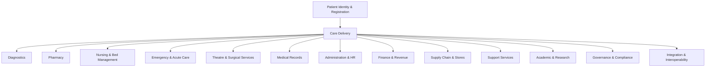
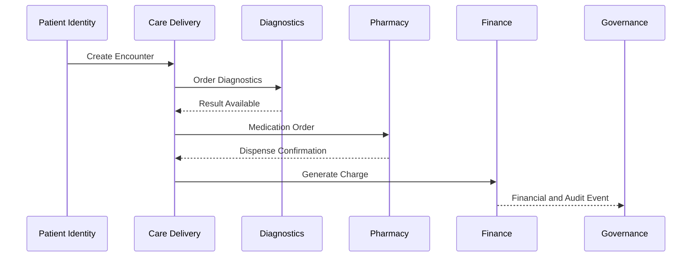
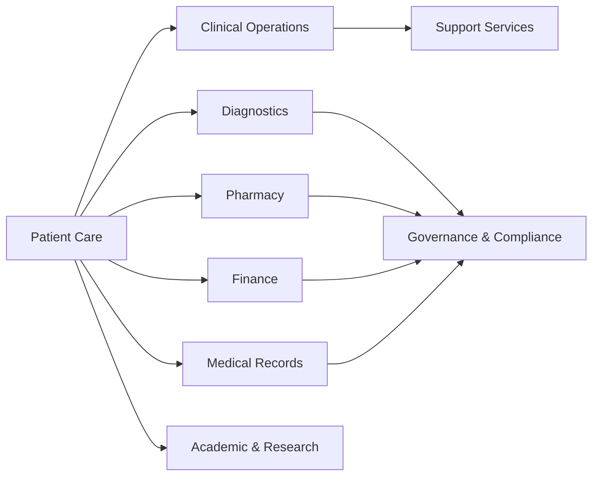

# Domain-Driven Architecture

## Purpose

This document defines the domain-driven architecture strategy for the Hospital Operating System (HOS) and its first implementation, the JUTH Digital Management System (JDMS). It translates the hospital business architecture into a modular software architecture organized around business domains, bounded contexts, and well-defined domain services.

The adoption of Domain-Driven Design (DDD) is necessary because a hospital is not a single workflow. It is a complex enterprise made up of clinical, administrative, financial, academic, research, and support domains, each with its own language, rules, stakeholders, and data obligations. DDD provides the structural discipline needed to model that complexity without turning the platform into an unmanageable monolith.

## Status

- Status: Draft
- Version: 0.1.0
- Owner: Enterprise Domain Architecture Team
- Audience: Architects, developers, clinicians, administrators, product teams, and engineering leads

## Scope

This document covers:

- why DDD is being adopted for HOS
- the business domains that must be modeled
- bounded contexts for each domain
- core entities, shared services, events, APIs, and dependencies
- inter-domain communication patterns
- anti-corruption layers for legacy and external systems
- how DDD aligns with Clean Architecture and modular platform development
- cross-references to the business and system architecture documents

## Related Project Documents

- [Project Charter](../../README.md)
- [Documentation Index](../DOCUMENT_INDEX.md)
- [Hospital Business Architecture](HOSPITAL_BUSINESS_ARCHITECTURE.md)
- [System Architecture](SYSTEM_ARCHITECTURE.md)
- [HOS Engineering Handbook](../25_Project_Operations/HOS_ENGINEERING_HANDBOOK.md)

---

## 1. Why Domain-Driven Design Is Being Adopted

HOS is intended to serve as a long-lived enterprise platform for hospitals, not as a one-off application. Hospital operations are highly specialized and deeply interconnected. Clinical care, billing, pharmacy, diagnostics, nursing, emergency, theatre, records, governance, and support services all have distinct business logic and terminology.

DDD is being adopted because it allows the platform to:

- model the hospital as a set of business domains rather than a collection of technical features
- preserve domain boundaries as the system grows in size and complexity
- reduce coupling between modules that should evolve independently
- improve clarity for clinicians, administrators, and engineers working from the same domain language
- support future multi-hospital and statewide deployment without structural rework

DDD is especially valuable in healthcare because domain rules are often safety-critical, regulatory, and context-sensitive. A domain-centric structure helps ensure that those rules remain explicit and maintainable.

---

## 2. Architectural Principles

The domain-driven architecture for HOS will follow these principles:

- align software design with real business capabilities
- define clear bounded contexts for each business area
- keep domain logic close to the business problem it solves
- use explicit contracts for inter-domain communication
- isolate external and legacy integrations behind anti-corruption layers
- keep shared infrastructure and cross-cutting concerns separate from domain logic
- preserve auditability, traceability, and compliance across domains

---

## 3. Business Domain Map

The hospital enterprise can be represented as a set of core and supporting business domains.

### Business Domains

- Patient Identity and Registration
- Care Delivery
- Diagnostics
- Pharmacy
- Nursing and Bed Management
- Emergency and Acute Care
- Theatre and Surgical Services
- Medical Records and Documentation
- Administration and Human Resources
- Finance and Revenue
- Supply Chain and Stores
- Support Services and Facilities
- Academic and Research
- Governance, Quality, and Compliance
- Integration and Interoperability

---

## 4. Domain Catalog

Each domain should be implemented as a bounded context with clear ownership, language, and interfaces.

### 4.1 Patient Identity and Registration

- Responsibilities: maintain patient identity, demographic data, registration workflows, encounter initiation, and referral intake
- Bounded Context: Patient Administration
- Core Entities: Patient, Visit, Encounter, DemographicProfile, Identifier, Referral
- Shared Services: identity verification, audit logging, notification, document management
- Events: PatientRegistered, VisitCreated, EncounterOpened, ReferralReceived
- APIs: /patients, /visits, /encounters, /referrals
- Dependencies: Care Delivery, Medical Records, Finance, Administration

### 4.2 Care Delivery

- Responsibilities: manage clinical workflows, treatment plans, discharge planning, care transitions, and departmental coordination
- Bounded Context: Clinical Care Management
- Core Entities: CarePlan, EpisodeOfCare, Order, ClinicalNote, DischargeSummary, TreatmentPathway
- Shared Services: workflow orchestration, authorization, scheduling, notifications, audit trail
- Events: CarePlanCreated, OrderPlaced, TreatmentCompleted, DischargeInitiated
- APIs: /care-plans, /orders, /episodes, /discharges
- Dependencies: Patient Identity, Diagnostics, Pharmacy, Nursing, Medical Records, Finance

### 4.3 Diagnostics

- Responsibilities: coordinate laboratory, radiology, pathology, and other diagnostic services and results delivery
- Bounded Context: Diagnostic Services
- Core Entities: DiagnosticOrder, Specimen, TestResult, ImagingStudy, Report, ResultStatus
- Shared Services: result routing, result validation, terminology services, notifications
- Events: DiagnosticOrderPlaced, SpecimenCollected, ResultReady, ReportPublished
- APIs: /diagnostic-orders, /results, /imaging-studies, /reports
- Dependencies: Care Delivery, Medical Records, Laboratory/Radiology Systems, Pharmacy

### 4.4 Pharmacy

- Responsibilities: manage medication prescribing, dispensing, stock control, medication safety, and reconciliation
- Bounded Context: Medication Management
- Core Entities: Prescription, MedicationOrder, Dispensation, StockItem, Formulary, MedicationAlert
- Shared Services: drug interaction checking, inventory validation, audit trail, expiry monitoring
- Events: PrescriptionReceived, MedicationDispensed, StockReplenished, AllergyAlertRaised
- APIs: /prescriptions, /dispensations, /stock-items, /alerts
- Dependencies: Care Delivery, Stores, Finance, Clinical Safety Services

### 4.5 Nursing and Bed Management

- Responsibilities: manage ward operations, patient observation, handover, bed allocation, and nursing workflows
- Bounded Context: Nursing Operations
- Core Entities: Ward, Bed, Shift, Observation, CareRound, HandoverRecord
- Shared Services: task management, bed allocation, staffing coordination, notifications
- Events: BedAssigned, ObservationRecorded, ShiftStarted, HandoverCompleted
- APIs: /beds, /observations, /shifts, /handover
- Dependencies: Care Delivery, Emergency, Theatre, Administration

### 4.6 Emergency and Acute Care

- Responsibilities: manage triage, emergency treatment, admission decisions, transfers, and urgent clinical workflows
- Bounded Context: Emergency Services
- Core Entities: TriageCase, EmergencyEncounter, TransferRequest, CriticalAlert, ResuscitationEvent
- Shared Services: triage protocols, escalation, bed availability, incident logging
- Events: TriageCompleted, CriticalAlertRaised, TransferRequested, PatientStabilized
- APIs: /triage, /emergency-encounters, /transfers, /alerts
- Dependencies: Care Delivery, Diagnostics, Nursing, Transport, Theatre

### 4.7 Theatre and Surgical Services

- Responsibilities: manage surgical scheduling, perioperative workflows, theatre utilization, and post-operative handover
- Bounded Context: Perioperative Management
- Core Entities: SurgerySchedule, Procedure, OperationNote, SurgicalTeam, RecoveryRecord
- Shared Services: scheduling, resource allocation, sterile supply coordination, theatre readiness
- Events: SurgeryScheduled, ProcedureStarted, ProcedureCompleted, RecoveryLogged
- APIs: /surgery-schedules, /procedures, /recovery-records
- Dependencies: Care Delivery, Nursing, Pharmacy, Diagnostics, Accounts

### 4.8 Medical Records and Documentation

- Responsibilities: manage patient documentation, chart completeness, records retrieval, retention, and access governance
- Bounded Context: Clinical Records Management
- Core Entities: MedicalRecord, Document, DocumentIndex, ArchiveEntry, AccessLog
- Shared Services: document versioning, retention policy enforcement, audit access, indexing
- Events: DocumentCreated, RecordRequested, RecordArchived, AccessDenied
- APIs: /records, /documents, /archives, /access-logs
- Dependencies: Care Delivery, Patient Identity, Governance, ICT

### 4.9 Administration and Human Resources

- Responsibilities: manage staff records, roles, approvals, departments, leave, attendance, and institutional administration
- Bounded Context: HR and Administration
- Core Entities: StaffMember, Role, Department, LeaveRequest, AttendanceRecord, ApprovalWorkflow
- Shared Services: role management, approval engine, directory services, notifications
- Events: StaffOnboarded, LeaveRequested, ApprovalCompleted, RoleAssigned
- APIs: /staff, /roles, /leave-requests, /approvals
- Dependencies: Identity Services, Finance, Governance, Clinical Operations

### 4.10 Finance and Revenue

- Responsibilities: manage billing, payment posting, claims processing, reimbursement, and financial reporting
- Bounded Context: Revenue Cycle Management
- Core Entities: Invoice, Payment, Claim, Reimbursement, Budget, LedgerEntry
- Shared Services: billing rules engine, claims validation, payment reconciliation, reporting
- Events: InvoiceGenerated, PaymentPosted, ClaimSubmitted, ReimbursementReceived
- APIs: /invoices, /payments, /claims, /reimbursements
- Dependencies: Care Delivery, Patient Identity, NHIA/Insurer Interfaces, Accounts

### 4.11 Supply Chain and Stores

- Responsibilities: manage procurement, inventory, stock movement, expiry monitoring, and supply distribution
- Bounded Context: Supply Chain Management
- Core Entities: Requisition, PurchaseOrder, StockItem, StockMovement, Supplier, ExpiryRecord
- Shared Services: inventory reconciliation, stock alerts, vendor management, procurement workflow
- Events: RequisitionRaised, PurchaseOrderApproved, StockIssued, StockLow
- APIs: /requisitions, /purchase-orders, /stock-items, /suppliers
- Dependencies: Pharmacy, Laboratory, Radiology, Maintenance, Finance

### 4.12 Support Services and Facilities

- Responsibilities: manage maintenance, transport, security, facilities requests, and operational continuity
- Bounded Context: Facilities and Operations
- Core Entities: ServiceRequest, WorkOrder, Asset, Vehicle, Incident, MaintenanceSchedule
- Shared Services: asset tracking, work-order routing, incident response, operations monitoring
- Events: ServiceRequested, WorkOrderCreated, IncidentReported, AssetMaintained
- APIs: /service-requests, /work-orders, /assets, /incidents
- Dependencies: Administration, Engineering, ICT, Stores

### 4.13 Academic and Research

- Responsibilities: manage training records, rotations, research proposals, ethics review, and publication workflows
- Bounded Context: Academic and Research Management
- Core Entities: Trainee, Rotation, Study, Protocol, EthicsApproval, Publication
- Shared Services: training coordination, study administration, approvals, data access governance
- Events: RotationAssigned, StudyApproved, PublicationSubmitted, EthicsReviewCompleted
- APIs: /trainees, /rotations, /studies, /protocols
- Dependencies: Care Delivery, Medical Records, Governance, Administration

### 4.14 Governance, Quality, and Compliance

- Responsibilities: manage policy governance, quality initiatives, audit readiness, incident review, and regulatory compliance
- Bounded Context: Governance and Assurance
- Core Entities: Policy, AuditFinding, IncidentCase, QualityMetric, RiskRegister
- Shared Services: policy workflow, audit reporting, quality dashboards, compliance monitoring
- Events: AuditTriggered, IncidentLogged, PolicyUpdated, RiskEscalated
- APIs: /policies, /audits, /incidents, /quality-metrics
- Dependencies: All operational domains, Executive Management, ICT

### 4.15 Integration and Interoperability

- Responsibilities: connect HOS with internal modules, third-party services, external laboratories, imaging systems, insurers, and national platforms
- Bounded Context: Integration Backbone
- Core Entities: IntegrationContract, Connector, MessageRoute, TransformationRule, EventSubscription
- Shared Services: API gateway, message broker, schema registry, transformation engine, monitoring
- Events: IntegrationFailed, MessagePublished, DataSynced, ContractValidated
- APIs: /integrations, /connectors, /events, /transformations
- Dependencies: All domains, external health systems, identity providers

---

## 5. Inter-Domain Communication

Domains should communicate through explicit contracts rather than direct shared implementation details.

### Recommended communication patterns

- synchronous APIs for immediate transactional interactions
- asynchronous events for domain state changes and downstream notifications
- command-based workflows for high-value business processes such as admission, discharge, billing, or claims submission
- shared read models for analytics and reporting where strong consistency is not required

### Communication rules

- domains must not share mutable state directly
- each interaction should be purposeful and documented
- business events should remain domain-specific and semantically meaningful

---

## 6. Anti-Corruption Layers

External systems, legacy platforms, and third-party services often use terminology and models that differ from HOS domain concepts. These must not leak directly into core domain logic.

### Anti-corruption layer responsibilities

- translate external data structures into HOS domain models
- adapt external terminology to hospital-aligned language
- prevent legacy or external implementation details from contaminating core domains
- isolate change impact from third-party systems

### Typical anti-corruption layer use cases

- legacy hospital information systems
- external laboratory or imaging interfaces
- insurer or NHIA claim submission adapters
- existing enterprise resource planning systems
- older document and records repositories

---

## 7. Alignment with Clean Architecture

DDD aligns naturally with Clean Architecture because both approaches seek to keep business rules at the center of the system.

### Alignment model

- Domain layer: contains business rules, entities, value objects, aggregates, and domain services
- Application layer: coordinates use cases, workflows, and orchestration
- Infrastructure layer: provides persistence, messaging, integrations, and external services
- Interface layer: exposes APIs, user interfaces, and integration endpoints

This structure ensures that core clinical and institutional rules remain independent from infrastructure concerns such as databases, message brokers, or UI frameworks.

### Why this matters for HOS

- clinical rules remain stable even as technology changes
- modules can be added, replaced, or upgraded without destabilizing the full platform
- the platform can support future multi-hospital deployment and evolving compliance requirements

---

## 8. Modular Development and Platform Evolution

DDD supports modular development by encouraging each domain to be developed as a cohesive and replaceable capability.

### Modular development benefits

- domain teams can own specific modules independently
- deployment can be staged by priority and risk
- shared services remain reusable across modules
- architecture can absorb future growth without forcing a rewrite

### Evolution path for HOS

1. establish core patient, care, and administration domains
2. expand diagnostics, pharmacy, and reporting capabilities
3. add emergency, theatre, and specialty workflows
4. introduce enterprise analytics, AI services, and cross-hospital orchestration

---

## 9. Cross-Reference to Architecture Documents

This document should be used alongside the following foundational architecture artifacts:

- [Hospital Business Architecture](HOSPITAL_BUSINESS_ARCHITECTURE.md): defines the hospital’s business model and operating domains
- [System Architecture](SYSTEM_ARCHITECTURE.md): defines the technical platform structure, services, and infrastructure layers
- [HOS Engineering Handbook](../25_Project_Operations/HOS_ENGINEERING_HANDBOOK.md): defines engineering standards, governance, and delivery discipline

The domain model should remain consistent with these documents as the platform matures.

---

## 10. Governance and Delivery Expectations

The DDD model must be maintained over time through disciplined engineering practices:

- every new domain or bounded context must be documented
- changes to domain boundaries must be reviewed and approved
- shared services must be justified as enterprise-wide and reused deliberately
- integration patterns must be standardized and versioned
- domain events and APIs must remain backward-compatible where possible

---

## 11. Summary

Domain-Driven Design provides the architectural discipline required to build HOS as a sustainable, modular, and clinically grounded hospital platform. By organizing the system around hospital domains, bounded contexts, and explicit contracts, HOS can evolve from a single implementation into a broader enterprise platform without losing coherence, safety, or maintainability.

## Revision History

| Version | Date | Summary |
| --- | --- | --- |
| 0.1.0 | 2026-07-07 | Initial publication of the domain-driven architecture strategy for HOS |

## 4. Shared Kernel and Cross-Cutting Capabilities

Some concepts must be shared across domains because they are enterprise-wide and strategic.

### Shared Kernel Candidates

- patient identity
- user and role identity
- organization and department reference data
- clinical coding and terminology
- document and record metadata
- audit trail and event logging
- reporting and dashboard definitions

### Cross-Cutting Services

- identity and access management
- notification and messaging
- workflow orchestration
- integration and interoperability services
- analytics and reporting services
- audit and compliance services
- configuration management

---

## 5. Domain Relationships

Domains must interact through explicit boundaries rather than implicit shared logic.

### Relationship Principles

- dependencies should be intentional and documented
- cross-domain interactions should use well-defined contracts
- shared concepts should be minimized unless truly enterprise-wide
- domain boundaries should remain stable as the platform evolves

---

## 6. Domain Service Mapping

Each domain should expose explicit capabilities that can be implemented as services or modules.

| Domain | Core Services | Typical Consumers |
| --- | --- | --- |
| Patient Care | patient registration, encounter management, admission, discharge | clinicians, nursing, billing, medical records |
| Clinical Operations | scheduling, ward management, task orchestration | departments, nursing, administration |
| Diagnostics | order management, result delivery, reporting | clinicians, labs, radiology |
| Pharmacy | medication ordering, dispensing, inventory | clinicians, pharmacy, stores |
| Administrative | staff administration, approvals, workflows | executives, HR, support units |
| Finance | billing, claims, payments, budgets | accounts, NHIA, management |
| Support Services | maintenance, transport, security, facilities | operations, departments |
| Academic & Research | training coordination, study management | faculty, trainees, investigators |
| Governance | audit, compliance, risk, quality | leadership, regulators, internal teams |

---

## 7. Implementation Strategy

The architecture should be implemented using a modular service-oriented approach.

### Recommended approach

- implement each bounded context as a cohesive module or service
- enforce clear interfaces between domains
- preserve domain language in APIs, models, and documentation
- use shared platform services sparingly and deliberately
- allow independent deployment where appropriate

### Evolution path

- begin with a core set of domains around patient care, billing, clinical operations, and administration
- expand into diagnostics, specialty clinics, pharmacy, research, and support services
- later evolve into multi-hospital and statewide capabilities

---

## 8. Domain-Driven Design Rules

The following rules must guide implementation:

- domains must reflect hospital business reality
- each domain must have clear ownership and responsibility
- business language should be reflected in code and documentation
- cross-domain communication must use explicit contracts
- shared concepts must be governed to avoid domain leakage
- domain changes must be reviewed for impact on related contexts

---

## 9. Architectural Implications for HOS Modules

This domain-driven structure becomes the foundation for software module design by informing:

- module boundaries
- service decomposition
- data ownership and persistence strategy
- API contracts
- reporting structures
- role-based access design
- integration architecture
- future platform scalability

---

## 10. Summary

Domain-driven architecture ensures that HOS remains grounded in the real operations of the hospital. By organizing the platform around business domains and bounded contexts, the system becomes modular, understandable, extensible, and aligned with clinical and institutional reality.

## Revision History

| Version | Date | Summary |
| --- | --- | --- |
| 0.1.0 | 2026-07-07 | Initial publication of the domain-driven architecture model |
