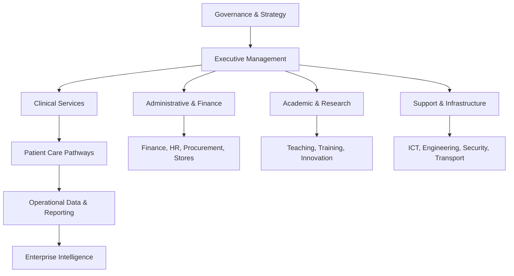
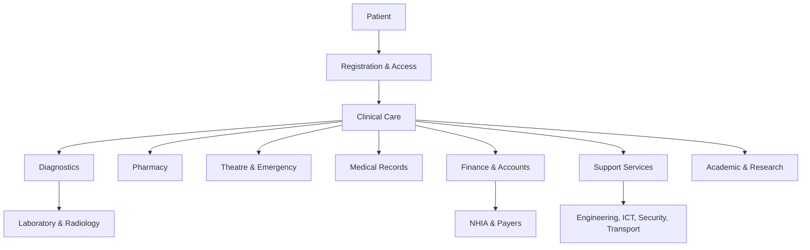

# Hospital Business Architecture

## Purpose

This document defines the enterprise business architecture of a tertiary teaching hospital and serves as the foundational reference for the Hospital Operating System (HOS) and its first implementation, the JUTH Digital Management System (JDMS). It models the hospital as an integrated enterprise of clinical, academic, research, administrative, financial, operational, and support functions.

This architecture is intended to guide software module design, workflow automation, data modeling, reporting, interoperability, and future digital transformation.

## Status

- Status: Draft
- Version: 0.1.0
- Owner: Healthcare Enterprise Architecture Team
- Audience: Architects, product managers, clinicians, administrators, engineers, ICT teams, and planners

## Scope

This document models a tertiary teaching hospital with the following domains:

- hospital governance and executive management
- clinical departments and patient care pathways
- academic and research units
- financial and administrative services
- support services, logistics, engineering, and ICT
- specialized services such as Eye Clinic, emergency, theatre, pharmacy, laboratory, radiology, and medical records

## Related Project Documents

- [Project Charter](../../README.md)
- [Documentation Index](../DOCUMENT_INDEX.md)
- [System Vision](../02_System_Vision/SYSTEM_VISION.md)
- [Software Requirements Specification](../03_Requirements/SOFTWARE_REQUIREMENTS_SPECIFICATION.md)
- [System Architecture](SYSTEM_ARCHITECTURE.md)
- [HOS Engineering Handbook](../25_Project_Operations/HOS_ENGINEERING_HANDBOOK.md)

---

## 1. Enterprise Context

A tertiary teaching hospital operates as a complex healthcare enterprise that combines:

- patient care delivery
- training of medical and allied health professionals
- medical research and innovation
- administrative and financial governance
- operational support and infrastructure services

The hospital is therefore not merely a care facility, but a multi-dimensional institution that must coordinate people, processes, policies, data, infrastructure, and governance.

### Enterprise Objectives

- deliver safe, timely, and high-quality patient care
- support clinical teaching and residency training
- enable research and innovation
- ensure financial sustainability and accountability
- maintain compliance, auditability, and operational resilience
- provide data-driven decision support at executive and operational levels

### Enterprise Value Streams

- patient access and registration
- outpatient and inpatient care delivery
- diagnostics and treatment workflows
- discharge, follow-up, and continuity of care
- finance and reimbursement management
- staffing, logistics, and infrastructure support
- strategic reporting and performance management

---

## 2. Enterprise Operating Model

### Core Business Capabilities

- patient registration and identity management
- clinical service delivery
- diagnostics and pharmacy services
- financial management and claims processing
- human resource administration
- asset, facility, and maintenance management
- academic administration and training coordination
- research governance and knowledge management
- enterprise reporting and performance monitoring

---

## 3. Hospital Governance

### Purpose

To provide strategic oversight, policy direction, accountability, and compliance assurance for the hospital enterprise.

### Responsibilities

- set strategy and institutional priorities
- approve policies and governance frameworks
- oversee quality, safety, compliance, and ethics
- coordinate executive decision-making
- monitor institutional performance and risk

### Business Processes

- strategic planning
- policy approval and review
- board and executive committee meetings
- risk and compliance monitoring
- quality assurance and audit coordination

### Interactions

- interacts with executive management, clinical departments, finance, procurement, HR, and regulatory bodies
- receives performance and risk reports from operational units
- provides direction to institutional transformation initiatives

### Data Produced

- policy documents
- board minutes
- strategic plans
- compliance reports
- risk registers
- performance dashboards

### Reports

- monthly institutional performance report
- risk and compliance dashboard
- quality and patient safety report
- strategic initiative status report

### KPIs

- patient satisfaction index
- clinical quality indicators
- audit findings rate
- compliance rate
- turnaround on strategic initiatives

### Future Digital Opportunities

- governance dashboards
- policy workflow automation
- enterprise risk intelligence
- digital board reporting

---

## 4. Executive Management

### Purpose

To lead the hospital’s day-to-day operations, align departments, support service delivery, and oversee institutional performance.

### Responsibilities

- operational leadership and coordination
- departmental performance oversight
- service delivery management
- budget monitoring and resource allocation
- implementation of strategic plans

### Business Processes

- executive operations review
- performance management meetings
- incident escalation and issue resolution
- resource prioritization
- interdepartmental coordination

### Interactions

- works with all departments and service lines
- receives operational and financial reports
- coordinates with governance bodies and external partners

### Data Produced

- executive summaries
- operational reports
- capacity and utilization data
- incident and escalation logs

### Reports

- executive dashboard
- departmental KPI performance report
- service delivery and utilization report
- operational risk report

### KPIs

- average turnaround time for escalations
- service uptime and continuity
- departmental performance score
- budget variance ratio

### Future Digital Opportunities

- enterprise command center
- real-time operational dashboards
- AI-assisted decision support
- predictive capacity planning

---

## 5. Clinical Departments

### Purpose

To provide safe, effective, and coordinated patient care across outpatient, inpatient, emergency, diagnostic, and surgical services.

### Responsibilities

- patient assessment and treatment
- admission, discharge, and referral management
- care coordination across specialties
- documentation of clinical encounters
- adherence to clinical protocols and quality standards

### Business Processes

- patient registration and triage
- consultation and treatment planning
- admission and ward management
- discharge and referral
- case review and clinical handover

### Interactions

- interfaces with nursing, pharmacy, laboratory, radiology, medical records, emergency, theatre, accounts, and ICT
- depends on shared patient records and diagnostic services

### Data Produced

- patient demographics
- diagnoses and treatment plans
- inpatient and outpatient encounters
- discharge summaries
- clinical notes and orders

### Reports

- patient census report
- morbidity and mortality review report
- outpatient and inpatient utilization report
- quality of care indicators

### KPIs

- length of stay
- patient wait time
- medication error rate
- readmission rate
- bed occupancy rate

### Future Digital Opportunities

- computerized clinical workflows
- clinical decision support
- bedside documentation automation
- integrated care pathways

---

## 6. Administrative Departments

### Purpose

To support the non-clinical operations of the hospital, ensure compliance, and maintain institutional efficiency.

### Responsibilities

- human resource administration
- general administration and records management
- policy implementation
- coordination of support activities
- institutional documentation and correspondence

### Business Processes

- staff administration
- leave and attendance management
- document circulation and approvals
- institutional correspondence
- service request handling

### Interactions

- connected to HR, finance, procurement, stores, ICT, security, and executive management

### Data Produced

- employee records
- attendance logs
- institutional documents
- service requests
- administrative reports

### Reports

- staff administration report
- service request summary
- policy compliance report
- document tracking summary

### KPIs

- turnaround time for requests
- staff attendance rate
- document processing time
- administrative service satisfaction

### Future Digital Opportunities

- workflow automation for approvals
- digital document management
- self-service HR and admin portals

---

## 7. Academic Units

### Purpose

To support training, teaching, and professional development for medical and allied health students and trainees.

### Responsibilities

- training program coordination
- postgraduate and undergraduate teaching support
- internship and residency management
- academic records and assessments
- curriculum and educational planning

### Business Processes

- student and trainee registration
- clinical posting coordination
- assessment and evaluation
- lecture and rotation scheduling
- examination and certification support

### Interactions

- interacts with clinical departments, medical records, administration, and hospital operations
- depends on access to patient care environments and educational data

### Data Produced

- trainee records
- posting schedules
- assessment results
- academic reports
- training attendance logs

### Reports

- training attendance report
- academic performance report
- posting completion report
- staff teaching load report

### KPIs

- trainee completion rate
- teaching hours delivered
- assessment pass rate
- posting compliance rate

### Future Digital Opportunities

- academic management system
- learning analytics
- digital trainee logbooks
- integrated academic-clinical workflows

---

## 8. Research Units

### Purpose

To support research governance, ethics review, scientific innovation, and evidence generation.

### Responsibilities

- implement research policies and ethics oversight
- manage study approvals and documentation
- coordinate with clinical departments and investigators
- support publication and knowledge transfer

### Business Processes

- research proposal submission
- ethics review and approval
- study coordination and monitoring
- data collection and reporting
- publication and dissemination

### Interactions

- interacts with clinical departments, academic units, ICT, and institutional ethics committees

### Data Produced

- research protocols
- ethics approvals
- study data sets
- publications and reports

### Reports

- research activity report
- ethics review report
- publication and grant report

### KPIs

- number of active studies
- ethics approval turnaround time
- publication output
- grant acquisition rate

### Future Digital Opportunities

- research information management platform
- clinical data integration for research
- AI-assisted literature and evidence review

---

## 9. Financial Units

### Purpose

To manage hospital revenue, financial controls, reimbursement, budgeting, and financial reporting.

### Responsibilities

- revenue cycle management
- budgeting and cost control
- billing and claims processing
- payment reconciliation
- financial reporting and audit support

### Business Processes

- patient billing
- payment posting
- insurance and NHIA claims submission
- budget preparation and monitoring
- financial close and reporting

### Interactions

- interfaces with accounts, NHIA, clinical services, billing teams, procurement, and stores

### Data Produced

- invoices
- payment records
- claims submissions
- budgets
- expenditure reports

### Reports

- revenue report
- expenditure report
- payer reconciliation report
- budget variance report

### KPIs

- collection rate
- claim turnaround time
- accounts receivable aging
- budget variance

### Future Digital Opportunities

- automated revenue cycle management
- predictive cash flow analytics
- digital claims and reimbursement workflow

---

## 10. Support Services

### Purpose

To ensure the hospital environment is safe, functional, and operationally sustainable.

### Responsibilities

- maintain infrastructure and environment
- support logistics and service continuity
- coordinate internal service requests and responsiveness

### Business Processes

- work order management
- facilities coordination
- service request handling
- utility and environment monitoring
- incident response

### Interactions

- works with maintenance, engineering, ICT, security, transport, stores, and clinical departments

### Data Produced

- work orders
- maintenance logs
- service requests
- infrastructure performance records

### Reports

- maintenance report
- facilities utilization report
- service request trends

### KPIs

- downtime frequency
- service request turnaround time
- preventive maintenance compliance
- incident resolution time

### Future Digital Opportunities

- computerized maintenance management
- facilities monitoring dashboards
- predictive maintenance

---

## 11. Engineering

### Purpose

To provide technical infrastructure support for hospital buildings, utilities, equipment, and operational systems.

### Responsibilities

- maintain physical infrastructure
- ensure utilities and equipment reliability
- support hospital expansion and renovation projects
- coordinate preventive and corrective maintenance

### Business Processes

- maintenance planning
- equipment servicing
- facility projects
- failure investigation
- infrastructure monitoring

### Interactions

- interfaces with maintenance, ICT, procurement, stores, clinical departments, and security

### Data Produced

- asset registers
- work orders
- equipment service records
- maintenance budgets

### Reports

- maintenance performance report
- equipment downtime report
- project status report

### KPIs

- equipment availability
- preventive maintenance compliance
- mean time to repair
- project completion timeliness

### Future Digital Opportunities

- asset lifecycle management
- IoT-based facility monitoring
- predictive equipment maintenance

---

## 12. ICT

### Purpose

To enable digital operations, connectivity, system support, cybersecurity, and information management across the hospital.

### Responsibilities

- manage infrastructure, applications, and data platforms
- support user computing and service availability
- implement cyber and information security controls
- maintain integration and interoperability services

### Business Processes

- service desk operations
- system administration
- incident and problem management
- application support
- cybersecurity monitoring

### Interactions

- interacts with all departments, especially clinical, finance, records, pharmacy, lab, radiology, and administration

### Data Produced

- incident logs
- system access records
- configuration records
- integration logs
- service performance data

### Reports

- IT service report
- service availability report
- incident trend report
- cybersecurity status report

### KPIs

- system uptime
- mean time to resolution
- incident volume
- patch compliance rate

### Future Digital Opportunities

- enterprise digital platform
- interoperability layer
- AI-enabled support services
- cybersecurity analytics

---

## 13. Medical Records

### Purpose

To maintain the integrity, confidentiality, accessibility, and archival quality of patient records and institutional information.

### Responsibilities

- record creation and filing
- records retrieval and release
- archiving and retention governance
- confidentiality and access control
- discharge summary and document management

### Business Processes

- record registration
- chart assembly and tracking
- retrieval and release of records
- index maintenance
- archive and retention management

### Interactions

- interfaces with clinical departments, admissions, legal/compliance, ICT, and accreditation bodies

### Data Produced

- patient charts
- index records
- discharge summaries
- archive metadata
- access logs

### Reports

- records utilization report
- archive status report
- release request report
- compliance and retention report

### KPIs

- record retrieval turnaround time
- completeness of records
- retention compliance rate
- access audit compliance

### Future Digital Opportunities

- electronic health record lifecycle management
- smart document capture
- automated record indexing

---

## 14. Pharmacy

### Purpose

To ensure safe, effective, and accountable medication management for patients and clinical services.

### Responsibilities

- medication dispensing
- prescription review and validation
- inventory and stock control
- adverse event monitoring
- formulary and medication safety management

### Business Processes

- order processing
- dispensing and distribution
- stock replenishment
- medication reconciliation
- reporting of medication incidents

### Interactions

- interacts with clinical departments, stores, laboratory, accounts, and medical records

### Data Produced

- prescriptions
- dispensing records
- stock movement data
- drug usage reports
- adverse event records

### Reports

- stock usage report
- dispensing summary report
- medication error report
- inventory valuation report

### KPIs

- dispensing turnaround time
- stockout rate
- medication error rate
- expiry compliance rate

### Future Digital Opportunities

- e-prescribing and dispensing integration
- barcode-enabled medication administration
- predictive pharmaceutical inventory planning

---

## 15. Laboratory

### Purpose

To provide reliable diagnostic testing services that support clinical decision-making.

### Responsibilities

- specimen collection and processing
- test execution and result reporting
- quality assurance and calibration
- referral and turnaround time management

### Business Processes

- order intake and specimen tracking
- testing and verification
- result release
- quality control and audit

### Interactions

- interacts with clinicians, pharmacy, radiology, medical records, and ICT

### Data Produced

- orders
- specimen data
- test results
- quality control records

### Reports

- turnaround time report
- quality assurance report
- utilization report
- critical result report

### KPIs

- turnaround time
- error rate
- specimen rejection rate
- quality compliance rate

### Future Digital Opportunities

- LIS integration
- automated result routing
- laboratory analytics and AI-assisted interpretation

---

## 16. Radiology

### Purpose

To provide imaging and diagnostic services that support care delivery, treatment planning, and follow-up.

### Responsibilities

- imaging request handling
- image acquisition and interpretation
- report generation and communication
- quality control and radiation safety

### Business Processes

- order entry
- image acquisition
- image review and reporting
- result distribution

### Interactions

- interacts with clinical departments, laboratory, pharmacy, medical records, ICT, and external referral sites

### Data Produced

- imaging orders
- image studies
- radiology reports
- quality logs

### Reports

- imaging utilization report
- turnaround time report
- critical finding report
- quality and safety report

### KPIs

- turnaround time
- report accuracy rate
- equipment availability
- image rejection rate

### Future Digital Opportunities

- PACS integration
- AI-assisted image analysis
- workflow automation and result routing

---

## 17. Nursing

### Purpose

To provide direct patient care, coordination, monitoring, and education in support of clinical outcomes.

### Responsibilities

- patient assessment and care delivery
- medication administration support
- observation and escalation
- patient education and advocacy
- ward coordination and handover

### Business Processes

- shift handover
- patient observation and monitoring
- medication administration support
- care plan execution
- discharge preparation

### Interactions

- interfaces with physicians, pharmacy, laboratory, radiology, medical records, and administrative teams

### Data Produced

- care notes
- observation records
- vital signs
- nursing handover notes
- incident reports

### Reports

- nursing workload report
- care quality report
- incident report summary
- staffing utilization report

### KPIs

- nurse-to-patient ratio
- pressure ulcer incidence
- medication administration compliance
- handover completeness

### Future Digital Opportunities

- bedside digital documentation
- smart monitoring integration
- workflow automation for rounding and handover

---

## 18. Theatre

### Purpose

To provide safe and efficient surgical and procedural care in a controlled environment.

### Responsibilities

- surgical scheduling and preparation
- perioperative care and coordination
- sterile supply and instrument readiness
- operating room utilization management

### Business Processes

- pre-operative preparation
- surgery scheduling
- intraoperative coordination
- postoperative recovery and handover

### Interactions

- interacts with surgeons, anaesthesia, nursing, pharmacy, laboratory, accounts, medical records, and ICT

### Data Produced

- surgery schedules
- operative notes
- inventory usage records
- postoperative notes

### Reports

- theatre utilization report
- turnaround time report
- case cancellation report
- surgical outcomes summary

### KPIs

- theatre utilization rate
- cancellation rate
- case turnaround time
- infection control compliance

### Future Digital Opportunities

- theatre management system
- perioperative digital workflow
- predictive scheduling and resource planning

---

## 19. Emergency

### Purpose

To provide rapid assessment, stabilization, and referral for acute and emergency patients.

### Responsibilities

- initial triage and stabilization
- emergency consultation and treatment
- patient tracking and flow management
- referral and transfer coordination

### Business Processes

- triage and registration
- emergency intervention
- transfer and admission decisions
- discharge and follow-up decisions

### Interactions

- interfaces with clinical departments, nursing, radiology, laboratory, pharmacy, transport, security, and ICT

### Data Produced

- triage records
- emergency notes
- referral and transfer records
- incident logs

### Reports

- emergency throughput report
- wait time report
- admission and referral report
- incident and response report

### KPIs

- triage time
- door-to-doctor time
- length of stay in emergency
- mortality and adverse event rate

### Future Digital Opportunities

- emergency workflow automation
- real-time bed management
- incident and triage analytics

---

## 20. Eye Clinic

### Purpose

To provide specialized ophthalmic care, diagnosis, treatment, and follow-up services.

### Responsibilities

- outpatient eye consultations
- imaging and diagnostic support
- surgical and specialist treatment pathways
- follow-up and referral management

### Business Processes

- appointment booking
- examination and diagnosis
- treatment and surgery coordination
- follow-up scheduling

### Interactions

- interacts with ophthalmology, nursing, records, pharmacy, radiology, accounts, and ICT

### Data Produced

- patient encounters
- diagnostic findings
- treatment plans
- clinic reports

### Reports

- clinic attendance report
- surgical volume report
- follow-up compliance report
- service utilization report

### KPIs

- clinic attendance rate
- turnaround time for consultation
- surgery completion rate
- patient follow-up rate

### Future Digital Opportunities

- specialty clinic workflow system
- ophthalmic diagnostics integration
- AI-assisted image and fundus analysis

---

## 21. NHIA

### Purpose

To manage third-party reimbursement, insurance claims, and payer interactions for eligible services.

### Responsibilities

- claim preparation and submission
- claim tracking and follow-up
- reimbursement reconciliation
- coordination with financial and clinical departments

### Business Processes

- patient eligibility verification
- claim generation
- claim submission and response handling
- dispute and reconciliation management

### Interactions

- interfaces with accounts, billing, clinical departments, and patient administration

### Data Produced

- claim records
- eligibility data
- reimbursement status records
- adjustment notes

### Reports

- claim submission report
- reimbursement status report
- aging report
- denial trend report

### KPIs

- claim turnaround time
- reimbursement rate
- denial rate
- reconciliation accuracy

### Future Digital Opportunities

- digital claims workflow
- payer integration and status tracking
- analytics for reimbursement optimization

---

## 22. Accounts

### Purpose

To manage financial transactions, ledger operations, receivables, and payment processing.

### Responsibilities

- posting payments and receipts
- maintaining financial ledgers
- reconciling accounts
- supporting audit and reporting requirements

### Business Processes

- receipt processing
- account reconciliation
- payment approval
- financial reporting support

### Interactions

- works with finance, billing, NHIA, procurement, stores, and executive management

### Data Produced

- payment vouchers
- receipts
- ledger entries
- reconciliation summaries

### Reports

- cash report
- receivables report
- payment posting summary
- audit support report

### KPIs

- posting turnaround time
- reconciliation accuracy
- receivables aging
- payment completeness

### Future Digital Opportunities

- automated reconciliation
- real-time financial visibility
- digital approval workflows

---

## 23. Procurement

### Purpose

To acquire goods and services needed by the hospital in a timely, compliant, and cost-effective manner.

### Responsibilities

- supplier management
- requisition processing
- purchase order approval
- contract and vendor oversight
- compliance monitoring

### Business Processes

- requisition intake
- quotation and supplier evaluation
- purchase order issuance
- receiving and invoice matching
- vendor performance review

### Interactions

- interfaces with stores, finance, maintenance, engineering, clinical departments, and ICT

### Data Produced

- requisitions
- purchase orders
- supplier records
- receiving reports
- contract records

### Reports

- procurement status report
- vendor performance report
- expenditure report
- stock replenishment report

### KPIs

- procurement cycle time
- purchase order accuracy
- vendor lead time
- budget compliance rate

### Future Digital Opportunities

- e-procurement workflows
- supplier portal
- spend analytics and demand planning

---

## 24. Stores

### Purpose

To manage inventory, stock movement, storage, and distribution of medical and non-medical materials.

### Responsibilities

- maintain inventory records
- manage stock issuance and replenishment
- monitor stock levels and expiry
- coordinate with procurement and departments

### Business Processes

- stock receipt and cataloging
- issuance and distribution
- stock adjustment and reconciliation
- expiry and low-stock monitoring

### Interactions

- interacts with procurement, pharmacy, laboratory, radiology, maintenance, engineering, and clinical departments

### Data Produced

- inventory records
- issue vouchers
- stock balances
- reorder requests
- expiry logs

### Reports

- inventory status report
- stock movement report
- expiry report
- consumption analysis report

### KPIs

- stockout rate
- inventory accuracy
- expiry rate
- turnaround time for issue processing

### Future Digital Opportunities

- inventory optimization analytics
- barcode-based stock management
- automated reorder triggers

---

## 25. Maintenance

### Purpose

To ensure hospital facilities, equipment, and infrastructure remain functional, safe, and dependable.

### Responsibilities

- preventive and corrective maintenance
- asset tracking
- service request response
- coordinated support for facilities and equipment

### Business Processes

- service request intake
- inspection and repair
- preventive maintenance planning
- asset lifecycle management

### Interactions

- works with engineering, procurement, stores, ICT, security, and clinical departments

### Data Produced

- maintenance records
- equipment history
- service requests
- asset registers

### Reports

- maintenance backlog report
- downtime report
- asset condition report
- preventive maintenance compliance report

### KPIs

- downtime rate
- response time
- preventive maintenance completion rate
- asset availability

### Future Digital Opportunities

- CMMS deployment
- mobile maintenance workflows
- predictive maintenance and asset analytics

---

## 26. Security

### Purpose

To protect people, property, information, and assets within the hospital environment.

### Responsibilities

- access control and physical security
- incident response and surveillance
- visitor and asset protection
- law and policy enforcement support

### Business Processes

- access control management
- incident reporting and response
- patrol and monitoring
- visitor management

### Interactions

- interacts with ICT, administration, emergency, transport, executive management, and clinical departments

### Data Produced

- incident reports
- access logs
- visitor records
- patrol records

### Reports

- incident summary report
- access and visitor report
- security trend report

### KPIs

- incident response time
- access compliance rate
- security breach frequency
- patrol completion rate

### Future Digital Opportunities

- smart access systems
- digital incident management
- integrated surveillance analytics

---

## 27. Transport

### Purpose

To support patient movement, logistics, and operational transport across the hospital and related services.

### Responsibilities

- internal patient and material transport
- ambulance and referral coordination
- vehicle scheduling and maintenance support
- transport request handling

### Business Processes

- transport request intake
- route planning and dispatch
- transfer coordination
- vehicle and trip reporting

### Interactions

- interfaces with emergency, clinical departments, security, stores, and administration

### Data Produced

- transport logs
- transfer records
- vehicle usage records
- dispatch reports

### Reports

- transport utilization report
- response time report
- vehicle maintenance summary
- transfer incident report

### KPIs

- response time
- turnaround time
- vehicle utilization rate
- transfer incident rate

### Future Digital Opportunities

- fleet management and scheduling
- digital dispatch and tracking
- route optimization analytics

---

## 28. Cross-Functional Business Interaction Model

This model shows how clinical care is supported by administrative, operational, academic, and support functions.

---

## 29. Data Domains Across the Hospital

The business architecture produces and depends on the following core data domains:

- patient identity and demographics
- clinical encounters and treatments
- diagnostics and results
- medication and pharmacy records
- financial and billing records
- HR and staff administration data
- inventory and supply chain data
- facilities, maintenance, and asset data
- academic and research records
- governance, compliance, and performance data

These data domains form the basis for future module design and enterprise data architecture.

---

## 30. Digital Transformation Opportunities

The hospital has significant opportunity to modernize through digital capabilities such as:

- enterprise patient journey management
- integrated hospital information systems
- digital workflow automation for back-office processes
- enterprise analytics and performance dashboards
- AI-assisted clinical and operational decision support
- interoperability with labs, pharmacy, imaging, NHIA, and external partners
- mobile and self-service capabilities for patients and staff

---

## 31. Architectural Implications for HOS

This business architecture becomes the foundation for HOS software modules by informing:

- module boundaries and business capabilities
- workflow automation design
- data model definition
- reporting and KPI requirements
- role-based access and governance needs
- interoperability and integration priorities
- future scalability and hospital expansion planning

---

## 32. Summary

The hospital business architecture defines the institution as a connected enterprise of care, learning, research, administration, finance, support, and technology. It is the foundation upon which every software module should be designed, ensuring that digital systems remain aligned with real hospital operations, governance, and value delivery.

## Revision History

| Version | Date | Summary |
| --- | --- | --- |
| 0.1.0 | 2026-07-07 | Initial publication of the hospital business architecture model |
