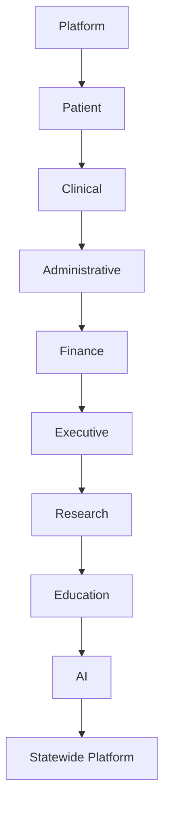

# Master Capability Matrix

## Purpose

This document models the capabilities of the Hospital Operating System (HOS) as a master planning artifact for platform delivery, module prioritization, implementation sequencing, and future expansion. It is designed for continuous growth as new capabilities are introduced across the hospital enterprise.

The matrix serves as the planning backbone for future module implementation and should be updated as the platform evolves.

## Status

- Status: Draft
- Version: 0.1.0
- Owner: Enterprise Capability Architecture Team
- Audience: architects, product managers, engineering leads, clinical stakeholders, administrators, and delivery teams

## Related Project Documents

- [Project Charter](../../README.md)
- [Documentation Index](../DOCUMENT_INDEX.md)
- [HOS Blueprint](../00_HOS_BLUEPRINT.md)
- [Hospital Business Architecture](../04_Architecture/HOSPITAL_BUSINESS_ARCHITECTURE.md)
- [Domain-Driven Architecture](../04_Architecture/DOMAIN_DRIVEN_ARCHITECTURE.md)
- [Capability Model Overview](README.md)

---

## Capability Matrix Overview

The matrix below captures major capabilities across the platform and the hospital enterprise, grouped by capability family.

---

## Master Capability Matrix

| Capability | Business Domain | Department | Primary Users | Supporting Users | Data Owner | Core Entities | Related APIs | Reports | Dashboards | Security Level | Dependencies | Priority | Implementation Phase | Sprint | Future Enhancements |
| --- | --- | --- | --- | --- | --- | --- | --- | --- | --- | --- | --- | --- | --- | --- | --- |
| Identity and Access Management | Platform | ICT / Security | Administrators | Clinicians, Patients | ICT | User, Role, Permission, Session | /auth/login, /roles, /permissions, /users | Access Review Report | Security Overview | High | Directory Services, Audit Services | Critical | Phase 1 | Sprint 01 | Federated identity, adaptive MFA |
| Configuration and Policy Management | Platform | ICT / Administration | Platform Engineers | Administrators | ICT | Configuration, Policy, FeatureFlag | /config, /policies, /feature-flags | Configuration Audit | Platform Operations | High | Deployment Pipeline, Logging | High | Phase 1 | Sprint 01 | Policy-as-code, environment governance |
| Audit and Traceability | Platform | ICT / Compliance | Compliance Teams | Administrators, Auditors | Governance | AuditEvent, TraceRecord, IncidentCase | /audit-events, /trace-reports | Audit Summary | Compliance Dashboard | High | Logging, Identity Services | High | Phase 1 | Sprint 02 | Event analytics, anomaly review |
| Patient Registration and Identity | Patient | Medical Records / Registration | Registration Staff | Clinicians, Patients | Medical Records | Patient, Identifier, Encounter, Visit | /patients, /visits, /encounters | Registration Activity Report | Patient Flow Dashboard | High | Identity Services, Clinical Workflow | Critical | Phase 1 | Sprint 02 | Biometric matching, self-service registration |
| Patient Journey Management | Patient | Clinical Operations | Case Managers | Clinicians, Nurses | Care Delivery | Journey, CarePathway, FollowUp | /journeys, /care-pathways, /follow-ups | Continuity of Care Report | Patient Journey Dashboard | High | Scheduling, Records | High | Phase 2 | Sprint 03 | Personalized journey orchestration |
| Clinical Workflow Management | Clinical | Clinical Departments | Physicians | Nurses, Residents | Clinical Operations | CarePlan, Task, Order, Handover | /workflows, /tasks, /care-plans | Clinical Workflow Report | Clinical Operations Dashboard | High | Patient Services, Diagnostics | Critical | Phase 2 | Sprint 03 | AI-assisted task routing |
| Diagnostics Management | Clinical | Laboratory / Radiology | Clinicians | Lab Staff, Radiologists | Diagnostic Services | DiagnosticOrder, Result, ImagingStudy, Report | /diagnostic-orders, /results, /reports | Turnaround Time Report | Diagnostic Dashboard | High | Integration Layer, Records | Critical | Phase 2 | Sprint 04 | AI-assisted interpretation |
| Pharmacy Management | Clinical | Pharmacy | Pharmacists | Clinicians, Stores | Pharmacy | Prescription, MedicationOrder, Dispensation | /prescriptions, /dispensations, /stock-items | Medication Safety Report | Pharmacy Dashboard | High | Stores, Clinical Workflow | Critical | Phase 2 | Sprint 04 | E-prescribing, barcode dispensing |
| Nursing and Bed Management | Clinical | Nursing | Nurses | Bed Managers, Physicians | Nursing | Bed, Ward, Observation, Handover | /beds, /observations, /handover | Bed Occupancy Report | Nursing Dashboard | High | Care Delivery, Emergency | High | Phase 2 | Sprint 05 | Smart monitoring, predictive capacity |
| Emergency Care Coordination | Clinical | Emergency | Emergency Physicians | Nurses, Transport | Emergency Services | TriageCase, EmergencyEncounter, Transfer | /triage, /emergency-encounters, /transfers | Emergency Throughput Report | Emergency Dashboard | High | Diagnostics, Bed Management | High | Phase 2 | Sprint 05 | Real-time bed prioritization |
| Theatre and Surgical Workflow | Clinical | Theatre | Surgeons | Anaesthesia, Nursing | Theatre Services | SurgerySchedule, Procedure, OperationNote | /surgery-schedules, /procedures | Theatre Utilization Report | Theatre Dashboard | High | Nursing, Pharmacy, Diagnostics | High | Phase 3 | Sprint 06 | Perioperative digital workflow |
| Medical Records Management | Clinical / Patient | Medical Records | Records Officers | Clinicians, Administrators | Medical Records | MedicalRecord, Document, ArchiveEntry | /records, /documents, /archives | Record Completeness Report | Records Dashboard | High | Clinical Workflow, Governance | High | Phase 2 | Sprint 03 | Smart indexing, EHR lifecycle automation |
| Human Resource Administration | Administrative | HR | HR Officers | Department Heads | HR | StaffMember, Role, LeaveRequest, Attendance | /staff, /roles, /leave-requests | Attendance and Staffing Report | HR Dashboard | Medium | Identity Services, Payroll | High | Phase 2 | Sprint 04 | Self-service HR, workforce analytics |
| Operations and Service Coordination | Administrative | Administration / Operations | Operations Staff | Support Teams | Administration | ServiceRequest, WorkOrder, Incident | /service-requests, /work-orders, /incidents | Service Request Report | Operations Dashboard | Medium | Facilities, ICT, Security | Medium | Phase 3 | Sprint 06 | Mobile request management |
| Billing and Revenue Cycle | Finance | Accounts / Billing | Billing Officers | Financial Analysts | Finance | Invoice, Payment, Claim, Reimbursement | /invoices, /payments, /claims | Revenue Report | Financial Dashboard | High | Patient Care, NHIA Interfaces | Critical | Phase 3 | Sprint 05 | Automated claims intelligence |
| Procurement and Inventory | Finance / Administrative | Procurement / Stores | Procurement Staff | Pharmacy, Stores, Finance | Supply Chain | Requisition, PurchaseOrder, StockItem | /requisitions, /purchase-orders, /stock-items | Procurement Status Report | Supply Chain Dashboard | Medium | Finance, Pharmacy, Stores | High | Phase 3 | Sprint 06 | Predictive replenishment |
| Accounts and Ledger Management | Finance | Accounts | Accountants | Finance Managers | Accounts | LedgerEntry, Receipt, Voucher | /accounts, /receipts, /ledger-entries | Cash and Receivables Report | Finance Dashboard | High | Billing, Finance System | High | Phase 3 | Sprint 05 | Automated reconciliation |
| Executive Performance Management | Executive | Executive Office | Executives | Department Heads | Executive Management | KPI, DashboardMetric, Report | /dashboards, /kpis, /reports | Executive Performance Report | Executive Dashboard | Medium | Analytics Services, Data Warehouse | High | Phase 3 | Sprint 06 | Predictive executive intelligence |
| Governance and Compliance Reporting | Executive | Compliance / Quality | Compliance Officers | Executives, Auditors | Governance | Policy, AuditFinding, QualityMetric | /compliance, /audits, /quality-metrics | Compliance Report | Quality Dashboard | High | Clinical, Finance, Administration | High | Phase 3 | Sprint 06 | Automated audit monitoring |
| Research Administration | Research | Research Office | Researchers | Academic Units | Research Office | Study, Protocol, EthicsApproval | /studies, /protocols, /ethics-approvals | Research Activity Report | Research Dashboard | High | Clinical Data, Governance | Medium | Phase 3 | Sprint 07 | Research data intelligence |
| Education and Training Management | Education | Academic Units | Faculty | Trainees, Administrators | Academic Affairs | Trainee, Rotation, Assessment | /trainees, /rotations, /assessments | Training Report | Academic Dashboard | Medium | Clinical Workflow, Records | Medium | Phase 3 | Sprint 07 | Digital logbooks, learning analytics |
| Clinical Decision Support | AI | Clinical AI | Clinicians | Clinical Informatics | Clinical AI Governance | RiskScore, Recommendation, Alert | /ai/clinical-decision-support, /ai/risk-scores | CDS Effectiveness Report | AI Clinical Dashboard | High | Clinical Data, Diagnostics | Medium | Phase 4 | Sprint 08 | Multimodal AI, explainability layers |
| Intelligent Operations and Forecasting | AI | Executive / Operations | Operations Leaders | Finance, Supply Chain | AI Governance | Forecast, Anomaly, Recommendation | /ai/forecasting, /ai/anomaly-detection | Forecast Accuracy Report | Operational Intelligence Dashboard | High | Analytics Services, Data Warehouse | Medium | Phase 4 | Sprint 08 | Digital twin scenarios |
| Interoperability and Data Exchange | Statewide Platform / Integration | ICT / Integration | Integration Engineers | External Partners | Integration Backbone | IntegrationContract, Connector, MessageRoute | /integrations, /connectors, /events | Integration Health Report | Integration Dashboard | High | External Systems, Security, APIs | High | Phase 4 | Sprint 09 | Standards-based exchange, event mesh |
| External Partner and Payer Integration | Statewide Platform / Finance | ICT / Billing | Integration Teams | Finance, Payers | Integration Backbone | PartnerConnection, ClaimSubmission, SyncRecord | /partners, /payer-connectors | Partner Sync Report | Payer Integration Dashboard | High | Billing, Security, External APIs | High | Phase 4 | Sprint 09 | Automated partner onboarding |
| Statewide Reporting and Analytics | Statewide Platform / Executive | Health Informatics | Health Authorities | Executives, Program Managers | Data Governance | RegionalMetric, Indicator, AggregateReport | /statewide/reports, /statewide/metrics | Statewide Performance Report | Statewide Dashboard | High | Integration Layer, Data Warehouse | Medium | Phase 4 | Sprint 10 | Regional forecasting, shared performance models |

---

## Planning Notes

- This matrix should be reviewed at the start of each planning cycle.
- New capabilities should be added as they are approved for delivery.
- Priority, phase, and sprint fields should be updated as delivery realities change.
- The matrix is intended to evolve with the platform and become the project’s master planning reference.

## Summary

The Master Capability Matrix provides a structured view of HOS capabilities across platform, patient, clinical, administrative, finance, executive, research, education, AI, and statewide platform domains. It is intended to guide module planning, implementation sequencing, and long-term platform evolution.
