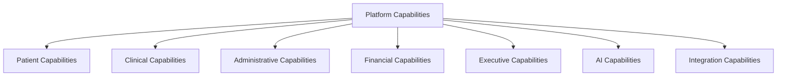
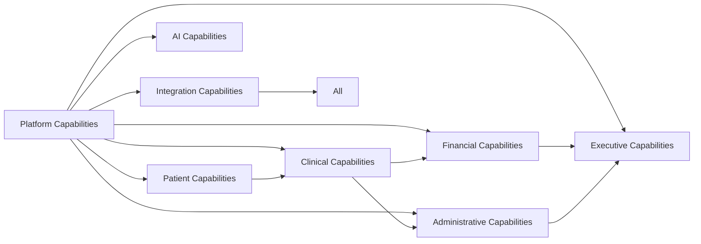

# HOS Capability Model

## Purpose

This directory defines the capability model for the Hospital Operating System (HOS). It provides a structured view of the business and platform capabilities required to implement, extend, and operate the hospital platform across clinical, administrative, financial, executive, AI, and integration domains.

The capability model is intended to serve as the foundation for future module implementation, roadmap planning, solution design, and delivery prioritization.

## Status

- Status: Draft
- Version: 0.1.0
- Owner: Enterprise Capability Architecture Team
- Audience: Architects, product teams, engineering leads, and delivery stakeholders

## Scope

This capability model covers the following capability groups:

- Platform
- Patient
- Clinical
- Administrative
- Financial
- Executive
- AI
- Integration

## Related Project Documents

- [Project Charter](../../README.md)
- [Documentation Index](../DOCUMENT_INDEX.md)
- [Hospital Business Architecture](../04_Architecture/HOSPITAL_BUSINESS_ARCHITECTURE.md)
- [Domain-Driven Architecture](../04_Architecture/DOMAIN_DRIVEN_ARCHITECTURE.md)
- [System Architecture](../04_Architecture/SYSTEM_ARCHITECTURE.md)

---

## Capability Model Overview

## Capability Structure

Each capability entry describes:

- Purpose
- Business Value
- Users
- Inputs
- Outputs
- Core Processes
- Data Ownership
- Related APIs
- Dependencies
- KPIs
- Future Enhancements

---

## Capability Catalog

### 1. Platform Capabilities

#### 1.1 Identity and Access Management

- Purpose: Provide secure user authentication, authorization, role management, and access governance.
- Business Value: Protects patient data, supports compliance, and enables appropriate role-based access across the platform.
- Users: clinicians, administrators, executives, support staff, patients, external partners
- Inputs: user profiles, role definitions, organization structure, access policies
- Outputs: signed-in sessions, access tokens, role assignments, audit logs
- Core Processes: user provisioning, authentication, authorization, session management, access review
- Data Ownership: Identity and Access Management domain
- Related APIs: /auth/login, /auth/refresh, /roles, /permissions, /users
- Dependencies: Directory services, security policies, audit services
- KPIs: sign-in success rate, access review completion rate, unauthorized access incidents
- Future Enhancements: adaptive authentication, MFA orchestration, federated identity support

#### 1.2 Configuration and Policy Management

- Purpose: Manage platform configuration, workflow rules, and policy-driven behavior.
- Business Value: Enables platform flexibility without code changes for common operational variations.
- Users: administrators, platform engineers, product owners
- Inputs: policy definitions, environment settings, feature flags, workflow rules
- Outputs: runtime configuration, policy evaluations, feature states
- Core Processes: configuration change, policy evaluation, feature rollout, environment management
- Data Ownership: Platform services
- Related APIs: /config, /policies, /feature-flags
- Dependencies: Identity services, deployment tooling, audit services
- KPIs: configuration change cycle time, deployment success rate, policy compliance rate
- Future Enhancements: policy-as-code, environment-specific governance, automated rollback triggers

#### 1.3 Audit and Traceability

- Purpose: Capture operational and business events for accountability, compliance, and investigation.
- Business Value: Supports clinical safety, regulatory oversight, and incident response.
- Users: compliance teams, auditors, administrators, support teams
- Inputs: system events, user actions, workflow changes, security events
- Outputs: audit logs, trace records, incident evidence
- Core Processes: event capture, correlation, retention, reporting
- Data Ownership: Governance and platform operations
- Related APIs: /audit-events, /trace-reports, /compliance-events
- Dependencies: logging services, identity services, integration backbone
- KPIs: audit coverage, event completeness, incident investigation turnaround time
- Future Enhancements: event analytics, compliance dashboards, AI-assisted anomaly review

### 2. Patient Capabilities

#### 2.1 Patient Registration and Identity

- Purpose: Create and maintain a trusted patient identity and registration record.
- Business Value: Ensures accurate patient matching, consistent records, and reduced duplication.
- Users: registration staff, clinicians, administrators, patients
- Inputs: demographics, identifiers, referrals, supporting documents
- Outputs: patient master record, visit record, encounter context
- Core Processes: registration, identity verification, merge/split workflows, demographic updates
- Data Ownership: Patient administration domain
- Related APIs: /patients, /visits, /encounters, /identifiers
- Dependencies: Identity management, records management, clinical workflow services
- KPIs: duplicate rate, registration turnaround time, patient match accuracy
- Future Enhancements: biometric matching, self-service registration, master data stewardship workflows

#### 2.2 Patient Journey Management

- Purpose: Track the patient experience across registration, care, diagnostics, discharge, and follow-up.
- Business Value: Improves continuity of care, reduces delays, and supports coordinated services.
- Users: clinicians, nurses, case managers, administrators
- Inputs: appointments, encounters, orders, referrals, discharge instructions
- Outputs: care pathway progress, referral status, discharge summaries
- Core Processes: scheduling, care pathway tracking, follow-up coordination, discharge management
- Data Ownership: Care delivery domain
- Related APIs: /journeys, /care-pathways, /discharges, /follow-ups
- Dependencies: scheduling services, clinical workflow, medical records
- KPIs: discharge turnaround time, follow-up completion rate, continuity-of-care score
- Future Enhancements: personalized journey orchestration, mobile follow-up reminders

### 3. Clinical Capabilities

#### 3.1 Clinical Workflow Management

- Purpose: Coordinate clinical tasks, pathways, and departmental workflows.
- Business Value: Improves care efficiency, reduces delays, and standardizes service delivery.
- Users: physicians, nurses, case managers, unit heads
- Inputs: diagnoses, orders, care plans, departmental protocols
- Outputs: task lists, workflow status, escalations, handovers
- Core Processes: order routing, task assignment, workflow monitoring, escalation handling
- Data Ownership: Clinical operations domain
- Related APIs: /workflows, /tasks, /care-plans, /handover
- Dependencies: patient services, diagnostics, pharmacy, nursing, records
- KPIs: workflow turnaround time, task completion rate, handover quality
- Future Enhancements: adaptive care pathways, AI-driven task orchestration

#### 3.2 Diagnostics Management

- Purpose: Manage laboratory, imaging, and other diagnostic orders and results.
- Business Value: Supports timely and accurate diagnosis and treatment decisions.
- Users: clinicians, laboratory scientists, radiologists, pathology staff
- Inputs: orders, specimens, imaging requests, referral notes
- Outputs: results, reports, alerts, status updates
- Core Processes: order submission, tracking, result validation, report delivery
- Data Ownership: Diagnostic services domain
- Related APIs: /diagnostic-orders, /results, /imaging-studies, /reports
- Dependencies: clinical workflows, LIS/PACS interfaces, records, integration services
- KPIs: turnaround time, result accuracy, critical result response time
- Future Enhancements: autonomous result routing, AI-assisted interpretation

#### 3.3 Specialty Care Management

- Purpose: Support specialized clinics and departments such as Eye Clinic, emergency, theatre, and oncology workflows.
- Business Value: Improves specialty care delivery and standardization across departments.
- Users: specialists, nurses, residents, department managers
- Inputs: specialty referrals, examinations, procedures, notes
- Outputs: specialty care plans, reports, procedure outcomes, follow-up plans
- Core Processes: appointment handling, examination workflow, procedure coordination, outcome recording
- Data Ownership: Specialty clinical domains
- Related APIs: /specialty-clinics, /procedures, /follow-up
- Dependencies: clinical workflow, diagnostics, pharmacy, records
- KPIs: clinic throughput, procedure turnaround time, follow-up rate
- Future Enhancements: specialty-specific digital workflows, predictive triage

### 4. Administrative Capabilities

#### 4.1 Human Resource Administration

- Purpose: Maintain staff records, roles, leave, attendance, and administrative governance.
- Business Value: Improves workforce coordination and institutional compliance.
- Users: HR staff, supervisors, administrators
- Inputs: staffing data, onboarding records, attendance logs, leave requests
- Outputs: employee records, approvals, rosters, attendance reports
- Core Processes: onboarding, role assignment, leave handling, attendance tracking
- Data Ownership: Human resource administration domain
- Related APIs: /staff, /roles, /leave-requests, /attendance
- Dependencies: identity services, governance, payroll integration
- KPIs: onboarding turnaround time, attendance compliance, leave processing time
- Future Enhancements: self-service HR workflows, workforce analytics

#### 4.2 Operations and Service Coordination

- Purpose: Coordinate internal services such as transport, security, facilities, and support requests.
- Business Value: Improves service continuity and institutional responsiveness.
- Users: operations staff, department heads, support teams
- Inputs: service requests, incident reports, maintenance requests, transport requests
- Outputs: work orders, dispatches, incident records, service status
- Core Processes: request intake, routing, fulfillment, closure, escalation
- Data Ownership: Operations and support services domain
- Related APIs: /service-requests, /work-orders, /incidents
- Dependencies: support services, ICT, maintenance, security
- KPIs: request turnaround time, incident resolution time, service satisfaction
- Future Enhancements: mobile request submission, automated dispatch

### 5. Financial Capabilities

#### 5.1 Revenue Cycle Management

- Purpose: Manage billing, payment collection, claim submission, and reimbursement.
- Business Value: Improves financial sustainability, reduces leakage, and speeds reimbursement.
- Users: billing officers, finance staff, NHIA teams, accounts personnel
- Inputs: encounters, charges, insurance data, payments, claims
- Outputs: invoices, receipts, reimbursement status, financial reports
- Core Processes: charge capture, billing, payment posting, claim submission, reconciliation
- Data Ownership: Finance and revenue domain
- Related APIs: /invoices, /payments, /claims, /reimbursements
- Dependencies: care delivery, patient administration, insurance interfaces
- KPIs: collection rate, claim turnaround time, denial rate, receivables aging
- Future Enhancements: automated claims validation, intelligent revenue analytics

#### 5.2 Procurement and Inventory Management

- Purpose: Support acquisition, replenishment, stock control, and distribution of goods and supplies.
- Business Value: Reduces stockout risk, supports care continuity, and improves spend control.
- Users: procurement staff, stores personnel, pharmacy staff, department heads
- Inputs: requisitions, supplier data, stock levels, usage patterns
- Outputs: purchase orders, stock movements, replenishment alerts, inventory reports
- Core Processes: requisition approval, purchase order issuance, receiving, issue, replenishment
- Data Ownership: Supply chain and stores domain
- Related APIs: /requisitions, /purchase-orders, /stock-items
- Dependencies: finance, pharmacy, laboratory, radiology, maintenance
- KPIs: stockout rate, procurement cycle time, inventory accuracy, expiry rate
- Future Enhancements: predictive replenishment, supplier portal integration

### 6. Executive Capabilities

#### 6.1 Performance Management and Dashboards

- Purpose: Provide leadership with real-time visibility into hospital performance.
- Business Value: Supports rapid governance, planning, and decision-making.
- Users: executives, unit heads, administrators, board members
- Inputs: operational metrics, patient metrics, finance data, quality indicators
- Outputs: dashboards, KPI summaries, executive reports
- Core Processes: metric collection, aggregation, visualization, alerting
- Data Ownership: Executive reporting and analytics domain
- Related APIs: /dashboards, /kpis, /reports
- Dependencies: analytics services, data warehouse, operational modules
- KPIs: dashboard availability, report turnaround time, decision cycle time
- Future Enhancements: predictive analytics, scenario planning, AI-assisted insight generation

#### 6.2 Governance and Compliance Reporting

- Purpose: Monitor quality, safety, audit readiness, and institutional compliance.
- Business Value: Strengthens accountability and supports regulatory readiness.
- Users: leadership, compliance officers, quality teams, auditors
- Inputs: policy data, incidents, audit results, quality metrics
- Outputs: compliance reports, audit summaries, risk views
- Core Processes: compliance monitoring, incident review, audit reporting
- Data Ownership: Governance and compliance domain
- Related APIs: /compliance, /audits, /incidents, /quality-metrics
- Dependencies: clinical, finance, administration, ICT
- KPIs: audit closure rate, incident resolution time, compliance rate
- Future Enhancements: automated compliance monitoring, digital audit trail analytics

### 7. AI Capabilities

#### 7.1 Clinical Decision Support

- Purpose: Deliver AI-assisted insights for diagnosis, triage, and care planning.
- Business Value: Improves quality, reduces variability, and supports safer decisions.
- Users: clinicians, nurses, residents, care coordinators
- Inputs: patient data, orders, results, protocols, historical patterns
- Outputs: alerts, recommendations, risk scores, summaries
- Core Processes: inference generation, alerting, review, and feedback
- Data Ownership: Clinical AI domain with governance oversight
- Related APIs: /ai/clinical-decision-support, /ai/risk-scores, /ai/summaries
- Dependencies: clinical data services, diagnostics, records, governance
- KPIs: recommendation acceptance rate, alert precision, clinician adoption rate
- Future Enhancements: contextual prompting, predictive care pathways, multimodal clinical intelligence

#### 7.2 Intelligent Operations and Analytics

- Purpose: Use AI to support demand forecasting, anomaly detection, and resource optimization.
- Business Value: Improves planning accuracy and operational resilience.
- Users: executives, operations teams, finance, supply chain managers
- Inputs: historical operations data, utilization patterns, service logs
- Outputs: forecasts, anomaly findings, optimization recommendations
- Core Processes: pattern analysis, anomaly detection, forecasting, scenario simulation
- Data Ownership: Analytics and operations intelligence domain
- Related APIs: /ai/forecasting, /ai/anomaly-detection, /ai/optimization
- Dependencies: data warehouse, reporting services, integration backbone
- KPIs: forecast accuracy, optimization impact, anomaly detection precision
- Future Enhancements: hospital-wide predictive intelligence, digital twin scenarios

### 8. Integration Capabilities

#### 8.1 Interoperability and Data Exchange

- Purpose: Connect HOS to internal modules, external systems, and national or regional health platforms.
- Business Value: Improves information flow, reduces manual work, and enables shared care models.
- Users: integration engineers, administrators, external partners, operations teams
- Inputs: source data, message schemas, integration contracts, endpoint definitions
- Outputs: exchanged data, event notifications, synchronized records
- Core Processes: transformation, routing, validation, reconciliation, monitoring
- Data Ownership: Integration backbone and domain owners
- Related APIs: /integrations, /connectors, /events, /transformations
- Dependencies: API gateway, messaging services, security, domain services
- KPIs: integration success rate, message latency, data reconciliation accuracy
- Future Enhancements: standards-based interoperability, event-driven ecosystem integration

#### 8.2 External Partner and Payer Integration

- Purpose: Exchange data with insurers, laboratories, imaging partners, and external providers.
- Business Value: Improves claims processing, referrals, diagnostics, and continuity of care.
- Users: finance teams, clinical operations, partner administrators
- Inputs: partner payloads, referral data, claims, results
- Outputs: synchronized transactions, status updates, acknowledgments
- Core Processes: connector management, message exchange, status tracking, reconciliation
- Data Ownership: Domain owners with integration governance
- Related APIs: /partners, /payer-connectors, /external-sync
- Dependencies: integration services, security controls, domain APIs
- KPIs: partner response time, reconciliation accuracy, transaction success rate
- Future Enhancements: API-first partner onboarding, automated contract compliance

---

## Capability Relationship Diagram

---

## Implementation Guidance

The capability model should guide future module implementation by:

- identifying the business capabilities that each module must support
- aligning software modules to enterprise capabilities rather than isolated features
- enabling phased delivery across platform and domain modules
- informing API design, data ownership, and dependency planning
- providing a shared vocabulary for architects, product teams, and engineering teams

---

## Related Planning Artifacts

- [Master Capability Matrix](MASTER_CAPABILITY_MATRIX.md)

## Summary

This capability model defines the core capabilities required for HOS to function as a long-term enterprise hospital platform. It provides a reusable foundation for future module implementation, solution architecture, roadmap planning, and digital transformation.
